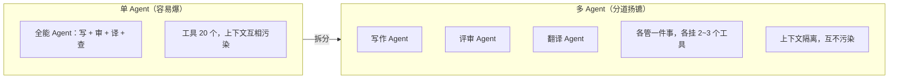
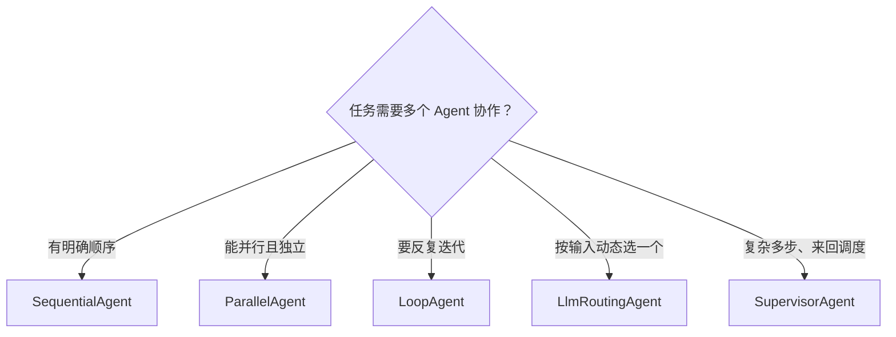

# 11 多 Agent 编排

> 一个 Agent 扛不住复杂任务时，就把它拆成多个各司其职的 Agent，像组建一支团队一样协作。本章把 Spring AI Alibaba 提供的 5 种编排模式逐一拆开，每种都配完整可运行代码。

## 本篇要解决的问题

- **为什么单 Agent 到一定复杂度就不行了**：上下文膨胀、职责混乱、工具选择困难
- **两种底层协作范式**：Tool Calling（工具调用）与 Handoffs（控制权交接）
- **5 种编排模式**逐一配代码：Sequential / Parallel / Loop / LlmRouting / Supervisor
- **多 Agent 之间怎么传数据**：`OverAllState` + 占位符机制
- **怎么调试和观测**一堆 Agent 跑起来后到底发生了什么
- **什么时候该用、什么时候别用**某一种模式

::: tip 先给结论
绝大多数业务，一个设计得当的 ReactAgent 就够了。**只有当「单 Agent 工具太多挑花眼」「上下文太长太贵」「任务天然分工」这三件事出现时，才上多 Agent。** 别为了架构高级而拆。
:::

## 一、为什么需要多个 Agent

### 1.1 单 Agent 的困境

我们第 10 章写的 ReactAgent 是个「全能选手」：理解意图、选工具、调工具、总结答案全它一个人干。任务简单时没问题，但任务一复杂，三个问题立刻暴露：

| 问题 | 表现 |
| --- | --- |
| **上下文膨胀** | 工具多、对话长，所有信息堆在一个 Agent 的上下文里，Token 烧得快，模型还越来越「记串」 |
| **职责混乱** | 让一个 Agent 又写文章、又做数据分析、又当客服，prompt 越写越长，它最终活成「四不像」 |
| **工具选择困难** | 工具超过 10 个，模型就开始「工具选择困难症」，经常调错或漏调 |

### 1.2 多 Agent 的核心价值

把「全能 Agent」拆成「专精 Agent」组队：



三个好处：**专业化分工**、**上下文隔离省 Token**、**单点失败不影响全局**。

### 1.3 两种底层协作范式

Spring AI Alibaba 的多 Agent 体系，底层其实是两种「合作方式」的排列组合：

| 范式 | 原理 | 控制流 | 适用 |
| --- | --- | --- | --- |
| **Tool Calling（工具调用）** | 主管 Agent 把其他 Agent **当工具调** | 集中式：所有事经主管调度 | 任务编排、结构化工作流 |
| **Handoffs（控制权交接）** | 当前 Agent 把「谁来处理用户」**交给另一个 Agent** | 去中心化：活跃 Agent 可变 | 跨领域对话、专家接管 |

> 你可以混合：用 Handoffs 切换活跃 Agent，同时让每个 Agent 把子 Agent 当工具调。

### 1.4 OverAllState 与占位符：多 Agent 怎么传数据

多 Agent 协作的命脉是**共享状态容器 `OverAllState`**。它贯穿所有 Agent，存对话历史、中间结果、全局变量。

- 每个 Agent 通过 `outputKey("xxx")` 把自己的输出存进状态。
- 后续 Agent 在 `instruction` 里用**占位符**引用前面的值：
  - `{input}` —— 用户原始输入
  - `{outputKey}` —— 其他 Agent 通过 `outputKey` 存的值
  - `{stateKey}` —— 状态里的任意键值

框架在跑 Agent 时，会自动把占位符替换成状态里的实际值。理解了这个，下面 5 种模式就都是「状态在 Agent 之间流动」的变体。

## 二、模式一 SequentialAgent（顺序流水线）

### 2.1 拓扑（纯文本图）

```text
输入 ──→ [Agent A] ──→ [Agent B] ──→ [Agent C] ──→ 输出
            │            │
            └─ outputKey=a ──┘
               B 的 instruction 用 {a} 引用 A 的结果
```

前一个 Agent 的 `outputKey` 输出，自动成为后一个 Agent 的输入模板变量。

### 2.2 适用场景

任务有明确先后次序，前一步输出是后一步输入：**写文章→评审→翻译**、数据清洗→校验→入库、需求→设计→实现。

### 2.3 完整代码

依赖与基础配置同第 10 章（引入 `spring-ai-alibaba-agent-framework`）。

路径：`src/main/java/com/example/saa/multi/SequentialConfig.java`

```java
package com.example.saa.multi;

import com.alibaba.cloud.ai.graph.agent.ReactAgent;
import com.alibaba.cloud.ai.graph.agent.flow.agent.SequentialAgent;
import org.springframework.ai.chat.model.ChatModel;
import org.springframework.context.annotation.Bean;
import org.springframework.context.annotation.Configuration;

import java.util.List;

/**
 * 顺序编排示例：写作 → 评审。
 *
 * 包说明：SequentialAgent 位于
 *   com.alibaba.cloud.ai.graph.agent.flow.agent.SequentialAgent
 */
@Configuration
public class SequentialConfig {

    /**
     * 写作 Agent：产出文章，存到状态的 "article" 键。
     */
    @Bean
    public ReactAgent writerAgent(ChatModel chatModel) {
        return ReactAgent.builder()
                .name("writer_agent")
                .model(chatModel)
                .description("专业写作 Agent，擅长创作文章")
                .instruction("""
                        你是一位知名作家，擅长创作各类文章。
                        请根据用户的提问进行回答，文章长度控制在 200 字左右。

                        用户提问:{input}
                        """)
                .outputKey("article")   // 关键：把输出存进状态，key 为 "article"
                .build();
    }

    /**
     * 评审 Agent：用 {article} 引用上一个 Agent 的输出。
     */
    @Bean
    public ReactAgent reviewerAgent(ChatModel chatModel) {
        return ReactAgent.builder()
                .name("reviewer_agent")
                .model(chatModel)
                .description("专业评审 Agent，擅长修改润色文章")
                .instruction("""
                        你是一位资深评论家，擅长对文章进行评审和修改。

                        待评审文章:{article}

                        请确保：语言优美流畅，最终只返回修改后的文章，不要包含任何评论信息。
                        """)
                .outputKey("reviewed_article")
                .build();
    }

    /**
     * 顺序编排：按 subAgents 列表顺序执行。
     */
    @Bean
    public SequentialAgent blogWorkflow(ChatModel chatModel) {
        return SequentialAgent.builder()
                .name("blog_workflow")
                .description("写作与评审工作流：先写文章，再评审修改")
                .subAgents(List.of(writerAgent(chatModel), reviewerAgent(chatModel)))
                .build();
    }
}
```

调用与读结果：`src/main/java/com/example/saa/multi/SequentialController.java`

```java
package com.example.saa.multi;

import com.alibaba.cloud.ai.graph.OverAllState;
import com.alibaba.cloud.ai.graph.agent.flow.agent.SequentialAgent;
import org.springframework.ai.chat.messages.AssistantMessage;
import org.springframework.web.bind.annotation.GetMapping;
import org.springframework.web.bind.annotation.RequestMapping;
import org.springframework.web.bind.annotation.RequestParam;
import org.springframework.web.bind.annotation.RestController;

import java.util.Optional;

@RestController
@RequestMapping("/api/seq")
public class SequentialController {

    private final SequentialAgent blogWorkflow;

    public SequentialController(SequentialAgent blogWorkflow) {
        this.blogWorkflow = blogWorkflow;
    }

    @GetMapping("/run")
    public String run(@RequestParam String topic) {
        // 流编排 Agent 用 invoke(String) 触发，返回 Optional<OverAllState>
        Optional<OverAllState> result = blogWorkflow.invoke(topic);
        if (result.isEmpty()) {
            return "执行失败";
        }
        OverAllState state = result.get();

        // 通过 outputKey 读取每个 Agent 的输出；状态里存的是 AssistantMessage
        StringBuilder sb = new StringBuilder();
        state.value("article").ifPresent(v ->
                sb.append("【原始文章】\n").append(((AssistantMessage) v).getText()).append("\n\n"));
        state.value("reviewed_article").ifPresent(v ->
                sb.append("【评审后】\n").append(((AssistantMessage) v).getText()));
        return sb.toString();
    }
}
```

```bash
curl "http://localhost:8080/api/seq/run?topic=写一首关于春天的现代诗"
```

### 2.4 什么时候别用

任务之间没有「前后依赖」（即后一步不依赖前一步输出）时，用 Sequential 就是白白排队。这种该用 Parallel。

## 三、模式二 ParallelAgent（并行分支 + 汇合）

### 3.1 拓扑

```text
               ┌─ [Agent A] ─┐
输入 ──分发──┼─ [Agent B] ─┼── 合并策略 ──→ 输出
               └─ [Agent C] ─┘
           三个 Agent 同时跑，最后按 mergeStrategy 汇合
```

### 3.2 适用场景

多个子任务彼此独立、可以同时做，最后汇总：多维度方案策划、同时从多个数据源查询、一次性生成不同格式内容（散文+诗歌+总结）。

### 3.3 完整代码

```java
package com.example.saa.multi;

import com.alibaba.cloud.ai.graph.agent.ReactAgent;
import com.alibaba.cloud.ai.graph.agent.flow.agent.ParallelAgent;
import org.springframework.ai.chat.model.ChatModel;
import org.springframework.context.annotation.Bean;
import org.springframework.context.annotation.Configuration;

import java.util.List;

@Configuration
public class ParallelConfig {

    @Bean
    public ReactAgent creativeAgent(ChatModel chatModel) {
        return ReactAgent.builder()
                .name("creative_agent")
                .model(chatModel)
                .description("创意策划师")
                .instruction("你是一个创意策划师，为以下主题提供 3 个创意点子：{input}")
                .outputKey("creative_ideas")
                .build();
    }

    @Bean
    public ReactAgent budgetAgent(ChatModel chatModel) {
        return ReactAgent.builder()
                .name("budget_agent")
                .model(chatModel)
                .description("财务规划师")
                .instruction("你是一个财务规划师，为以下主题制定预算方案：{input}")
                .outputKey("budget_plan")
                .build();
    }

    @Bean
    public ReactAgent executionAgent(ChatModel chatModel) {
        return ReactAgent.builder()
                .name("execution_agent")
                .model(chatModel)
                .description("执行专家")
                .instruction("你是一个执行专家，为以下主题规划执行步骤：{input}")
                .outputKey("execution_steps")
                .build();
    }

    /**
     * 并行编排：三个 Agent 拿到同一份输入同时跑。
     * mergeOutputKey：汇总结果存入状态的哪个 key。
     * mergeStrategy：合并策略，默认 DefaultMergeStrategy（拼成 Map）。
     */
    @Bean
    public ParallelAgent planningAgent(ChatModel chatModel) {
        return ParallelAgent.builder()
                .name("planning_agent")
                .description("多维度策划：创意 + 预算 + 执行同时推进")
                .subAgents(List.of(
                        creativeAgent(chatModel),
                        budgetAgent(chatModel),
                        executionAgent(chatModel)))
                .mergeOutputKey("merged_results")   // 汇总结果存这里
                .mergeStrategy(new ParallelAgent.DefaultMergeStrategy())  // 默认合并策略
                .build();
    }
}
```

调用与读结果：

```java
package com.example.saa.multi;

import com.alibaba.cloud.ai.graph.OverAllState;
import com.alibaba.cloud.ai.graph.agent.flow.agent.ParallelAgent;
import org.springframework.web.bind.annotation.GetMapping;
import org.springframework.web.bind.annotation.RequestMapping;
import org.springframework.web.bind.annotation.RequestParam;
import org.springframework.web.bind.annotation.RestController;

import java.util.Optional;

@RestController
@RequestMapping("/api/parallel")
public class ParallelController {

    private final ParallelAgent planningAgent;

    public ParallelController(ParallelAgent planningAgent) {
        this.planningAgent = planningAgent;
    }

    @GetMapping("/run")
    public String run(@RequestParam String topic) {
        Optional<OverAllState> result = planningAgent.invoke(topic);
        if (result.isEmpty()) {
            return "执行失败";
        }
        // 读取合并后的结果（类型以你所用版本为准，常见是 Map 或拼接字符串）
        Object merged = result.get().value("merged_results").orElse("无结果");
        return merged.toString();
    }
}
```

```bash
curl "http://localhost:8080/api/parallel/run?topic=在公司楼下开一家咖啡店"
```

::: tip 合并策略
框架提供常见策略：`DefaultMergeStrategy`（拼成键值 Map）、`ConcatenationMergeStrategy`（拼成单一字符串）、`ListMergeStrategy`（合并为 List）。需要自定义格式就自己实现 `MergeStrategy` 接口。
:::

### 3.4 什么时候别用

子任务之间有强依赖（B 必须等 A 出结果）时，并行反而会乱，应该用 Sequential。另外并行会**同时发起多次模型调用**，费用和时间开销是翻倍的，别滥用。

## 四、模式三 LoopAgent（循环迭代）

### 4.1 拓扑

```text
                ┌─────────────────────┐
                │  条件判断：继续？    │
                │   是 ↓   否 ↓       │
输入 → [Agent] →└── 循环    输出结果  │
            （反复执行同一个 Agent，直到满足条件）
```

### 4.2 适用场景

需要「反复打磨」直到达标的任务：文章质量迭代优化、逐步完善方案、工具调用失败重试。

### 4.3 完整代码

```java
package com.example.saa.multi;

import com.alibaba.cloud.ai.graph.agent.ReactAgent;
import com.alibaba.cloud.ai.graph.agent.flow.agent.LoopAgent;
import org.springframework.ai.chat.model.ChatModel;
import org.springframework.context.annotation.Bean;
import org.springframework.context.annotation.Configuration;

@Configuration
public class LoopConfig {

    /**
     * 被循环执行的「优化器」Agent。
     * 关键：在指令里约定一个「达标信号」，让模型自己宣布通过。
     */
    @Bean
    public ReactAgent optimizerAgent(ChatModel chatModel) {
        return ReactAgent.builder()
                .name("optimizer_agent")
                .model(chatModel)
                .instruction("""
                        你是一个文章优化专家。请对以下文章进行优化：{input}
                        优化标准：逻辑清晰、语言优美、无语法错误。
                        如果文章已经足够好，请在回复末尾加上 '[QUALITY_PASS]'。
                        """)
                .outputKey("optimized_article")
                .build();
    }

    /**
     * 循环编排：固定迭代 N 次，或满足条件退出。
     * subAgent（单数）：LoopAgent 只接受一个子 Agent。
     * loopStrategy：循环策略，CountLoopStrategy.of(5) 表示最多 5 次。
     */
    @Bean
    public LoopAgent qualityLoopAgent(ChatModel chatModel) {
        return LoopAgent.builder()
                .name("quality_loop_agent")
                .description("文章质量迭代优化循环")
                .subAgent(optimizerAgent(chatModel))        // 注意是 subAgent(单数)
                .loopStrategy(CountLoopStrategy.of(5))        // 最多迭代 5 次
                .build();
    }
}
```

::: warning LoopAgent 的配置写法版本差异
- 上面用的是 `subAgent(单数)` + `loopStrategy(CountLoopStrategy.of(n))`，与框架源码一致。
- 部分社区示例用 `maxIterations(5)` + `terminationCondition((input, output) -> ...)` 的写法，**该方法在不同版本间可能不存在或签名不同**。若编译不过，请以 `com.alibaba.cloud.ai.graph.agent.flow.agent.LoopAgent` 的 Builder 源码为准；核心思路始终是「限定最大次数 + 约定退出信号」。
:::

调用：

```java
Optional<OverAllState> result = qualityLoopAgent.invoke("写一篇关于秋天的短文");
result.ifPresent(s -> s.value("optimized_article")
        .ifPresent(v -> System.out.println(((AssistantMessage) v).getText())));
```

### 4.4 什么时候别用

任务一步就能完成、或没有明确的「迭代收敛」标准时，Loop 只会徒增耗时和费用。给它一个清晰的退出条件（达标信号 / 最大次数），否则容易空转。

## 五、模式四 LlmRoutingAgent（模型路由分发）

### 5.1 拓扑

```text
                 ┌─ 写作 Agent ─┐
输入 → [Router] ─┼─ 评审 Agent ─┤→ 输出
   (LLM 看描述选) └─ 翻译 Agent ─┘
        一次只派一个最合适的人
```

### 5.2 适用场景

用户问题分很多种，需要「看菜下单」：智能客服（技术/账单/退货分流）、多功能助手（写作/翻译/编程各司其职）。Router 是 LLM，根据子 Agent 的 `description` 自主判断派给谁。

### 5.3 完整代码

```java
package com.example.saa.multi;

import com.alibaba.cloud.ai.graph.agent.ReactAgent;
import com.alibaba.cloud.ai.graph.agent.flow.agent.LlmRoutingAgent;
import org.springframework.ai.chat.model.ChatModel;
import org.springframework.context.annotation.Bean;
import org.springframework.context.annotation.Configuration;

import java.util.List;

@Configuration
public class RoutingConfig {

    @Bean
    public ReactAgent writerAgent(ChatModel chatModel) {
        return ReactAgent.builder()
                .name("writer_agent")
                .model(chatModel)
                .description("擅长创作各类文章，包括散文、诗歌等文学作品") // 路由关键依据！
                .instruction("你是一个知名作家，擅长写作和创作。")
                .outputKey("writer_output")
                .build();
    }

    @Bean
    public ReactAgent reviewerAgent(ChatModel chatModel) {
        return ReactAgent.builder()
                .name("reviewer_agent")
                .model(chatModel)
                .description("擅长对文章进行评论、修改和润色") // 描述越清晰，路由越准
                .instruction("你是一个资深评论家，擅长对文章进行修改。")
                .outputKey("reviewer_output")
                .build();
    }

    @Bean
    public ReactAgent translatorAgent(ChatModel chatModel) {
        return ReactAgent.builder()
                .name("translator_agent")
                .model(chatModel)
                .description("擅长将文章翻译成各种语言")
                .instruction("你是一个专业翻译家，能够准确翻译文章。")
                .outputKey("translator_output")
                .build();
    }

    /**
     * 路由编排：LLM 根据输入和子 Agent 的 description 选一个最合适的。
     */
    @Bean
    public LlmRoutingAgent routingAgent(ChatModel chatModel) {
        return LlmRoutingAgent.builder()
                .name("content_routing_agent")
                .description("根据用户需求智能路由到合适的专家 Agent")
                .model(chatModel)   // 路由本身也要一个 LLM 来做决策
                .subAgents(List.of(
                        writerAgent(chatModel),
                        reviewerAgent(chatModel),
                        translatorAgent(chatModel)))
                .build();
    }
}
```

调用：`routingAgent.invoke("帮我写一篇关于春天的散文")` → 会路由到 `writer_agent`。

```bash
curl "http://localhost:8080/api/routing/run?q=将'春暖花开'翻译成英文"
```

::: tip 提高路由准确性的关键
**把每个子 Agent 的 `description` 写得具体、无歧义，且职责不重叠。** Router 完全靠这些描述做决策。能力重叠（两个 Agent 都能翻译）会让路由随机翻车。
:::

### 5.4 什么时候别用

只有 1~2 类问题、或路由逻辑能用简单规则（如关键词）判断时，直接 if-else 或规则路由更便宜可靠。LLM 路由每次都多花一次模型调用。

## 六、模式五 Supervisor（主管 - 子代理，含 handoff）

Supervisor 是「大总管」：接收复杂任务，动态决定调哪个子 Agent、调完之后下一步调谁，直到任务完成。Spring AI Alibaba 里有两种落地方式。

### 6.1 方式一：Tool Calling 式 Supervisor（最常用、最稳）

把每个子 Agent 用 `AgentTool.getFunctionToolCallback(...)` 包成「工具」，主管 Agent 像调普通工具一样调度它们。子 Agent 不直接面对用户，只干活、返回结果。

```java
package com.example.saa.multi;

import com.alibaba.cloud.ai.graph.agent.AgentTool;
import com.alibaba.cloud.ai.graph.agent.ReactAgent;
import org.springframework.ai.chat.model.ChatModel;
import org.springframework.context.annotation.Bean;
import org.springframework.context.annotation.Configuration;

@Configuration
public class SupervisorConfig {

    /**
     * 子 Agent：订单查询。注意要设 name + description，主管靠它们决定何时调用。
     */
    @Bean
    public ReactAgent orderAgent(ChatModel chatModel) {
        return ReactAgent.builder()
                .name("query_order")
                .description("查询订单状态。当用户询问订单、物流时调用。")
                .instruction("你是订单查询助手。根据用户提供的订单号查询订单状态。")
                .model(chatModel)
                .outputKey("order_result")
                .build();
    }

    /**
     * 子 Agent：通知。
     */
    @Bean
    public ReactAgent notifyAgent(ChatModel chatModel) {
        return ReactAgent.builder()
                .name("send_notify")
                .description("向用户发送通知。当需要通知用户时调用。")
                .instruction("你是通知助手。根据用户提供的信息生成通知内容。")
                .model(chatModel)
                .outputKey("notify_result")
                .build();
    }

    /**
     * 主管 Agent：把两个子 Agent 当工具，自己决定调用顺序。
     */
    @Bean
    public ReactAgent supervisorAgent(ChatModel chatModel) {
        return ReactAgent.builder()
                .name("personal_assistant")
                .description("智能个人助手，可查询订单并通知用户")
                .instruction("你是一个智能个人助手。根据用户需求，决定调用 query_order 或 send_notify 工具来完成任务。")
                .model(chatModel)
                // 把子 Agent 包成 ToolCallback，主管就能像调工具一样调度它们
                .tools(
                        AgentTool.getFunctionToolCallback(orderAgent(chatModel)),
                        AgentTool.getFunctionToolCallback(notifyAgent(chatModel)))
                .build();
    }
}
```

调用（主管返回的是 `AssistantMessage`）：

```java
AssistantMessage resp = supervisorAgent.call(
        new org.springframework.ai.chat.messages.UserMessage("查一下订单456的状态，然后通知用户已发货"));
System.out.println(resp.getText());
```

```bash
curl "http://localhost:8080/api/supervisor/ask?q=查一下订单456的状态，然后通知用户已发货"
```

### 6.2 方式二：SupervisorAgent 类（内置主管，含 handoff 思路）

框架还提供了 `SupervisorAgent` 类，内部帮你做「多轮路由 + 循环调度」。子 Agent 用 `subAgents(...)` 注册，主管在 system prompt 里被要求「返回子 Agent 名字或 FINISH」。

```java
// 包路径与具体方法名请以你所用版本为准（常见在 com.alibaba.cloud.ai.graph.agent 下）
// 下面给出社区示例中的形态，编译前请打开 SupervisorAgent 源码核对 builder 方法名。
SupervisorAgent supervisor = SupervisorAgent.builder()
        .name("content_supervisor")
        .model(chatModel)
        .systemPrompt("你负责协调翻译和评审任务，只返回 Agent 名字或 FINISH。")
        .subAgents(List.of(translatorAgent, reviewerAgent))
        .build();

// 再与顺序流组合，可形成「先写、再由主管动态流转」的高级工作流
SequentialAgent finalWorkflow = SequentialAgent.builder()
        .name("super_workflow")
        .subAgents(List.of(articleWriterAgent, supervisor))
        .build();
```

::: warning SupervisorAgent 类的 API 存疑项
`SupervisorAgent` 的**精确包名与 builder 方法**（如是否叫 `systemPrompt` / `instruction` / `subAgents`）在不同版本间可能不一致。第 10 章文末也强调过：核实不到就**以你所用版本的官方文档为准**。查找路径：在依赖里搜索类名 `SupervisorAgent`，确认它所在的包（通常是 `com.alibaba.cloud.ai.graph.agent` 或其 `flow.agent` 子包），再照抄它的 Builder 方法。**生产落地，方式一（Tool Calling）是最稳、最可移植的。**
:::

### 6.3 什么是 handoff（控制权交接）

Handoffs 与 Tool Calling 的区别：**Tool Calling 里子 Agent 不直接见用户**；Handoffs 里当前 Agent 可以把「谁来处理用户」交给另一个 Agent，用户随后直接和新的活跃 Agent 对话（跨领域接管，如通用客服 → 财务专家）。

在 Spring AI Alibaba 中，Handoffs 通常通过「带记忆的 ReactAgent + 状态机式拦截器」实现：用 `RunnableConfig` 携带 `threadId` 维持同一会话，用 `ModelInterceptor` 根据当前步骤动态切换 `systemPrompt` 和 `tools`，用工具方法里的 `ToolContextHelper` 推进状态。这套较进阶，建议先吃透 Tool Calling 式 Supervisor，再按需深入。

### 6.4 适用场景与「什么时候别用」

- **适用**：复杂多步骤、需要来回调度不同专家的协作（内容生产流水线、智能客服总管）。
- **别用**：任务其实一条直线能跑完（用 Sequential 更直观）；或只是简单分流（用 LlmRouting 更轻）。Supervisor 的调度多花模型调用，且 prompt 设计不好容易「调度混乱」。

## 七、多 Agent 之间的状态如何传递（再强调）

把上面所有模式串起来看，状态传递只有三条规则：

1. **写**：每个 Agent 用 `outputKey("xxx")` 把自己的输出写进 `OverAllState`。
2. **读**：后续 Agent 在 `instruction` 里用 `{xxx}`（即 `{outputKey}`）引用前面的值；也可以用 `{input}` 读用户原始输入、`{stateKey}` 读任意状态。
3. **隔离/共享开关**：
   - `includeContents(true/false)`：子 Agent 执行业务时，是否带上父流程全部上下文。`false` 让它专注自己、省 Token。
   - `returnReasoningContents(true/false)`：是否把中间推理也写进消息历史。想省 Token 关掉，想看完整链路打开。

::: tip 调试状态时最有用的一招
把最后一个 Agent 的输出 `outputKey` 设成你能直接读到的 key，在 Controller 里 `state.value("key")` 打印出来，就能看清每个 Agent 到底产出了什么。这是排查「传错值 / 没传值」的最快办法。
:::

## 八、编排模式选型建议

一张表帮你秒选：

| 模式 | 一句话 | 适用 | 别用 |
| --- | --- | --- | --- |
| **SequentialAgent** | 流水线，一步接一步 | 任务有固定先后依赖 | 子任务彼此独立（应用 Parallel） |
| **ParallelAgent** | 多线齐发，最后汇总 | 独立子任务同时做 | 有强依赖（应用 Sequential）；省钱优先时慎用 |
| **LoopAgent** | 反复打磨直到达标 | 迭代优化、重试 | 一步到位或无收敛标准 |
| **LlmRoutingAgent** | LLM 当前台分诊 | 问题种类多、需分流 | 只有 1~2 类问题或规则能判断 |
| **SupervisorAgent** | 大总管动态调度 | 复杂多步骤协作 | 直线流程（Sequential）或简单分流（Routing） |



## 九、调试与观测建议

多 Agent 一跑起来，内部发生了什么很容易变成黑盒。几条实操建议：

1. **开 DEBUG 日志**：`logging.level.com.alibaba.cloud.ai=DEBUG`，能看清每一步推理、工具调用、路由决策。
2. **用 outputKey 暴露中间结果**：在 Controller 里把每个子 Agent 的 `outputKey` 都打印出来，确认数据确实在 Agent 之间流转。
3. **先小后大**：先单独测通每个子 Agent（当普通 ReactAgent 跑），再拼编排。不要让 N 个没单独验证过的 Agent 一起跑。
4. **给 loop / 路由设上限**：`LoopAgent` 限最大次数，`LlmRoutingAgent` 的路由 prompt 写清「不确定就走默认」，避免失控调用。
5. **成本可观测**：多 Agent = 多次模型调用，叠加很快。用第 02 章的 Token 统计切面，记录每次编排的总消耗。
6. **善用拦截器**：在 `ModelInterceptor` 里统一记耗时/Token，定位「哪个 Agent 最慢最贵」。

## 本篇小结

- **单 Agent 到复杂度上限会上下文膨胀、职责混乱、工具选择困难**；多 Agent 通过专业化分工和上下文隔离解决。
- **底层两种范式**：Tool Calling（把子 Agent 当工具）与 Handoffs（控制权交接）。
- **5 种编排模式**：Sequential（顺序流水线）、Parallel（并行汇合）、Loop（循环迭代）、LlmRouting（LLM 路由分发）、Supervisor（主管调度，最常用 Tool Calling 式）。
- **状态靠 `OverAllState` + `outputKey` + 占位符 `{input}`/`{outputKey}` 传递**；`includeContents`/`returnReasoningContents` 控制上下文粒度。
- **选型口诀**：顺序看依赖、并行看独立、迭代用 Loop、分流用 Routing、复杂调度用 Supervisor。
- **调试核心**：开 DEBUG 日志、用 outputKey 暴露中间结果、先单独验证子 Agent 再拼装、给循环和路由设上限。

## 参考链接

- Spring AI Alibaba 官网（多 Agent / Agent Tool）：<https://java2ai.com/docs/frameworks/agent-framework/>
- Multi-agent 模式文档：<https://java2ai.com/docs/frameworks/agent-framework/advanced/multi-agent>
- Agent 作为工具：<https://java2ai.com/docs/frameworks/agent-framework/advanced/agent-tool>
- Spring AI Alibaba GitHub：<https://github.com/alibaba/spring-ai-alibaba>
- 官方多 Agent 示例：<https://github.com/alibaba/spring-ai-alibaba/tree/main/examples>
- 阿里云百炼控制台：<https://bailian.console.aliyun.com/>

::: details 存疑 API 说明（请以你所用版本官方文档 / 源码为准）
1. **`SupervisorAgent` 类**：精确包名与 builder 方法名（如 `systemPrompt` / `instruction` / `subAgents`）在不同版本间可能不一致。查找路径：在 `spring-ai-alibaba-agent-framework` 依赖里搜索 `SupervisorAgent`，确认其包（常为 `com.alibaba.cloud.ai.graph.agent` 或其 `flow.agent` 子包）后照抄 Builder。生产首选更稳的 Tool Calling 式（方式一）。
2. **`LoopAgent` 的 `maxIterations` / `terminationCondition`**：部分社区示例中出现，但源码中主推 `subAgent(单数)` + `loopStrategy(CountLoopStrategy.of(n))`。若编译不过，请以 `com.alibaba.cloud.ai.graph.agent.flow.agent.LoopAgent` 的 Builder 源码为准。
3. **`ParallelAgent` 的 `mergeStrategy` 实现类**：`DefaultMergeStrategy` / `ConcatenationMergeStrategy` / `ListMergeStrategy` 的包路径以版本为准，常见在 `com.alibaba.cloud.ai.graph.agent.flow.agent` 下。
4. **`OverAllState.value(key)` 的返回类型**：通常为 `Optional<Object>`，状态里存的是 `AssistantMessage`；若你所用版本直接存文本或封装类型不同，请以源码为准再做强转。
:::

下一篇 → [12 上下文工程](/java/saa/context-engineering)
