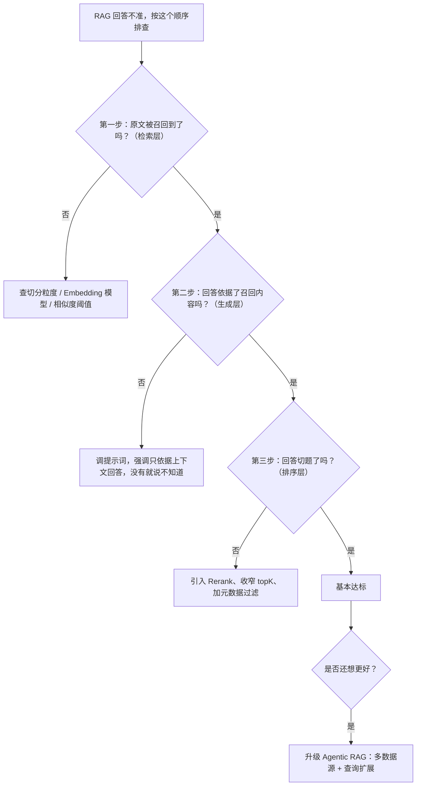

# 20 RAG 进阶调优

> RAG 跑通之后，"回答不准"这件事怎么系统性地排查和调优。从切分、检索到混合检索、Rerank、Query 改写，再到评测指标与生产踩坑清单。

## 本篇要解决的问题

上一章解决了"能不能跑起来"。这一章解决跑起来之后最常听到的一句评价：**"你这机器人回答得不准啊。"**

这句话背后可能是五种完全不同的问题：文档没切好、向量没召回、召回了但排序靠后、召回了但模型没看、或者压根不该走 RAG。搞清楚是哪一种，比盲目调 `topK` 有用得多。

::: tip 本篇立场
所有示例代码仍然**只用 Elasticsearch 一种向量库**（8.x）。混合检索、RRF 融合都是在 ES 内部完成的，不需要引入第二个向量库。
:::

## 一、先定位：回答不准时到底是谁的锅

很多团队一上来就调 `topK`、换 prompt，结果越调越乱。正确做法是**先定位问题属于哪一层**，再动手。



这套顺序的价值在于：**绝大多数"回答不准"，根因都在第一步 —— 压根没召回到**。没召回到，后面生成和排序调得再花哨也是白搭。所以先去看检索，别急着怪模型。

## 二、传统 RAG 的三个局限

先看清楚问题。传统流程是「用户提问 → 向量库检索 → 拼进提示词 → 生成」，它有三个结构性缺陷：

1. **数据源单一** —— 只能从一个知识库里捞，缺乏网页搜索、业务 API 等其他来源，覆盖面不够。
2. **检索严重依赖用户输入** —— 直接用原始问题去检索。用户问得含糊、用词和专业文档不一致，就召回不到想要的内容。
3. **没有反馈机制** —— 检索结果好不好，中间没有任何判断环节，直接就丢给了模型，错了也不重试。

针对这三点，Agentic RAG 的应对：

| 局限 | Agentic RAG 的解法 |
| --- | --- |
| 数据源单一 | 给 Agent 挂载多个工具／MCP 服务，让它能并行查网页、第三方平台、业务 API |
| 依赖用户输入 | 用大模型做**查询扩展**，把一个问题改写成多个角度分别检索 |
| 没有反馈 | 引入**检索结果评估**，判断召回内容是否足够回答，不够就带着反馈重新检索 |

核心转变一句话：**检索不再是固定的前置步骤，而是 Agent 可以反复调用、自我纠偏的一个动作。** 在 Spring AI Alibaba 里，就是把检索包装成 Tool，由 ReactAgent 决定要不要调用、要不要换个关键词重试。

## 三、第一道关卡：文档切分

::: warning 这是最容易被低估的环节
分块质量直接决定召回质量的上限 —— **后面的模型再好也救不回来**。如果你发现模型老是"话说一半"，或者答非所问，第一件该做的事是回去看切分，而不是换模型。
:::

### 3.1 常见切分策略

| 策略 | 做法 | 适用 |
| --- | --- | --- |
| 按固定长度切 | 每 N 个 token 一刀切，配 overlap 重叠 | 通用，最常用，本专栏默认 |
| 语义分块 | 按段落／句子边界切，保证块内语义连贯 | 叙述性长文，避免把一句话拦腰截断 |
| 树状分块 | 把章、节、小节组装成树后入库 | 结构严谨的长文档（说明书、规范），能感知"A 章节"和"a 小节"的从属 |
| 压缩存储 | 用大模型把大段文字提炼成摘要再入库 | 原文冗余度高时，降低低相关内容对模型的干扰 |

### 3.2 经验值

- **chunk size 不是越小越好**。过小导致答案残缺，过大导致召回的内容里只有一小段有用，反而稀释了重点。中文场景建议先从 **300～500 token** 起步。
- **一定要设置 overlap（重叠）**。按固定长度硬切会把一句话拦腰截断，overlap 让相邻块有重叠，可以救回一部分被切断的语义。常用 10%～20% 的块大小作为重叠。
- **元数据是刚需**。给每个块打上来源文件名、章节、更新时间等元数据，后面做过滤（尤其多租户隔离）全靠它。

```java
package com.example.saa.rag.config;

import org.springframework.ai.transformer.splitter.TokenTextSplitter;
import org.springframework.context.annotation.Bean;
import org.springframework.context.annotation.Configuration;

/**
 * 切分器配置。集中管理 chunk 经验值，方便统一调优。
 */
@Configuration
public class SplitterConfig {

    @Bean
    public TokenTextSplitter tokenTextSplitter() {
        return TokenTextSplitter.builder()
                .withChunkSize(400)                  // 每块约 400 token，中文从 300~500 起步
                .withMinChunkLengthToEmbed(50)       // 太短的碎片丢弃，避免噪声
                // TokenTextSplitter 内部默认带重叠，无需额外开关；
                // 若使用按字符/按行的切分器，请显式设置 overlap 参数
                .build();
    }
}
```

## 四、第二道关卡：Embedding 模型选择与维度

向量本质上是在用 Embedding 模型理解语义，模型选错了，检索再怎么调都是白费。

- **中文场景优先选中文优化过的模型**。用只针对英文训练的模型处理中文，语义表征能力会明显下降。
- **注意输出维度**。不同模型维度不同，切换模型意味着整个知识库必须重灌，一定要在项目早期定下来。
- **同一个库里不要混用模型**。不同模型产出的向量不在同一个空间，不可比。

在 Spring AI Alibaba 里，通过 DashScope 配置即可：

```yaml
spring:
  ai:
    dashscope:
      api-key: ${AI_DASHSCOPE_API_KEY}
      embedding:
        options:
          model: text-embedding-v3      # 阿里云百炼，中文优化
    vectorstore:
      elasticsearch:
        index-name: knowledge-index
        dimensions: 1024                # 必须和上面 Embedding 模型的输出维度一致
        similarity: cosine
        initialize-schema: true
```

::: danger 换模型 = 重建索引
改 `model` 的同时必须改 `dimensions`，并且**删掉 ES 里的旧索引重新灌一遍**。跨模型的向量不在同一个空间，混在一起检索的结果是不可信的。这件事一定要写进上线检查单。

DashScope `text-embedding-v3` 默认 **1024 维**，并支持 256 / 512 / 768 / 1024 等规格（在模型侧指定）。你选了哪个规格，`application.yml` 的 `dimensions` 和 ES mapping 的 `dims` 就要同步成哪个，**两者永远保持一致**。
:::

具体可用的 Embedding 模型和维度以百炼官方最新文档为准：<https://help.aliyun.com/zh/model-studio/>

## 五、第三道关卡：检索质量（三道关卡）

检索不是"一个向量查询"那么简单。生产里通常要叠三层过滤网：

```text
查询
  ├─ 关卡1：BM25 关键词检索   ─┐
  │   （型号/编号/人名的精确词面匹配）   ├── 关卡3：RRF 融合排序 ──→ 精排候选 ──→ Top-N 给模型
  └─ 关卡2：kNN 向量检索     ─┘
      （语义相似、同义表述）
```

### 5.1 关卡 1：BM25 关键词检索

对专有名词、型号、编号、人名这类**精确词面匹配**极强，而这恰恰是向量检索最容易翻车的地方。比如用户搜"型号 XQ-2024A 的参数是什么"，向量检索可能召回一堆语义相近但型号不对的文档，BM25 却能精准命中。

ES 的 BM25 就是标准的 `match` 全文检索，作用在 `content` 字段上，不需要任何额外配置。

### 5.2 关卡 2：kNN 向量检索

对语义相似、同义表述有优势。这就是 `ElasticsearchVectorStore` 默认走的通路，由 `similarityThreshold` + `topK` 控制：

```java
package com.example.saa.rag.config;

import org.springframework.ai.chat.client.advisor.Advisor;
import org.springframework.ai.rag.advisor.RetrievalAugmentationAdvisor;
import org.springframework.ai.rag.retrieval.search.VectorStoreDocumentRetriever;
import org.springframework.ai.vectorstore.VectorStore;
import org.springframework.context.annotation.Bean;
import org.springframework.context.annotation.Configuration;

@Configuration
public class RetrieverConfig {

    /**
     * 纯向量检索的 RAG Advisor。
     * similarityThreshold 比 topK 更重要：它决定"没把握时能不能拒答"。
     */
    @Bean
    public Advisor vectorRagAdvisor(VectorStore vectorStore) {
        return RetrievalAugmentationAdvisor.builder()
                .documentRetriever(VectorStoreDocumentRetriever.builder()
                        .vectorStore(vectorStore)
                        .topK(5)                  // 先从 4~6 起步，别贪大
                        .similarityThreshold(0.7) // 低于 0.7 不要，过滤噪声
                        .build())
                .build();
    }
}
```

- `topK` 不是越大越好。塞 20 个片段进去，不仅烧 Token，还会把正确答案淹没在噪声里。**先从 4～6 起步**。
- `similarityThreshold` 一定要设。不设的话，问任何问题都会返回"最像的那几个"，模型就只能硬答。

### 5.3 关卡 3：混合检索 + RRF 融合（ES 的独特优势）

这是选择 Elasticsearch 做向量库的**最大收益**。向量召回快但粗，BM25 精确但不懂语义，两者用 **RRF（Reciprocal Rank Fusion，倒数排名融合）** 融合排序，效果通常明显优于任何单一检索。

`ElasticsearchVectorStore` 默认走的是**纯 kNN 向量检索**；混合检索 + RRF 需要在 ES 侧用原生查询完成。下面这份查询体可以直接通过 ES 的 `_search` 接口执行，是 ES 8.x 做 RRF 融合的标准写法：

```json
GET /knowledge-index/_search
{
  "size": 10,
  "query": {
    "match": {
      "content": {
        "query": "XQ-2024A 型号的参数是什么"
      }
    }
  },
  "knn": {
    "field": "embedding",
    "query_vector_builder": {
      "text_embedding": {
        "model_id": "your-es_model_id",
        "model_text": "XQ-2024A 型号的参数是什么"
      }
    },
    "k": 10,
    "num_candidates": 100
  },
  "rank": {
    "rrf": {
      "window_size": 100,
      "rank_constant": 20
    }
  }
}
```

```text
说明：
- query.match        → BM25 关键词分支（精确匹配型号/编号）
- knn                → 向量分支（语义相似）
- rank.rrf           → 把两个分支的排名融合成一个，RRF 不依赖分数绝对值，只认排名
- 两个分支召回的文档，按 RRF 公式重新打分后取 Top-N
```

拿到融合结果后给模型，召回质量会显著优于单一向量检索。要在 Java 里落地，可以通过 `ElasticsearchVectorStore.getNativeClient()` 拿到原生 `ElasticsearchClient`，执行上面的混合查询，再包成自定义的 `VectorStore` 或 `DocumentRetriever`：

```java
package com.example.saa.rag.retriever;

import org.springframework.ai.vectorstore.elasticsearch.ElasticsearchVectorStore;
import org.springframework.ai.vectorstore.VectorStore;

import java.util.Optional;

/**
 * 通过 getNativeClient() 拿到底层 ES 客户端，执行混合检索 + RRF。
 * 说明：原生 co.elastic.clients Java DSL 较长且随版本演进，
 * 工程上建议把上面那段 JSON 查询用 RestClient 直接发，或用原生 ElasticsearchClient 组装。
 * 具体 DSL 写法以你所用 ES 版本的官方文档为准：
 * https://www.elastic.co/guide/en/elasticsearch/reference/current/rrf.html
 */
public class HybridSearchHelper {

    public void showNativeClient(VectorStore vectorStore) {
        if (vectorStore instanceof ElasticsearchVectorStore esStore) {
            Optional<?> nativeClient = esStore.getNativeClient();
            // nativeClient 是 co.elastic.clients.elasticsearch.ElasticsearchClient
            // 用它执行上面 JSON 里的 knn + query + rank.rrf 混合查询即可
            nativeClient.ifPresent(client -> {
                // 这里执行你的混合检索查询（按 ES 版本官方文档组装）
            });
        }
    }
}
```

::: warning 别指望改个配置就自动变混合检索
Spring AI 的 `ElasticsearchVectorStore` 当前走纯 kNN。混合检索 + RRF 必须由你**在 ES 侧写查询**（如上 JSON），或通过原生客户端实现。框架不会因为你配了什么就自动融合 BM25 和向量 —— 这是 ES 的能力，不是 Spring AI 的开关。
:::

纯关键词场景的替代做法更简单：这类需求压根不该走向量，直接用 ES 的全文检索去查即可，连 Embedding 都省了。

### 5.4 用元数据过滤收窄范围

多租户、多业务线场景下，元数据过滤是**安全底线**而不是优化项：

```java
VectorStoreDocumentRetriever.builder()
        .vectorStore(vectorStore)
        .topK(5)
        .filterExpression("tenantId == 't001' && docType == 'policy'")
        .build();
```

靠语义相似度是拦不住跨租户泄漏的，必须用 `filterExpression` 强制隔离。

## 六、Rerank 重排

检索召回一坨候选后，Top-N 里正确答案可能排在后面。Rerank（重排）用一个更强的模型，对候选做一次"谁最相关"的精排，把最相关的顶到最前面再给大模型。

### 6.1 为什么需要它

kNN / RRF 解决的是"召回面够不够广"，但**排名不一定准**。Rerank 在生成前再加一道"相关性裁判"，专门解决"召回到了但排在后面，模型没看到"的问题。

### 6.2 在 Spring AI 里怎么落地

`RetrievalAugmentationAdvisor` 支持 `documentPostProcessors`，让你在检索后、生成前插入重排逻辑。Spring AI 提供了 `DocumentPostProcessor` 接口：

```java
package com.example.saa.rag.rerank;

import org.springframework.ai.document.Document;
import org.springframework.ai.rag.Query;
import org.springframework.ai.rag.postretrieval.document.DocumentPostProcessor;

import java.util.List;

/**
 * 自定义重排处理器。
 *
 * 做法：把用户问题和候选文档交给一个 rerank 模型打分，按分数从高到低重排。
 * rerank 模型的接入（本地或云端）抽象在 RerankService 里，见下方说明。
 */
public class RerankDocumentPostProcessor implements DocumentPostProcessor {

    private final RerankService rerankService;
    private final int topN;

    public RerankDocumentPostProcessor(RerankService rerankService, int topN) {
        this.rerankService = rerankService;
        this.topN = topN;
    }

    @Override
    public List<Document> process(Query query, List<Document> documents) {
        // ① 调用 rerank 模型，返回每个文档的相关性分数
        List<ScoredDoc> scored = rerankService.rerank(query.text(), documents);
        // ② 按分数降序排列，只保留前 topN 个
        return scored.stream()
                .sorted((a, b) -> Double.compare(b.score, a.score))
                .limit(topN)
                .map(s -> s.document)
                .toList();
    }

    /** rerank 模型返回的结果载体 */
    public record ScoredDoc(Document document, double score) {}
}
```

把重排器挂到 Advisor 上：

```java
package com.example.saa.rag.config;

import com.example.saa.rag.rerank.RerankDocumentPostProcessor;
import com.example.saa.rag.rerank.RerankService;
import org.springframework.ai.chat.client.advisor.Advisor;
import org.springframework.ai.rag.advisor.RetrievalAugmentationAdvisor;
import org.springframework.ai.rag.retrieval.search.VectorStoreDocumentRetriever;
import org.springframework.ai.vectorstore.VectorStore;
import org.springframework.context.annotation.Bean;
import org.springframework.context.annotation.Configuration;

@Configuration
public class RerankConfig {

    /**
     * 带重排的 RAG Advisor：先粗召回（topK=20），再重排取 topN=5 给模型。
     * 粗召回放宽、精排收紧，是业界标准做法。
     */
    @Bean
    public Advisor rerankRagAdvisor(VectorStore vectorStore, RerankService rerankService) {
        return RetrievalAugmentationAdvisor.builder()
                .documentRetriever(VectorStoreDocumentRetriever.builder()
                        .vectorStore(vectorStore)
                        .topK(20)                  // 先多召回一些，给重排留空间
                        .similarityThreshold(0.5)
                        .build())
                .documentPostProcessors(new RerankDocumentPostProcessor(rerankService, 5))
                .build();
    }
}
```

### 6.3 重排模型怎么选（可落地的两种方案）

| 方案 | 做法 | 适合 |
| --- | --- | --- |
| **本地重排模型** | 部署 BGE-Reranker 等开源重排模型（ONNX / Transformers），本地推理 | 数据敏感、不愿出公网、QPS 高 |
| **云端 rerank 服务** | 调用百炼或第三方提供的 rerank 接口，传入 query + 候选文档，返回分数 | 快速验证、不想运维模型 |

`RerankService` 的具体 API 因你选用的模型/服务而异（本地推理框架或云端 rerank 接口的报文格式各不相同），**动手前以你所用 provider 的官方文档为准**，把"传入 query + 文档列表、返回分数"这一步接好即可，外层 `DocumentPostProcessor` 的结构不变。

::: tip 重排的代价
重排会**多一次模型调用**，带来额外延迟和费用。只在政策制度、医疗法律、合同审查这类"准确率压倒一切"的场景才值得上。一般业务用 RRF 融合 + 合理阈值已经够用。
:::

## 七、Query 改写与多查询

在检索之前加工一下用户的问题，往往比调各种检索参数见效更快 —— 因为根因常在"用户问的和文档写的不是一套词"。

### 7.1 三种加工

| 加工 | 解决什么 | Spring AI 组件 |
| --- | --- | --- |
| 查询改写 Rewrite | 用户问得含糊/有歧义，先改写成清晰的检索句 | `RewriteQueryTransformer` |
| 多查询扩展 Multi-Query | 用户用词和文档不一致，一个变多个角度分别检索再合并 | `MultiQueryExpander` |
| 查询压缩 Compression | 多轮对话里把冗长历史和追问压缩成一句独立检索句 | `CompressionQueryTransformer` |

### 7.2 代码：查询改写

```java
package com.example.saa.rag.config;

import org.springframework.ai.chat.client.ChatClient;
import org.springframework.ai.chat.client.advisor.Advisor;
import org.springframework.ai.rag.advisor.RetrievalAugmentationAdvisor;
import org.springframework.ai.rag.retrieval.search.VectorStoreDocumentRetriever;
import org.springframework.ai.rag.transformer.query.RewriteQueryTransformer;
import org.springframework.ai.vectorstore.VectorStore;
import org.springframework.context.annotation.Bean;
import org.springframework.context.annotation.Configuration;

@Configuration
public class RewriteConfig {

    /**
     * 带查询改写的 RAG Advisor。
     * 检索前先用大模型把用户问题改写得更适合检索。
     *
     * 注意：RewriteQueryTransformer 内部会再调一次模型，
     * 建议用低 temperature（0.0）保证改写稳定可复现。
     */
    @Bean
    public Advisor rewriteRagAdvisor(VectorStore vectorStore, ChatClient.Builder chatClientBuilder) {
        return RetrievalAugmentationAdvisor.builder()
                .queryTransformers(RewriteQueryTransformer.builder()
                        .chatClientBuilder(chatClientBuilder.build().mutate()) // 低 temperature 的 Builder
                        .build())
                .documentRetriever(VectorStoreDocumentRetriever.builder()
                        .vectorStore(vectorStore)
                        .similarityThreshold(0.6)
                        .topK(5)
                        .build())
                .build();
    }
}
```

### 7.3 代码：多查询扩展

```java
package com.example.saa.rag.config;

import org.springframework.ai.chat.client.ChatClient;
import org.springframework.ai.chat.client.advisor.Advisor;
import org.springframework.ai.rag.advisor.RetrievalAugmentationAdvisor;
import org.springframework.ai.rag.query.expander.MultiQueryExpander;
import org.springframework.ai.rag.retrieval.search.VectorStoreDocumentRetriever;
import org.springframework.ai.vectorstore.VectorStore;
import org.springframework.context.annotation.Bean;
import org.springframework.context.annotation.Configuration;

@Configuration
public class MultiQueryConfig {

    /**
     * 多查询扩展：把一个问题生成 3 个角度，分别检索后合并结果，提升召回 breadth。
     * includeOriginal(true) 保留原问题，避免改写后丢失原意。
     */
    @Bean
    public Advisor multiQueryRagAdvisor(VectorStore vectorStore, ChatClient.Builder chatClientBuilder) {
        MultiQueryExpander expander = MultiQueryExpander.builder()
                .chatClientBuilder(chatClientBuilder.build().mutate())
                .numberOfQueries(3)
                .includeOriginal(true)
                .build();

        return RetrievalAugmentationAdvisor.builder()
                .queryExpander(expander)
                .documentRetriever(VectorStoreDocumentRetriever.builder()
                        .vectorStore(vectorStore)
                        .similarityThreshold(0.5)
                        .topK(5)
                        .build())
                .build();
    }
}
```

### 7.4 代码：查询压缩（多轮对话）

```java
package com.example.saa.rag.config;

import org.springframework.ai.chat.client.ChatClient;
import org.springframework.ai.chat.messages.AssistantMessage;
import org.springframework.ai.chat.messages.UserMessage;
import org.springframework.ai.rag.Query;
import org.springframework.ai.rag.transformer.query.CompressionQueryTransformer;
import org.springframework.ai.vectorstore.VectorStore;

import java.util.List;

/**
 * 演示查询压缩：把"多轮历史 + 追问"压成一句独立检索句。
 * 例如历史里说过"Django"，用户追问"它的 ORM 怎么用"，
 * 压缩后得到"Django 的 ORM 怎么用"，检索才找得到。
 */
public class CompressionDemo {

    public Query compress(ChatClient.Builder chatClientBuilder, String followUp,
                          String capital, String answer) {
        CompressionQueryTransformer transformer = CompressionQueryTransformer.builder()
                .chatClientBuilder(chatClientBuilder.build().mutate())
                .build();

        Query query = Query.builder()
                .text(followUp)   // 例如："它的 ORM 怎么用？"
                .history(         // 把前面轮次塞进 history，压缩器据此补全指代
                        new UserMessage("什么是 Django？"),
                        new AssistantMessage(capital + " 是一个 Python Web 框架。"))
                .build();

        return transformer.transform(query); // 返回补全后的独立检索句
    }
}
```

::: tip 三种加工都多一次模型调用
Query 改写/扩展/压缩本质上都是"先让模型处理一下问题再检索"，**每次都会增加延迟和费用**。它们解决的是"召回不到"这类根因问题，比盲目调 topK 划算，但别无脑全开 —— 先用评测集（见第八节）确认哪道关卡是瓶颈，再决定开哪个。
:::

## 八、效果评估指标体系

调到这里，你需要一个客观尺度，否则永远在"感觉好像好了一点"。

### 8.1 三个核心指标

**最小可行做法**：准备 20～50 条典型问题，配上人工标注的标准答案（或标准答案依据的原文块 ID），跑完自动对比。重点看三个指标：

| 指标 | 衡量什么 | 怎么算 | 重要性 |
| --- | --- | --- | --- |
| **召回率 Recall@K** | 标准答案依据的那段原文，是否出现在检索结果里 | 命中块数 / 总问题数 | ★★★ 最高，召回不到后面全白搭 |
| **忠实度 Faithfulness** | 回答内容是否能在检索到的材料里找到依据 | 用模型判"回答每句是否可溯源" | ★★ 衡量幻觉 |
| **答案相关性** | 回答是否真的回应了用户问题 | 用模型判"回答是否切题" | ★★ 衡量跑题 |

### 8.2 一个最小评测集骨架

```java
package com.example.saa.rag.eval;

import org.springframework.ai.vectorstore.SearchRequest;
import org.springframework.ai.vectorstore.VectorStore;
import org.springframework.ai.document.Document;

import java.util.List;

/**
 * 最小评测：只验证"召回率"这一项（最关键的指标）。
 *
 * 用法：准备一份 ground-truth.csv，每行是「问题, 期望命中的原文块ID」，
 * 跑一遍，统计有多少问题能召回到期望的块。
 */
public class RecallEval {

    private final VectorStore vectorStore;

    public RecallEval(VectorStore vectorStore) {
        this.vectorStore = vectorStore;
    }

    /**
     * 判断某个期望块是否被召回到。
     *
     * @param question   评测问题
     * @param expectDocId 期望命中的文档块 ID
     * @return 是否召回到
     */
    public boolean hit(String question, String expectDocId) {
        List<Document> hits = vectorStore.similaritySearch(
                SearchRequest.builder()
                        .query(question)
                        .topK(5)
                        .similarityThreshold(0.5)
                        .build());
        // 只要期望块出现在 Top-5 里，就算召回成功
        return hits.stream().anyMatch(d -> d.getId().equals(expectDocId));
    }

    /** 汇总：打印整体召回率 */
    public void report(List<QuestionAnswer> cases) {
        long hitCount = cases.stream()
                .filter(c -> hit(c.question(), c.expectDocId()))
                .count();
        double recall = (double) hitCount / cases.size();
        System.out.printf("Recall@5 = %.2f (%d/%d)%n", recall, hitCount, cases.size());
    }

    /** 评测用例载体 */
    public record QuestionAnswer(String question, String expectDocId) {}
}
```

忠实度和相关性通常需要再调一次大模型来打分（把"回答"和"召回材料"喂给裁判模型，让它判是否可溯源、是否切题），外层循环和上面的 `report` 类似，只是把 `hit` 换成"调用裁判模型"。具体裁判 prompt 以你所用版本文档为准。

### 8.3 评测集怎么搭

1. 从真实用户提问里抽 20～50 条（别自己拍脑袋编，要贴近真实分布）。
2. 每条人工标注：期望命中的原文块（召回率用）、标准答案（相关性用）。
3. 每次改了切分/阈值/检索策略，**先跑评测集对比数字**，再决定是否上线。
4. 把评测集固化进 CI，避免回归。

::: tip 没有评测集 = 玄学调优
"感觉好像好一点"是最危险的优化状态。所有切分、阈值、重排的改动，**都必须用评测集的数字说话**，否则只是在互相抵消。
:::

## 九、生产环境踩坑清单

| # | 坑 | 症状 | 怎么避免 |
| --- | --- | --- | --- |
| 1 | Embedding 维度不匹配 | 写入报错，或检索永远召回不到 | 让 `dimensions` 与模型输出严格一致；换模型必改 |
| 2 | 换 Embedding 模型未重灌 | 新文档能检索到，老文档检索不到 | 换模型 = 重建全量索引，写进上线检查单 |
| 3 | 切分过粗 / 无 overlap | 回答"话说一半"或引错上下文 | 调整 chunk size，务必设置重叠 |
| 4 | topK 过大 | 答案被噪声淹没，Token 成本飙升 | 从 4～6 起步，靠评测集调整 |
| 5 | 没设相似度阈值 | 什么问题都能答，但经常是编的 | 必须设阈值，允许答"不知道" |
| 6 | 无元数据过滤 | 多租户数据串泄 | 元数据打标 + 强制 `filterExpression`，值来自服务端 |
| 7 | 用向量检索做精确匹配 | 搜型号、编号、人名永远不准 | 这类需求交给 ES 的 BM25 全文检索，或上混合检索 |
| 8 | 缺 `spring-ai-rag` 依赖 | 编译报找不到 `RetrievalAugmentationAdvisor` | pom 显式加 `spring-ai-rag` |
| 9 | 把评测当玄学 | 改了策略说不清有没有变好 | 固化评测集，每次改动对比数字 |
| 10 | 本地关了 ES 安全认证直接上生产 | 知识库被全网扫、数据泄露 | 云端必须账号密码 + 白名单，绝不暴露公网 |

## 本篇小结

- **RAG 调优的第一步永远是定位**：是没召回、召回了没用上、还是排序靠后。绝大多数"不准"根因在第一步。
- **切分质量是天花板**，chunk size + overlap + 元数据，值得花最多时间。
- **阈值必须设**，让 Agent 敢于说"不知道"，这比编一个漂亮的答案重要。
- **检索三道关卡**：BM25 管精确词面、kNN 管语义、RRF 融合两者 —— 这是 ES 的独特优势，混合检索在 ES 侧用原生查询实现。
- **Rerank 和 Query 改写/扩展**是召回后的精排与召回前的加工，都多一次模型调用，按评测集瓶颈决定开哪个。
- 传统 RAG 的三个局限，靠 **Agentic RAG**（多源工具、查询扩展、检索评估回流）来破，这也正好回到 SAA 的主线。
- 最后一定要有**评测集**，否则所有优化都是玄学。

## 参考链接

- Spring AI RAG 模块文档：<https://docs.spring.io/spring-ai/reference/api/retrieval-augmented-generation.html>
- Elasticsearch RRF 融合检索：<https://www.elastic.co/guide/en/elasticsearch/reference/current/rrf.html>
- Elasticsearch kNN 检索：<https://www.elastic.co/guide/en/elasticsearch/reference/current/knn-search.html>
- 百炼 Embedding 模型文档：<https://help.aliyun.com/zh/model-studio/>
- 百炼平台 RAG 文档：<https://help.aliyun.com/product/2400256.html>
- 官网文档：<https://java2ai.com/>

下一篇 → [21 可观测性与评估](/java/saa/observability)
