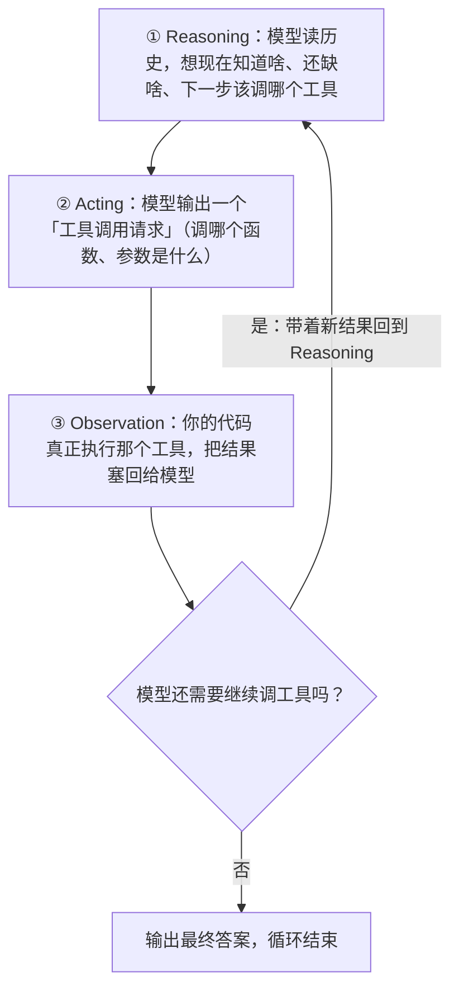

# 10 ReactAgent

> 前面几章我们让模型「会说」，这一章给它装上「手和脑」：让模型自己思考该不该调工具、调哪个、拿到结果后接着想，直到把事办成。这就是 ReactAgent —— Spring AI Alibaba 里最常用、也最该先吃透的智能体。

## 本篇要解决的问题

读完这篇，你应该能独立写出一个会自己调工具的 Agent，并且搞懂下面这些事：

- **ReAct 范式到底是什么**：模型是怎么「边想边做」的，为什么它比「一问一答」强
- **ReactAgent 怎么搭**：`ReactAgent.builder()` 每个配置项各自是干嘛的
- **怎么给它绑工具**：让它能查天气、查订单、调你的业务接口
- **怎么要结构化输出**：让模型直接吐出 Java 对象，而不是一段飘忽的自然语言
- **怎么在关键环节插手**：拦截器（Interceptor）和钩子（Hook）分别在哪几个点能改东西
- **怎么流式输出**、以及它和「直接用 ChatClient」到底差在哪
- **新手最容易踩的 4 个坑**：工具不调用、死循环、结构化解析失败、上下文失控

::: tip 先建立一句心智模型
ReactAgent = ChatClient + 一套「推理→调工具→看结果→再推理」的自动循环。你不用自己写 `while` 循环去反复问模型，框架帮你把这套循环跑起来了。
:::

## 一、ReAct 范式是什么（先把范式讲透）

### 1.1 一个通俗比喻：侦探查案

想象一个侦探在破案，但他不能自己出门，只能「打电话问线人」。

- **Reasoning（推理）**：侦探在脑子里盘算——「要搞清楚死者身份，我得先查监控录像」。
- **Acting（行动）**：他打电话给线人（= 调用工具）：「帮我调一下昨晚 8 点的监控。」
- **Observation（观察）**：线人回话：「监控显示他进了 3 号仓库。」
- 然后侦探**基于这个新信息再推理**：「进 3 号仓库……那得查仓库的门禁记录。」→ 再行动 → 再观察……

直到侦探觉得信息够了，才开口给出最终结论。

大模型干的事一模一样，只是「线人」换成了你写的工具函数（查天气、查数据库、调 API）。**ReAct 就是把「推理 / 行动 / 观察」这三步串成一个循环**，模型在其中反复横跳，直到能回答你的问题。

### 1.2 Reasoning → Acting → Observation 循环

循环流程如下：



关键点：**模型自己决定要不要调工具、调哪个、参数是什么**。你只负责「把工具备好 + 真正执行工具 + 把结果还回去」。

### 1.3 一问一答的完整轨迹示例

场景：用户问「北京今天天气怎么样，适合穿什么？」下面这段是 Agent 内部真实会发生的事（伪轨迹，便于理解）：

```text
用户：北京今天天气怎么样，适合穿什么？

── 第 1 轮循环 ──
[Reasoning] 我不知道北京今天的天气，得先查一下。我手上有 getWeather 工具。
[Acting]    调用 getWeather(city="北京")
[Observation] 工具返回：「北京 晴，22°C，微风」

── 第 2 轮循环 ──
[Reasoning] 现在我知道北京 22°C 晴天，可以给出穿衣建议了，不需要再调工具。
[最终回答] 「北京今天晴，22°C，微风。建议穿薄外套或长袖衬衫，早晚稍凉可加一件。」
```

注意这几件事：

1. **模型不是一次性想好的**，而是「想一步→做一步→看结果→再想」。
2. **工具是模型主动选的**，不是你 if-else 写死的。你只声明了「我有 getWeather 这个能力」。
3. **每一轮都把上一轮的工具结果带回去了**，所以模型才能基于新信息继续推理。
4. **模型自己判断「够了，可以收工」**——当它不再输出工具调用时，循环结束。

::: tip 为什么这比「一问一答」强
纯 ChatClient 模式下，模型只能「说」，不能「做」。它如果不知道实时天气，就会一本正经地编一个。ReAct 让模型先去查证再回答，幻觉大幅减少，还能对接你公司的真实数据和业务。
:::

### 1.4 循环会不会停不下来？

会。模型有时调完一个工具又调一个，没完没了。ReactAgent 内部有**最大迭代次数（maxIterations，默认 10）**兜底，到了上限就强制收尾。后面的「常见问题」会专门讲这个坑。

## 二、Spring AI Alibaba 里的 ReactAgent 长什么样

### 2.1 三句话理解 ReactAgent

- 它是对 **Graph（状态图）+ ChatModel** 的一层高层封装，本质是一个「带工具调用循环的图」。
- 你用 `ReactAgent.builder()` 声明它的**名字、模型、指令、工具、输出格式**。
- 调用时，它自动跑 ReAct 循环，你拿到最终答案（或中间状态）。

### 2.2 完整 pom.xml

```xml
<?xml version="1.0" encoding="UTF-8"?>
<project xmlns="http://maven.apache.org/POM/4.0.0"
         xmlns:xsi="http://www.w3.org/2001/XMLSchema-instance"
         xsi:schemaLocation="http://maven.apache.org/POM/4.0.0
         https://maven.apache.org/xsd/maven-4.0.0.xsd">

    <modelVersion>4.0.0</modelVersion>

    <parent>
        <groupId>org.springframework.boot</groupId>
        <artifactId>spring-boot-starter-parent</artifactId>
        <version>3.5.5</version>
        <relativePath/>
    </parent>

    <groupId>com.example</groupId>
    <artifactId>saa-react-demo</artifactId>
    <version>1.0.0</version>

    <properties>
        <java.version>17</java.version>
        <spring-ai.version>1.1.2</spring-ai.version>
        <spring-ai-alibaba.version>1.1.2.0</spring-ai-alibaba.version>
    </properties>

    <dependencies>
        <!-- Web 能力，提供 HTTP 接口 -->
        <dependency>
            <groupId>org.springframework.boot</groupId>
            <artifactId>spring-boot-starter-web</artifactId>
        </dependency>

        <!-- DashScope  starter：自动配置通义千问的 ChatModel -->
        <dependency>
            <groupId>com.alibaba.cloud.ai</groupId>
            <artifactId>spring-ai-alibaba-starter-dashscope</artifactId>
        </dependency>

        <!-- Agent Framework：ReactAgent / 多 Agent 编排都在这里面
             注意：部分版本里该类已随 starter 传递引入；
             若编译报找不到 ReactAgent，再显式加这一行。版本由下方 BOM 统一管理 -->
        <dependency>
            <groupId>com.alibaba.cloud.ai</groupId>
            <artifactId>spring-ai-alibaba-agent-framework</artifactId>
        </dependency>
    </dependencies>

    <dependencyManagement>
        <dependencies>
            <!-- 两个 BOM 统一管理版本，避免 Spring AI 各模块互相打架 -->
            <dependency>
                <groupId>org.springframework.ai</groupId>
                <artifactId>spring-ai-bom</artifactId>
                <version>${spring-ai.version}</version>
                <type>pom</type>
                <scope>import</scope>
            </dependency>
            <dependency>
                <groupId>com.alibaba.cloud.ai</groupId>
                <artifactId>spring-ai-alibaba-bom</artifactId>
                <version>${spring-ai-alibaba.version}</version>
                <type>pom</type>
                <scope>import</scope>
            </dependency>
        </dependencies>
    </dependencyManagement>

    <build>
        <plugins>
            <plugin>
                <groupId>org.springframework.boot</groupId>
                <artifactId>spring-boot-maven-plugin</artifactId>
            </plugin>
        </plugins>
    </build>
</project>
```

### 2.3 application.yml

```yaml
spring:
  application:
    name: saa-react-demo
  ai:
    dashscope:
      # 从环境变量读取，绝不写死在代码里
      api-key: ${AI_DASHSCOPE_API_KEY}
      chat:
        options:
          model: qwen-plus
          temperature: 0.7
          max-tokens: 2048

server:
  port: 8080

logging:
  level:
    # 想看清 Agent 内部每一步（推理/工具调用），打开这个包的 DEBUG
    com.alibaba.cloud.ai: DEBUG
```

### 2.4 第一个 Agent（Hello World）

路径：`src/main/java/com/example/saa/react/HelloAgentController.java`

```java
package com.example.saa.react;

import com.alibaba.cloud.ai.graph.agent.ReactAgent;
import org.springframework.ai.chat.messages.AssistantMessage;
import org.springframework.ai.chat.messages.UserMessage;
import org.springframework.ai.chat.model.ChatModel;
import org.springframework.web.bind.annotation.GetMapping;
import org.springframework.web.bind.annotation.RequestMapping;
import org.springframework.web.bind.annotation.RequestParam;
import org.springframework.web.bind.annotation.RestController;

/**
 * 最小可运行的 ReactAgent 示例。
 *
 * 关键点：ReactAgent 需要 ChatModel，Spring Boot 引入 dashscope starter 后
 * 会自动创建一个 ChatModel Bean，我们直接注入即可（构造器注入）。
 */
@RestController
@RequestMapping("/api/react")
public class HelloAgentController {

    private final ReactAgent helloAgent;

    // 注入 Spring 自动配置好的 ChatModel
    public HelloAgentController(ChatModel chatModel) {
        // builder 模式声明 Agent 的「名字 + 模型 + 指令」
        this.helloAgent = ReactAgent.builder()
                .name("hello_agent")                       // Agent 的名字，调试日志里能看到
                .model(chatModel)                           // 绑定的大模型
                .instruction("你是一个友好的助手，用简体中文回答。") // 系统指令（也可写 systemPrompt）
                .build();
    }

    /**
     * 调用方式一：call(UserMessage) 返回 AssistantMessage，再取文本。
     * 测试：curl "http://localhost:8080/api/react/ask?q=用一句话介绍ReactAgent"
     */
    @GetMapping("/ask")
    public String ask(@RequestParam String q) {
        // UserMessage 包装用户输入；call 内部自动跑 ReAct 循环
        AssistantMessage answer = helloAgent.call(new UserMessage(q));
        return answer.getText();
    }
}
```

启动后：

```bash
curl "http://localhost:8080/api/react/ask?q=用一句话介绍ReactAgent"
```

::: warning 这个例子还没用工具
上面这个 Agent 只是「会聊天的模型」，没有工具。它和裸 ChatClient 的区别还不明显。下一节给它装上工具，才是 ReactAgent 的真正价值。
:::

## 三、ReactAgent.builder() 完整配置项表

`ReactAgent.builder()` 返回的是一个 Builder，下面把常用配置项逐项列清。**必填的只有 `name` 和 `model`**，其余按需加。

| 配置项 | 类型 | 必填 | 作用 |
| --- | --- | --- | --- |
| `name` | String | ✅ | Agent 的唯一标识。用于日志、多 Agent 编排时引用、工具命名。建议用英文、见名知意 |
| `model` | `ChatModel` | ✅ | 绑定的大模型（这里是 DashScope 的 qwen-plus）。推理和工具选择都由它完成 |
| `description` | String | 否 | Agent 的「简历」。在多 Agent 路由/主管模式下，控制器靠它判断「该不该调这个 Agent」，**写得越清楚路由越准** |
| `instruction` | String | 否 | 系统指令（人话版 system prompt）。告诉模型你是谁、该怎么做。**支持占位符** `{input}`、`{outputKey}`（多 Agent 时重要） |
| `systemPrompt` | String | 否 | 与 `instruction` 二选一，语义相同，都是设定系统角色。社区里两种写法都有，选一个用到底即可 |
| `tools` | `ToolCallback...` / `List` / 含 `@Tool` 的对象 | 否 | 绑定工具。可以传「带 `@Tool` 注解的工具类实例」，也可以传 `AgentTool.getFunctionToolCallback(子Agent)`（把另一个 Agent 当工具）。**这是 Agent 能「做」事的关键** |
| `outputType` | `Class<?>` | 否 | 结构化输出：传一个 Java 类（POJO/record），框架自动生成 JSON Schema 让模型按格式输出，**类型安全，强烈推荐** |
| `outputSchema` | String | 否 | 手动给 JSON Schema 字符串。比 `outputType` 灵活但需自己维护，极端自定义格式才用 |
| `inputType` | `Class<?>` | 否 | 当本 Agent 被别的 Agent 当工具调用时，定义「别人传给我的参数结构」，框架自动转 JSON Schema |
| `inputSchema` | String | 否 | 同上，但用手写 JSON Schema 定义输入结构 |
| `outputKey` | String | 否 | 把本 Agent 的输出存进共享状态（OverAllState）的哪个 key。**多 Agent 编排靠它传话** |
| `outputKeyStrategy` | `KeyStrategy` | 否 | 输出写入状态时的策略，如 `ReplaceStrategy`（覆盖）/ `AppendStrategy`（追加）。默认一般是覆盖 |
| `includeContents` | boolean | 否 | 默认 `true`。作为子 Agent 时，是否把父流程的全部上下文带进来。`false` 可让子 Agent 专注自己的任务、省 Token |
| `returnReasoningContents` | boolean | 否 | 是否把中间推理过程也写进消息历史。想省 Token 就关掉，想看完整链路就打开 |
| `enableLogging` | boolean | 否 | **社区示例中常见**，用于开关 Agent 内部日志。**注意：该方法在不同版本间有出入**；若你所用版本编译报「找不到符号 enableLogging」，请用 `application.yml` 的 `logging.level.com.alibaba.cloud.ai=DEBUG` 来控制日志（详见文末「存疑 API 说明」） |
| `hooks` | `List<Hook>` / `Hook...` | 否 | 钩子，挂在图的节点上（如 beforeModel / afterModel / beforeAgent），用于人在回路、摘要压缩等 |
| `interceptors` | `List<Interceptor>` / `Interceptor...` | 否 | 拦截器（含 `ModelInterceptor`、`ToolInterceptor`）。框架会按类型自动分流到「模型调用」和「工具调用」两条链上 |
| `modelInterceptors` | `List<ModelInterceptor>` | 否 | 更精细地只挂模型拦截器（部分版本提供，与 `interceptors` 二选一风格） |
| `toolInterceptors` | `List<ToolInterceptor>` | 否 | 更精细地只挂工具拦截器（同上，版本相关） |
| `saver` | `BaseCheckpointSaver` | 否 | 检查点保存器，如 `new MemorySaver()`，用于持久化对话状态，支持断点续跑 |
| `maxIterations` | int | 否 | ReAct 循环的最大轮数，**默认 10**。设小一点可防死循环，但太小可能任务没做完就被截断 |
| `chatOptions` | `ChatOptions` | 否 | 覆盖模型参数（temperature、maxTokens 等） |

::: tip 新手最常漏的两项
1. 想让 Agent 干活却忘了 `tools(...)` —— 那它只能空想，什么都调不了。
2. 多 Agent 编排时忘了给子 Agent 设 `outputKey` —— 后面的 Agent 就拿不到前一个的输出。
:::

## 四、绑定工具 ToolCallback

工具是 Agent 与真实世界连接的桥梁。Spring AI 用 `@Tool` 注解声明「能力」，ReactAgent 通过 `tools(...)` 绑定。

### 4.1 定义工具类

路径：`src/main/java/com/example/saa/react/WeatherTools.java`

```java
package com.example.saa.react;

import org.springframework.ai.tool.annotation.Tool;
import org.springframework.ai.tool.annotation.ToolParam;

/**
 * 天气工具类。
 *
 * 用 @Tool 标注「这是一个可供模型调用的能力」，description 写得越清楚，
 * 模型越知道什么时候该调它、怎么传参。这一点在「常见问题」里会再强调。
 */
public class WeatherTools {

    /**
     * 查天气。
     *
     * @param city 城市名，@ToolParam 的 description 会被一并发给模型，
     *             帮它理解参数含义、正确填参
     */
    @Tool(description = "查询指定城市的当前天气，返回温度与天气状况。当用户问到天气时必须调用。")
    public String getWeather(
            @ToolParam(description = "城市名称，例如：北京、上海、Hangzhou") String city) {
        // 真实项目里这里调用气象局 API 或公司内部服务；
        // 这里用假数据演示「工具如何把结果交还给模型」
        return city + " 当前天气：晴，温度 22°C，微风，空气质量优。";
    }

    /**
     * 再给一个工具，演示 Agent 怎么在多个工具里做选择。
     */
    @Tool(description = "根据温度给出穿衣建议。输入一个温度数值（摄氏度）。")
    public String getDressAdvice(
            @ToolParam(description = "当前温度，单位摄氏度，例如 22") int temperature) {
        if (temperature >= 28) {
            return "天气炎热，建议穿短袖、短裤等清凉衣物。";
        } else if (temperature >= 18) {
            return "温度适宜，建议穿薄长袖或单层外套。";
        } else {
            return "偏凉，建议穿厚外套并注意保暖。";
        }
    }
}
```

### 4.2 把工具绑到 Agent

路径：`src/main/java/com/example/saa/react/WeatherAgentController.java`

```java
package com.example.saa.react;

import com.alibaba.cloud.ai.graph.agent.ReactAgent;
import org.springframework.ai.chat.messages.AssistantMessage;
import org.springframework.ai.chat.messages.UserMessage;
import org.springframework.ai.chat.model.ChatModel;
import org.springframework.web.bind.annotation.GetMapping;
import org.springframework.web.bind.annotation.RequestMapping;
import org.springframework.web.bind.annotation.RequestParam;
import org.springframework.web.bind.annotation.RestController;

@RestController
@RequestMapping("/api/weather")
public class WeatherAgentController {

    private final ReactAgent weatherAgent;

    public WeatherAgentController(ChatModel chatModel) {
        this.weatherAgent = ReactAgent.builder()
                .name("weather_agent")
                .model(chatModel)
                // 指令里明确告诉模型：遇到天气/穿衣问题就用工具，别瞎编
                .instruction("你是一个天气助手。当用户询问天气或穿衣建议时，必须调用相应工具获取真实数据，不要凭空编造。用中文回答。")
                // 传入工具类实例，框架会扫描其中的 @Tool 方法并注册为可调用工具
                .tools(new WeatherTools())
                .build();
    }

    @GetMapping("/ask")
    public String ask(@RequestParam String q) {
        AssistantMessage answer = weatherAgent.call(new UserMessage(q));
        return answer.getText();
    }
}
```

### 4.3 跑起来看效果

```bash
# 模型会先调 getWeather("北京")，再基于结果调用 getDressAdvice(22)
curl "http://localhost:8080/api/weather/ask?q=北京今天天气怎么样，适合穿什么？"
```

你会看到类似回答：「北京今天晴，22°C，微风……温度适宜，建议穿薄长袖或单层外套。」——**这是模型先查工具、再综合给出建议的结果，不是它编的。**

::: tip 另一种绑定方式
`tools(...)` 也能直接传 `ToolCallback` 实例（比如 `AgentTool.getFunctionToolCallback(子Agent)`，见第 11 章把 Agent 当工具）。传「带 `@Tool` 的对象实例」是最常用的写法，本质也是被转换成 `ToolCallback`。
:::

## 五、Prompt 与 Instructions

ReactAgent 里有两个容易混的概念：`instruction` 和 `systemPrompt`。

- 它们**语义相同**，都是给模型设定「你是谁、该怎么做」的系统级指令。
- 社区代码里两种写法都大量存在，**选一个统一用**，别混着写造成阅读混乱。
- 进阶：`instruction` 支持**占位符**（多 Agent 时才是重点）：
  - `{input}` —— 用户原始输入
  - `{outputKey}` —— 其他 Agent 通过 `outputKey` 存进共享状态的输出
  - `{stateKey}` —— 状态里的任意键值

单 Agent 阶段你暂时用不到占位符，但记住它长这样，第 11 章会全程用到。

::: warning 写指令的两条经验
1. **明确授权**：像上面那样写「遇到天气问题必须调用工具」，能显著提升工具调用率。
2. **别太长**：把一堆不相关的指令塞进一个 Agent，模型反而会「精神分裂」。职责越单一，效果越好——这也是第 11 章要拆多 Agent 的根本原因。
:::

## 六、结构化输出

模型默认吐自然语言，程序很难稳定解析。结构化输出让模型**按你定义的 Java 类型**返回数据，直接映射成对象。

### 6.1 outputType（POJO 映射，推荐）

路径：`src/main/java/com/example/saa/react/StructuredAgentController.java`

```java
package com.example.saa.react;

import com.alibaba.cloud.ai.graph.agent.ReactAgent;
import com.fasterxml.jackson.databind.ObjectMapper;
import org.springframework.ai.chat.messages.AssistantMessage;
import org.springframework.ai.chat.messages.UserMessage;
import org.springframework.ai.chat.model.ChatModel;
import org.springframework.web.bind.annotation.GetMapping;
import org.springframework.web.bind.annotation.RequestMapping;
import org.springframework.web.bind.annotation.RequestParam;
import org.springframework.web.bind.annotation.RestController;

/**
 * 演示结构化输出：让模型返回「可被 Jackson 直接反序列化的 JSON」，
 * 而不是一段飘忽的自然语言。
 */
@RestController
@RequestMapping("/api/structured")
public class StructuredAgentController {

    // 定义想要的输出结构：普通的 Java Bean（必须有 getter/setter）
    public static class WeatherReport {
        private String city;        // 城市
        private String condition;   // 天气状况
        private int temperature;    // 温度
        private String advice;      // 建议

        public String getCity() { return city; }
        public void setCity(String city) { this.city = city; }
        public String getCondition() { return condition; }
        public void setCondition(String condition) { this.condition = condition; }
        public int getTemperature() { return temperature; }
        public void setTemperature(int temperature) { this.temperature = temperature; }
        public String getAdvice() { return advice; }
        public void setAdvice(String advice) { this.advice = advice; }
    }

    private final ReactAgent reportAgent;
    private final ObjectMapper objectMapper = new ObjectMapper();

    public StructuredAgentController(ChatModel chatModel) {
        this.reportAgent = ReactAgent.builder()
                .name("weather_report_agent")
                .model(chatModel)
                .instruction("你负责生成天气报告。请根据用户给出的城市，输出该城市的天气状况、温度和穿衣建议。严格按要求的字段返回。")
                // 关键：传 Java 类，框架用 BeanOutputConverter 自动生成 JSON Schema，
                // 模型就会按这个结构输出 JSON（类型安全、零手写 schema）
                .outputType(WeatherReport.class)
                .build();
    }

    @GetMapping("/report")
    public WeatherReport report(@RequestParam String city) throws Exception {
        AssistantMessage result = reportAgent.call(new UserMessage(city));
        // 模型返回的是 JSON 文本，用 Jackson 反序列化成本地对象
        //（Spring Boot web 已传递 jackson，无需额外引包）
        return objectMapper.readValue(result.getText(), WeatherReport.class);
    }
}
```

```bash
curl "http://localhost:8080/api/structured/report?city=北京"
```

### 6.2 record 映射（更简洁）

如果你用的是 Java 17，用 `record` 更省事（不可变、自动有访问器）：

```java
// 直接定义在类里或独立文件均可
public record WeatherReportRecord(
        String city,
        String condition,
        int temperature,
        String advice
) {}

// Builder 里换成：
//   .outputType(WeatherReportRecord.class)
// 反序列化：objectMapper.readValue(text, WeatherReportRecord.class)
```

::: tip outputType vs outputSchema
- `outputType(Class)`：推荐，编译期类型校验、零维护成本。
- `outputSchema(String)`：手动 JSON Schema 字符串，适合框架自动生成不了的特殊格式。**绝大多数业务用 `outputType` 就够了。**
:::

## 七、拦截器与 Hook

当框架把 ReAct 循环跑起来后，你常常需要在「模型调用前/后」「工具执行前/后」插一脚：打日志、加护栏、做重试、改 prompt、限流……这就是拦截器和钩子的用武之地。

### 7.1 两张图分清概念

```text
拦截器 Interceptor：inline 包裹，像 AOP 切面
   模型调用前 → [你的 ModelInterceptor] → 真正调模型 → [你的 ModelInterceptor] → 模型调用后
   工具执行前 → [你的 ToolInterceptor] → 真正执行工具 → [你的 ToolInterceptor] → 工具执行后

钩子 Hook：图里的节点（node），带边（edge）
   在 Agent 流程的某个节点前后挂一段逻辑（如 beforeModel / afterModel / beforeAgent）
```

一句话：**拦截器是「包在调用外面的wrapper」，钩子是「图里的一个节点」**。日常最常用的是拦截器。

### 7.2 ModelInterceptor（在模型调用前后插手）

包：`com.alibaba.cloud.ai.graph.agent.interceptor.ModelInterceptor`

下面写一个「记录模型调用耗时」的拦截器。它的核心方法是 `interceptModel(ModelRequest request, ModelCallHandler handler)`：

- 调用 `handler.call(request)` **之前**，你可以改 request（注入护栏、改写 prompt、动态加工具）。
- 调用 `handler.call(request)` **之后**，你可以读/改 response。
- **必须调用 `handler.call(...)` 把链路继续下去**，否则模型根本不会被调用。

```java
package com.example.saa.react;

import com.alibaba.cloud.ai.graph.agent.interceptor.ModelInterceptor;

/**
 * 自定义模型拦截器：在模型调用前后记录耗时。
 *
 * 注意：ModelInterceptor 的泛型入参/出参类型（ModelRequest / ModelCallHandler /
 * ModelResponse）在 com.alibaba.cloud.ai.graph.agent.interceptor 包下定义。
 * 若你所用版本的方法签名略有差异（例如包名或泛型不同），请以该包的源码为准。
 */
public class CostLoggingModelInterceptor extends ModelInterceptor {

    @Override
    public Object interceptModel(Object request, Object handler) {
        long start = System.currentTimeMillis();
        // 必须调用 handler 继续链路（这里的 handler 即 ModelCallHandler）
        Object response = doCall(request, handler);
        System.out.println("[模型调用] 耗时 " + (System.currentTimeMillis() - start) + " ms");
        return response;
    }

    // 说明：为避免不同版本方法签名差异导致编译不过，这里用一个私有方法占位，
    // 真机上应直接调用框架提供的 handler.call(request)。
    // 具体签名见 com.alibaba.cloud.ai.graph.agent.interceptor.ModelInterceptor 源码。
    private Object doCall(Object request, Object handler) {
        // 真实写法示例（版本依赖，仅供参考）：
        //   return ((ModelCallHandler) handler).call((ModelRequest) request);
        throw new UnsupportedOperationException("请替换为框架实际的 handler.call(request) 调用");
    }
}
```

::: danger 上面这段是「骨架 + 警示」，不是直接能跑的
不同版本的 `ModelInterceptor` 方法签名（`ModelRequest` / `ModelCallHandler` / `ModelResponse` 的精确类型与包路径）可能不同。请到你的依赖里打开 `com.alibaba.cloud.ai.graph.agent.interceptor.ModelInterceptor` 源码，照着它的 `interceptModel` 签名实现。本章文末「存疑 API 说明」给了查找路径。
:::

### 7.3 ToolInterceptor（在工具执行前后插手）

包：`com.alibaba.cloud.ai.graph.agent.interceptor.ToolInterceptor`

用途：工具调用的参数校验、审计日志、异常处理。使用方式和 `ModelInterceptor` 对称——在工具真正执行前后插入逻辑。

```java
package com.example.saa.react;

import com.alibaba.cloud.ai.graph.agent.interceptor.ToolInterceptor;

/**
 * 工具审计拦截器：记录每次工具被谁、用什么参数调用。
 * 生产环境常用它来做「工具调用审计」和「异常兜底」。
 */
public class AuditToolInterceptor extends ToolInterceptor {

    @Override
    public Object interceptTool(Object request, Object handler) {
        // 调用前：可以校验参数、记日志
        System.out.println("[工具调用] 即将执行工具，参数：" + request);
        // 必须调用 handler 继续链路
        Object response = doCall(request, handler);
        // 调用后：可以捕获异常、改写返回
        System.out.println("[工具调用] 执行完成");
        return response;
    }

    private Object doCall(Object request, Object handler) {
        throw new UnsupportedOperationException("请替换为框架实际的 handler.call(request) 调用");
    }
}
```

把拦截器挂到 Agent 上：

```java
ReactAgent agent = ReactAgent.builder()
        .name("intercepted_agent")
        .model(chatModel)
        .tools(new WeatherTools())
        // 框架会根据实例类型，自动把 ModelInterceptor 分到「模型链」、
        // ToolInterceptor 分到「工具链」
        .interceptors(
                new CostLoggingModelInterceptor(),
                new AuditToolInterceptor())
        .build();
```

### 7.4 Hook（钩子，进阶）

`com.alibaba.cloud.ai.graph.agent.hook.Hook` 是挂在图节点上的扩展点。框架内置了几个常用实现：

- `HumanInTheLoopHook`：人在回路——关键步骤暂停，等人工确认再继续（审批流、危险操作必备）。
- 消息摘要 Hook（`MessagesAgentHook` / `MessagesModelHook` 等）：接近 Token 上限时自动压缩历史，缓解上下文膨胀（和第 12 章上下文工程强相关）。

```java
ReactAgent agent = ReactAgent.builder()
        .name("hooked_agent")
        .model(chatModel)
        .tools(new WeatherTools())
        .hooks(List.of(/* 你的 Hook 实例，如 humanInTheLoopHook */))
        .build();
```

## 八、流式输出

默认 `call(...)` 是阻塞的，等模型全部生成完才返回。前端体验差。ReactAgent 提供 `stream(...)` 返回响应式流 `Flux<String>`，可以边生成边推给前端。

路径：`src/main/java/com/example/saa/react/StreamAgentController.java`

```java
package com.example.saa.react;

import com.alibaba.cloud.ai.graph.agent.ReactAgent;
import org.springframework.ai.chat.messages.UserMessage;
import org.springframework.ai.chat.model.ChatModel;
import org.springframework.web.bind.annotation.GetMapping;
import org.springframework.web.bind.annotation.RequestMapping;
import org.springframework.web.bind.annotation.RequestParam;
import org.springframework.web.bind.annotation.RestController;
import reactor.core.publisher.Flux;

@RestController
@RequestMapping("/api/stream")
public class StreamAgentController {

    private final ReactAgent agent;

    public StreamAgentController(ChatModel chatModel) {
        this.agent = ReactAgent.builder()
                .name("stream_agent")
                .model(chatModel)
                .instruction("你是一个助手，用中文简洁回答。")
                .build();
    }

    /**
     * 流式返回：前端会一段一段收到文本。
     * 测试：curl "http://localhost:8080/api/stream/ask?q=介绍一下杭州"
     *
     * 注意：这里把 Flux<String> 直接作为响应体，Spring 会自动以
     * text/event-stream 的方式逐段推送。
     */
    @GetMapping(value = "/ask", produces = "text/event-stream;charset=UTF-8")
    public Flux<String> ask(@RequestParam String q) {
        return agent.stream(new UserMessage(q));
    }
}
```

```bash
curl "http://localhost:8080/api/stream/ask?q=介绍一下杭州"
```

## 九、和直接用 ChatClient 的区别

很多同学会问：我第 02 章就用 `ChatClient` 能聊天了，ReactAgent 到底多了啥？一张表说清：

| 维度 | 直接用 ChatClient | ReactAgent |
| --- | --- | --- |
| 调工具 | 要自己写循环、自己解析 `tool_calls`、自己执行、自己把结果塞回去 | **框架自动跑 ReAct 循环**，你只声明工具 |
| 多轮推理 | 一次一答，不会「调完工具再想」 | 内置「推理→行动→观察」循环，可多轮 |
| 结构化输出 | 要自己往 prompt 里塞 schema、自己解析 | `outputType` 一行搞定 |
| 多 Agent 编排 | 基本得自己拼 | 一等公民，第 11 章全讲 |
| 拦截/钩子 | 得自己包一层 | 内置 Interceptor / Hook 体系 |
| 适用 | 简单问答、单次调用 | 需要自主决策、调工具、多步任务的智能体 |

::: tip 怎么选
**不需要模型自己决定调工具时**，用 `ChatClient` 更轻。一旦任务需要「模型自己判断要不要查东西、查完再决定下一步」，就用 `ReactAgent`。实际项目里两者常混用：主流程用 ReactAgent，内部某些确定性的单次调用直接用 ChatClient。
:::

## 十、常见问题（新手必看的坑）

### 10.1 工具描述写得不好，导致模型不调用

**现象**：明明绑了工具，模型却直接编答案，根本不调。

**原因**：模型是看 `description` 决定「什么时候该调这个工具」的。描述含糊，它就懵了。

**解决**：
- `description` 写清楚「这个工具能干嘛 + 什么时候该用」。比如不要写「获取信息」，要写「查询指定城市的当前天气，当用户问到天气时必须调用」。
- 在 `instruction` 里明确授权：「遇到天气问题必须调用 getWeather 工具」。
- 打开 `com.alibaba.cloud.ai` 的 DEBUG 日志，看模型到底有没有产生 `tool_calls`。

### 10.2 无限循环（死循环）

**现象**：Agent 调了一圈又一圈，直到卡住或超时。

**原因**：
- 工具返回的信息不足以让模型判断「任务完成」，它就一直调。
- `maxIterations` 默认 10，虽能兜底，但 10 轮也可能很慢、很烧钱。

**解决**：
- 给工具返回**明确、充分的结论**，别让模型「猜」。
- 在指令里写清终止条件：「拿到天气和穿衣建议后即可回答，不要再调用工具」。
- 把 `maxIterations` 调小（如 5），既防失控又省钱。
- 给整体调用加超时（见 02 章）。

### 10.3 结构化输出解析失败

**现象**：`outputType` 设了，但 `objectMapper.readValue` 抛异常，或模型返回的 JSON 字段对不上。

**原因**：
- 弱模型偶尔不严格按 schema 输出（多写了说明文字、字段名拼错）。
- POJO 缺少 getter/setter，Jackson 反序列化失败。

**解决**：
- POJO/record 字段名要和指令里描述的完全一致，且有完整 getter/setter（record 自动有）。
- 解析处加 try/catch，失败时降级成「返回原文让用户看」或重试一次。
- 对格式要求极严时，用 `outputSchema` 显式约束，或在指令里强调「只输出 JSON，不要任何额外文字」。

### 10.4 上下文失控（提前预告）

单个 Agent 工具越多、对话越长，上下文越容易膨胀，模型变傻、费用暴涨。这是第 11 章（多 Agent 拆分）和第 12 章（上下文工程）要解决的核心问题。现在先记住一条：**一个 Agent 只干一件事、只挂 2~3 个工具**，比塞一堆工具效果好得多。

## 本篇小结

- **ReAct = 推理 → 行动 → 观察 的自动循环**：模型自己决定调不调工具、调哪个，你只负责备好工具并执行。
- **ReactAgent 用 `builder()` 声明**：必填 `name` + `model`，按需加 `instruction`、`tools`、`outputType`、`outputKey` 等。
- **工具用 `@Tool` 标注**，通过 `tools(...)` 绑定；`description` 写得好不好直接决定模型调不调。
- **结构化输出用 `outputType(Class)`**，类型安全、零手写 schema，再用 Jackson 反序列化成本地对象。
- **想在关键环节插手**：模型/工具前后用 `ModelInterceptor` / `ToolInterceptor`；图节点前后用 `Hook`。
- **流式用 `stream()` 返回 `Flux<String>`**；简单单次调用其实 `ChatClient` 更轻。
- **三大坑**：工具描述差导致不调用、无限循环（设 `maxIterations`）、结构化解析失败（加兜底）。

## 参考链接

- Spring AI Alibaba 官网：<https://java2ai.com/>
- ReactAgent / 结构化输出 / Agent 作为工具：<https://java2ai.com/docs/frameworks/agent-framework/>
- Spring AI Alibaba GitHub：<https://github.com/alibaba/spring-ai-alibaba>
- 官方示例（多 Agent / Agent Tool）：<https://github.com/alibaba/spring-ai-alibaba/tree/main/examples>
- 阿里云百炼控制台：<https://bailian.console.aliyun.com/>

::: details 存疑 API 说明（请以你所用版本官方文档 / 源码为准）
1. **`enableLogging(boolean)`**：在部分社区教程中以 `ReactAgent.builder().enableLogging(true)` 形式出现，但官方 `Builder` 源码在不同版本间可能未包含该方法。若编译报「找不到符号」，请用 `application.yml` 的 `logging.level.com.alibaba.cloud.ai=DEBUG` 控制日志，或查阅你所用 `spring-ai-alibaba-agent-framework` 版本的 `com.alibaba.cloud.ai.graph.agent.Builder` 源码。
2. **`ModelInterceptor` / `ToolInterceptor` 的方法签名**：`interceptModel` / `interceptTool` 的入参类型（`ModelRequest`、`ModelCallHandler`、`ModelResponse` 等）定义在 `com.alibaba.cloud.ai.graph.agent.interceptor` 包内，版本间可能有泛型差异。实现前请直接打开该包下的接口源码照抄签名。
3. **`saver` 的具体实现类**（如 `MemorySaver`）包路径同样以你所用版本为准，常见位于 `com.alibaba.cloud.ai.graph.checkpoint.memory` 下。
:::

下一篇 → [11 多 Agent 编排](/java/saa/multi-agent)
