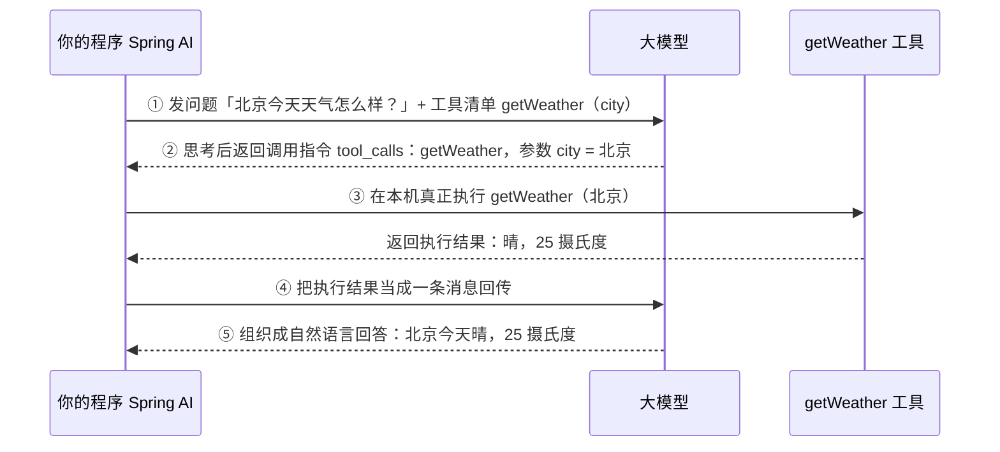
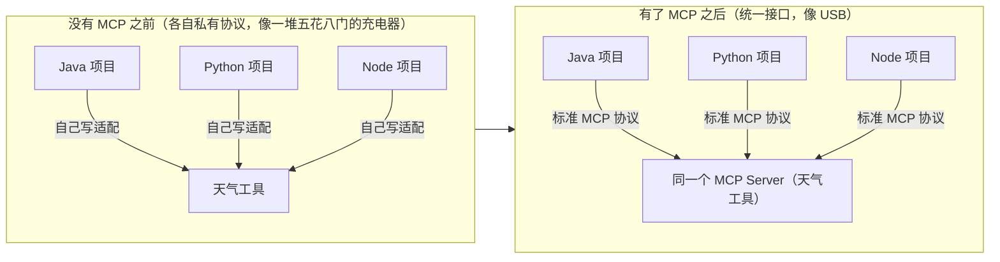

# 18 Tool 与 MCP

> 这一章让 AI 从「只能说」变成「能动手」：先讲清 Function Calling 的本质（模型其实不会真执行代码），再用 `@Tool` 把你的 Java 方法暴露给模型调用，最后介绍 MCP 协议——它像「AI 应用的 USB 接口」一样让工具跨项目复用，并演示 Spring AI 的 MCP Client 与 SAA 的 Nacos 动态注册。

## 本篇要解决的问题

读完上一篇你应该已经能让模型「说」了，但真正有价值的 AI 应用几乎都要「做」：

- 模型怎么查询我系统的订单、库存、天气？——靠**工具（Tool）**
- 但一个普遍的误解是「模型会自己执行我的代码」，**这到底是真的吗？**
- `@Tool` 怎么写，模型才选得对、参数填得对？描述到底该怎么写？
- 工具能不能跨项目、跨语言复用，而不用每个项目重写一遍？——靠 **MCP**
- 工具能删库、能转账，怎么控权限、怎么超时重试、怎么防危险操作？

这一章把上面每一个问题拆开讲，并给出**能直接复制运行的代码**。

## 一、Function Calling 原理：模型不会执行代码

这是全章最重要的一个认知，先把它钉死。

### 1.1 一个必须祛魅的误解

很多人以为「Function Calling = 模型自己跑了我的函数」。**不对。** 模型本身只是一个「文本续写机器」，它运行在模型服务商的机房里，根本碰不到你的代码、你的数据库、你的文件系统。

模型在工具调用里真正做的，只有一件事：**选出要调用的工具名字，并生成一串符合格式的「参数 JSON」**。至于这串 JSON 描述的动作到底有没有执行、怎么执行、执行结果是什么——**全在你的本地代码里**。

### 1.2 一次工具调用的真实流程



::: tip 把这句话刻进脑子里
**模型负责「决定调哪个工具、填什么参数」；你的代码负责「真正执行并把结果喂回去」。** Spring AI 的 `ChatClient` 在背后自动完成了第 ③⑤ 步的循环——你只需要声明工具、写工具实现，剩下的「模型选工具 → 执行 → 回传结果 → 再回答」由框架替你循环到底。第 ② 步返回的指令，模型自己**不会**执行，也执行不了。
:::

为什么这个认知关键？因为后面所有的「权限控制、超时、危险操作二次确认」都建立在「执行发生在本地」这个事实上——既然执行在你手里，你自然能在执行前拦截、加锁、要确认。

## 二、声明式工具 @Tool

Spring AI 用注解把「一个普通 Java 方法」变成「模型可调用的工具」。

### 2.1 用 @Tool 标注方法

```java
package com.example.saa.tool.service;

import org.springframework.ai.tool.annotation.Tool;
import org.springframework.ai.tool.annotation.ToolParam;
import org.springframework.stereotype.Service;

/**
 * 天气工具：把「查天气」这个能力暴露给模型。
 *
 * 关键点：方法体里真正干活的是本地代码（这里用假数据演示，真实场景可以是
 * 调第三方天气 API / 查数据库）。模型永远碰不到这段代码，它只负责「决定调用」。
 */
@Service
public class WeatherTools {

    /**
     * @Tool 把这个公开方法标记为一个工具。
     * description 是写给「模型」看的——模型靠它判断「什么时候该调这个工具」。
     * 所以 description 必须说清楚：这个工具能干嘛、什么时候用，而不是写给程序员看。
     */
    @Tool(description = "查询指定城市的当前天气，当用户问天气、温度、是否下雨时使用")
    public String getWeather(
            // @ToolParam 描述参数含义，模型靠它填对参数
            @ToolParam(description = "城市名称，例如：北京、上海、杭州") String city) {
        // 真实执行发生在本地：这里用模拟数据，生产可替换为天气 API 调用
        return city + "：晴，25°C，东南风 3 级";
    }
}
```

### 2.2 用 MethodToolCallbackProvider 注册

光有 `@Tool` 还不够，得把它「登记」进工具系统。最常用的是 `MethodToolCallbackProvider`：扫描带 `@Tool` 的对象，自动生成 `ToolCallback`。

```java
package com.example.saa.tool.config;

import com.example.saa.tool.service.WeatherTools;
import org.springframework.ai.tool.method.MethodToolCallbackProvider;
import org.springframework.context.annotation.Bean;
import org.springframework.context.annotation.Configuration;

/**
 * 工具注册配置。
 *
 * MethodToolCallbackProvider 会扫描 weatherTools 里所有 @Tool 方法，
 * 把它们变成模型可见的工具定义。包名：org.springframework.ai.tool.method
 */
@Configuration
public class ToolConfig {

    @Bean
    public MethodToolCallbackProvider weatherTools(WeatherTools weatherTools) {
        return MethodToolCallbackProvider.builder()
                .toolObjects(weatherTools)   // 传入带有 @Tool 注解的对象（可传多个）
                .build();
    }
}
```

### 2.3 在 ChatClient 里挂载工具并测试

```java
package com.example.saa.tool.controller;

import org.springframework.ai.chat.client.ChatClient;
import org.springframework.ai.tool.ToolCallbackProvider;
import org.springframework.web.bind.annotation.GetMapping;
import org.springframework.web.bind.annotation.RequestMapping;
import org.springframework.web.bind.annotation.RequestParam;
import org.springframework.web.bind.annotation.RestController;

/**
 * 带工具的对话接口。
 *
 * 注入 ToolCallbackProvider（即上面注册的天气工具），
 * 通过 defaultToolCallbacks 挂到 ChatClient 上。
 *
 * 注意：当模型决定调用工具时，Spring AI 会自动执行并回传结果，
 * 你看到的 .content() 已经是「模型综合工具结果后的最终回答」。
 */
@RestController
@RequestMapping("/api/tool")
public class ToolChatController {

    private final ChatClient chatClient;

    public ToolChatController(ChatClient.Builder builder,
                              ToolCallbackProvider weatherTools) {
        this.chatClient = builder
                // defaultToolCallbacks：把这个 Provider 里的所有工具设为默认可用
                .defaultToolCallbacks(weatherTools)
                .build();
    }

    @GetMapping("/weather")
    public String chat(@RequestParam String msg) {
        return chatClient.prompt()
                .user(msg)
                .call()
                .content();
    }
}
```

`curl` 测试——注意模型会**自己决定**调用 `getWeather`：

```bash
curl "http://localhost:8080/api/tool/weather?msg=北京今天天气怎么样？"
```

你会看到返回「北京：晴，25°C……」，而代码里从没写过「如果问题含城市就调天气」——是模型根据 `@Tool` 的 description 自己选的。

::: tip 更简单的挂法
如果工具就是一个 `@Tool` 对象，也可以不写 `MethodToolCallbackProvider`，直接 `.defaultTools(weatherTools)` 传入对象本身，`ChatClient` 会自动扫描其中的 `@Tool` 方法。Provider 的好处是「按业务分组、可动态返回不同工具集」。
:::

## 三、编程式注册 ToolCallback

有些场景你没法（或不想）给方法加 `@Tool` 注解：比如工具来自第三方类、想用函数式写法、或需要完全控制输入类型与元数据。这时用 `FunctionToolCallback` 编程式构建。

```java
package com.example.saa.tool.config;

import org.springframework.ai.tool.ToolCallback;
import org.springframework.ai.tool.function.FunctionToolCallback;
import org.springframework.context.annotation.Bean;
import org.springframework.context.annotation.Configuration;

import java.util.function.Function;

/**
 * 编程式工具注册。
 *
 * FunctionToolCallback.builder(name, function) 把一个 Function 包装成工具，
 * 不依赖 @Tool 注解，适合动态/函数式场景。
 */
@Configuration
public class ProgrammaticToolConfig {

    /**
     * 用 Function 定义「获取当前时间」工具。
     * 第二个参数是真正的执行逻辑（本地代码），模型只负责决定要不要调、传什么。
     */
    @Bean
    public ToolCallback currentTimeTool() {
        Function<String, String> fn = (zone) ->
                "当前时间：" + java.time.LocalTime.now() + "（时区参数：" + zone + "）";

        return FunctionToolCallback.builder("get_current_time", fn)
                .description("获取当前系统时间，当用户问现在几点、今天日期时使用")
                .inputType(String.class)   // 告诉模型参数类型
                .build();
    }

    /**
     * 另一个示例：用 MethodToolCallback 包裹一个已存在的普通方法（无注解）。
     * 包名：org.springframework.ai.tool.method.MethodToolCallback。
     *
     * 说明：MethodToolCallback 的 builder 细节（toolDefinition / toolMethod /
     * toolObject 等方法名）随版本可能有差异，具体以你所用版本的官方文档为准；
     * 绝大多数场景用 @Tool + MethodToolCallbackProvider（第二章）更省心。
     */
}
```

把编程式工具挂到 ChatClient：

```java
package com.example.saa.tool.controller;

import org.springframework.ai.chat.client.ChatClient;
import org.springframework.ai.tool.ToolCallback;
import org.springframework.web.bind.annotation.GetMapping;
import org.springframework.web.bind.annotation.RequestMapping;
import org.springframework.web.bind.annotation.RequestParam;
import org.springframework.web.bind.annotation.RestController;

@RestController
@RequestMapping("/api/tool")
public class ProgrammaticToolController {

    private final ChatClient chatClient;

    // 注入上面 @Bean 的 currentTimeTool（类型 ToolCallback 可精确注入）
    public ProgrammaticToolController(ChatClient.Builder builder,
                                       ToolCallback currentTimeTool) {
        this.chatClient = builder
                // defaultToolCallbacks 接受单个 ToolCallback 或 ToolCallbackProvider
                .defaultToolCallbacks(currentTimeTool)
                .build();
    }

    @GetMapping("/time")
    public String chat(@RequestParam String msg) {
        return chatClient.prompt().user(msg).call().content();
    }
}
```

`curl` 测试：

```bash
curl "http://localhost:8080/api/tool/time?msg=现在几点了？"
```

::: tip @Tool 与 FunctionToolCallback 怎么选
- 工具是你自己写的 Spring Bean 方法 → 用 `@Tool` + `MethodToolCallbackProvider`，最直观。
- 工具是函数式逻辑、或来自无法改源码的第三方 → 用 `FunctionToolCallback.builder(...)` 编程式包装。
- 两者最终都变成 `ToolCallback`，对 `ChatClient` 来说没有区别。
:::

## 四、工具设计原则：描述写得好不好，决定模型选不选得对

模型完全靠 `@Tool` / `@ToolParam` 的 **description** 来判断「什么时候用这个工具、参数怎么填」。描述写烂了，模型要么不选、要么瞎填。

### 4.1 好描述 vs 坏描述对比表

| 维度 | 坏描述（模型容易选错/填错） | 好描述（模型选得对、填得对） |
| --- | --- | --- |
| 工具用途 | `@Tool(description = "天气")` | `@Tool(description = "查询指定城市的当前天气，当用户问天气、温度、是否下雨、要不要带伞时使用")` |
| 参数含义 | `@ToolParam(description = "c")` | `@ToolParam(description = "城市名称，例如：北京、上海、杭州，不要缩写")` |
| 时机提示 | 不写何时用 | 明确「用户问 X 时用」「需要实时数据时用」 |
| 取值范围 | 不限制 | 「取值只能是 active/inactive，不要传其他值」 |
| 单位 | 「金额」 | 「金额，单位：元，不要带货币符号」 |
| 歧义 | 「时间」（模型不知时区） | 「时间，格式 ISO-8601，如 2026-09-21T10:00:00」 |

### 4.2 一个对照示例

```java
// ❌ 坏：模型看不出什么时候该用，参数也不知道填啥
@Tool(description = "查订单")
public String queryOrder(@ToolParam String id) { ... }

// ✅ 好：说清用途、触发时机、参数格式
@Tool(description = "根据用户订单号查询订单详情（状态/金额/物流）。当用户提及订单号、问订单到哪了、问退款进度时使用")
public String queryOrder(
        @ToolParam(description = "订单号，格式形如 A20260921（字母A+8位数字），不要编造") String orderId) {
    // ...
}
```

::: warning 描述不是写给人看的
`@Tool` 的 description 是**写给模型看的 prompt 的一部分**。模型读它来决策，写得模糊 = 模型随机发挥。宁可啰嗦，也要把「何时用、参数长什么样、取值约束」写清楚。
:::

## 五、MCP 协议概述：AI 应用的「USB 接口」

当你只有一两个工具、全在一个 Java 项目里，`@Tool` 就够了。但现实里工具越来越多、还分散在不同语言/不同团队的服务里——总不能每个项目都把同一套工具重写一遍。

### 5.1 什么是 MCP

**MCP（Model Context Protocol，模型上下文协议）** 是 Anthropic 提出的开放标准，用来统一「AI 应用」和「外部工具/数据源」之间的通信方式。

打个比方——**它就像 AI 世界的 USB 接口**：



你只要把「天气工具」做成**一个 MCP Server**，所有支持 MCP 的 AI 应用（无论什么语言、什么框架）都能即插即用，不用重复开发。

### 5.2 Client / Server 角色

| 角色 | 是谁 | 干什么 |
| --- | --- | --- |
| **MCP Server** | 工具/数据的提供方（一个进程或服务） | 暴露工具（Tool）、资源（Resource）、提示（Prompt），等待被调用 |
| **MCP Client** | 你的 AI 应用（如本专栏的 Spring Boot 服务） | 连接 Server，自动发现它提供的工具，把工具交给 `ChatClient` 使用 |

在 Spring AI 里：**你写的应用是 Client**，你去连各种各样的 Server（可能是 Java 写的、Node 写的、Python 写的），把它们的工具「桥接」成你本地的 `ToolCallbackProvider`。

### 5.3 两种传输方式：stdio 与 SSE

MCP 不规定工具怎么「传」，只规定「说了什么」。传输层有两种最常见方式：

| 传输方式 | 适用场景 | 原理 | Spring AI 配置前缀 |
| --- | --- | --- | --- |
| **stdio**（标准输入输出） | 本地工具、CLI 型 Server（如 `npx` 启动的 Server） | Client 把 Server 当子进程拉起，通过 stdin/stdout 通信 | `spring.ai.mcp.client.stdio.connections` |
| **SSE**（Server-Sent Events） | 远程 Server（HTTP 长连接） | Client 通过 HTTP 连接远程 Server 的 SSE 端点 | `spring.ai.mcp.client.sse.connections` |
| **Streamable HTTP**（较新） | 生产级远程 Server，并发更好 | 标准 HTTP + 可选流式 | `spring.ai.mcp.client.streamable-http.connections` |

::: tip 本地还是远程？
- 本地小工具、陪你一起启动的 Server → **stdio**（最简单，Client 自动拉起进程）。
- 独立部署、多人共享的 Server → **SSE / Streamable HTTP**（远程访问，可水平扩展）。
:::

## 六、接入 MCP Server（Spring AI MCP Client 完整示例）

Spring AI 提供了 MCP Client 的 Boot Starter，几行配置就能连上 Server 并把工具自动注册进来。

### 6.1 加依赖

```xml
<!-- Spring AI 的 MCP Client starter：支持 stdio 与 SSE 两种传输 -->
<dependency>
    <groupId>org.springframework.ai</groupId>
    <artifactId>spring-ai-starter-mcp-client</artifactId>
</dependency>
<!-- 若连接的是 WebFlux 响应式 SSE Server，用下面这个更合适（二选一即可） -->
<!--
<dependency>
    <groupId>org.springframework.ai</groupId>
    <artifactId>spring-ai-starter-mcp-client-webflux</artifactId>
</dependency>
-->
```

### 6.2 application.yml：同时连一个 stdio 和一个 SSE Server

```yaml
spring:
  application:
    name: saa-mcp-client-demo
  ai:
    dashscope:
      api-key: ${AI_DASHSCOPE_API_KEY}
      chat:
        options:
          model: qwen-plus
    mcp:
      client:
        enabled: true
        type: SYNC                 # SYNC 或 ASYNC，二者不能混用；这里用同步
        request-timeout: 30s       # 调用 MCP 工具的超时
        toolcallback:
          enabled: true            # 默认就是 true：自动把发现到的 MCP 工具注册成 ToolCallbackProvider
        # —— stdio 传输：Client 自动用 npx 拉起文件系统 Server 子进程 ——
        stdio:
          connections:
            filesystem:
              command: npx
              args:
                - "-y"
                - "@modelcontextprotocol/server-filesystem"
                - "/tmp/mcp-demo"   # 允许访问的目录，务必限定在非敏感目录
        # —— SSE 传输：连接一个远程 MCP Server ——
        sse:
          connections:
            my-tools:
              url: http://localhost:8081     # 远程 Server 地址
              sse-endpoint: /sse             # SSE 端点后缀，默认 /sse
```

::: warning Windows 上 stdio 的坑
Windows 用 `npx` 启动 stdio Server 时，command 可能需要包成 `cmd.exe /c npx ...`，具体写法以官方文档为准；且务必把文件系统 Server 的允许目录限制在 `/tmp/mcp-demo` 这类非敏感路径，避免模型读到敏感文件。
:::

### 6.3 在 ChatClient 里使用 MCP 工具

当 `spring.ai.mcp.client.toolcallback.enabled=true`（默认）时，Spring AI 会自动创建一个 `ToolCallbackProvider` Bean，里面装着所有连上的 MCP Server 暴露的工具。直接注入即可：

```java
package com.example.saa.tool.controller;

import org.springframework.ai.chat.client.ChatClient;
import org.springframework.ai.tool.ToolCallbackProvider;
import org.springframework.web.bind.annotation.GetMapping;
import org.springframework.web.bind.annotation.RequestMapping;
import org.springframework.web.bind.annotation.RequestParam;
import org.springframework.web.bind.annotation.RestController;

/**
 * 使用 MCP 工具的对话接口。
 *
 * 这里注入的 ToolCallbackProvider 由 Spring AI MCP Client 自动创建，
 * 里面是所有已连接 MCP Server 暴露的工具（filesystem、远程 my-tools 等）。
 * 模型和本地 @Tool 一样地使用它们，完全无感「工具其实在另一个进程/另一台机器」。
 */
@RestController
@RequestMapping("/api/mcp")
public class McpChatController {

    private final ChatClient chatClient;

    public McpChatController(ChatClient.Builder builder,
                             ToolCallbackProvider mcpTools) {
        this.chatClient = builder
                .defaultToolCallbacks(mcpTools)   // 挂上所有 MCP 工具
                .build();
    }

    @GetMapping("/ask")
    public String ask(@RequestParam String msg) {
        return chatClient.prompt().user(msg).call().content();
    }
}
```

`curl` 测试（filesystem 工具可用，所以它能读 `/tmp/mcp-demo` 下的文件）：

```bash
# 先放一个测试文件
mkdir -p /tmp/mcp-demo && echo "Hello from MCP filesystem tool" > /tmp/mcp-demo/readme.txt

# 让模型通过 MCP 文件系统工具读取它
curl "http://localhost:8080/api/mcp/ask?msg=读一下/tmp/mcp-demo/readme.txt的内容"
```

::: tip 把本地 @Tool 和 MCP 工具混用
`ChatClient` 的 `defaultToolCallbacks(...)` 可以多次叠加：本地 `MethodToolCallbackProvider` 和 MCP 的 `ToolCallbackProvider` 都能挂上，模型看到一个统一的工具池。若项目里存在多个 `ToolCallbackProvider` Bean 导致注入冲突，请用 `@Qualifier` 区分，或把它们收集成 `List<ToolCallbackProvider>` 后逐个传给 `.toolCallbacks(...)`。
:::

## 七、Nacos MCP Registry：动态发现与热更新（SAA 差异化能力）

`@Tool` 和静态 MCP 配置解决了「能调用」，但企业里还有两个痛点：

1. **工具越来越多，Server 也要多实例部署**——怎么让 Client 自动发现、负载均衡、感知上下线？
2. **工具的描述/开关想改，能不能不重启服务？**

Spring AI Alibaba 的 **Nacos MCP Registry** 就是干这个的：把 MCP Server 注册到 Nacos（阿里微服务注册中心），Client 从 Nacos **动态发现**工具，Server 上下线、配置变更都能**热感知**。这是 SAA 相比裸 Spring AI 的差异化能力。

### 7.1 Client 侧：从 Nacos 动态发现 MCP 工具

加依赖（Nacos 注册发现 starter + MCP Client）：

```xml
<!-- SAA 的 Nacos MCP Registry starter：提供从 Nacos 动态发现 MCP 服务的能力 -->
<dependency>
    <groupId>com.alibaba.cloud.ai</groupId>
    <artifactId>spring-ai-alibaba-starter-mcp-registry</artifactId>
</dependency>
<!-- MCP Client 本体 -->
<dependency>
    <groupId>org.springframework.ai</groupId>
    <artifactId>spring-ai-starter-mcp-client</artifactId>
</dependency>
```

`application.yml`（Client 不再写死 URL，而是订阅 Nacos 上的服务名）：

```yaml
spring:
  application:
    name: saa-mcp-nacos-client
  ai:
    dashscope:
      api-key: ${AI_DASHSCOPE_API_KEY}
    mcp:
      client:
        enabled: true
        type: SYNC
      alibaba:
        mcp:
          nacos:
            client:
              enabled: true
              streamable:
                connections:
                  server1:
                    service-name: webflux-mcp-server   # Nacos 上注册的服务名
                    version: 1.0.0
              configs:
                server1:
                  namespace: 0908ca08-c382-404c-9d96-37fe1628b183  # 你的 Nacos 命名空间
                  server-addr: 127.0.0.1:8848                       # Nacos 地址
                  username: nacos
                  password: nacos
```

注入动态发现的 `ToolCallbackProvider`（注意用 `@Qualifier`，bean 名随版本可能是 `distributedSyncToolCallback` / `distributedAsyncToolCallback` 等，以你所用版本官方文档为准）：

```java
package com.example.saa.tool.controller;

import org.springframework.ai.chat.client.ChatClient;
import org.springframework.ai.tool.ToolCallbackProvider;
import org.springframework.beans.factory.annotation.Qualifier;
import org.springframework.web.bind.annotation.GetMapping;
import org.springframework.web.bind.annotation.RequestMapping;
import org.springframework.web.bind.annotation.RequestParam;
import org.springframework.web.bind.annotation.RestController;

@RestController
@RequestMapping("/api/mcp/nacos")
public class NacosMcpController {

    private final ChatClient chatClient;

    /**
     * @Qualifier 指定 Nacos 动态发现得到的 Provider。
     * bean 名称在不同 SAA 版本里可能不同，请按你实际版本的官方文档确认，
     * 常见如 distributedSyncToolCallback / distributedAsyncToolCallback。
     */
    public NacosMcpController(ChatClient.Builder builder,
                              @Qualifier("distributedSyncToolCallback") ToolCallbackProvider nacosTools) {
        this.chatClient = builder
                .defaultToolCallbacks(nacosTools)
                .build();
    }

    @GetMapping("/ask")
    public String ask(@RequestParam String msg) {
        return chatClient.prompt().user(msg).call().content();
    }
}
```

### 7.2 Server 侧：把 MCP 服务注册到 Nacos（支持热更新）

一个要被发现的 MCP Server 自己也要注册到 Nacos。最小示例：

```xml
<!-- Server 侧：注册到 Nacos 的 starter + WebMVC 的 MCP Server -->
<dependency>
    <groupId>com.alibaba.cloud.ai</groupId>
    <artifactId>spring-ai-alibaba-starter-mcp-registry</artifactId>
</dependency>
<dependency>
    <groupId>org.springframework.ai</groupId>
    <artifactId>spring-ai-starter-mcp-server-webmvc</artifactId>
</dependency>
```

`application.yml`（Server 配置 + Nacos 注册）：

```yaml
spring:
  application:
    name: saa-mcp-server
  ai:
    mcp:
      server:
        name: webflux-mcp-server     # 注册到 Nacos 的服务名（Client 按这个名字发现）
        version: 1.0.0
        type: SYNC                   # SYNC 或 ASYNC
        instructions: "本服务提供服务号查询、库存查询等工具"
    alibaba:
      mcp:
        nacos:
          server-addr: 127.0.0.1:8848
          namespace: public
          register:
            enabled: true            # 开启注册到 Nacos
            service-name: webflux-mcp-server
            service-group: mcp-server
```

Server 上照常写 `@Tool`，并注册成 `ToolCallbackProvider`：

```java
package com.example.saa.tool.server;

import org.springframework.ai.tool.annotation.Tool;
import org.springframework.ai.tool.annotation.ToolParam;
import org.springframework.stereotype.Service;

@Service
public class InventoryTools {

    @Tool(description = "查询指定商品的库存数量，当用户问某商品还有没有货、库存多少时使用")
    public String getStock(
            @ToolParam(description = "商品 SKU 编码，例如 SKU-1001") String sku) {
        // 真实场景查数据库；这里返回模拟值
        return "SKU " + sku + " 当前库存：42 件";
    }
}
```

```java
package com.example.saa.tool.server;

import com.example.saa.tool.server.InventoryTools;
import org.springframework.ai.tool.ToolCallbackProvider;
import org.springframework.ai.tool.method.MethodToolCallbackProvider;
import org.springframework.context.annotation.Bean;
import org.springframework.context.annotation.Configuration;

@Configuration
public class ServerToolConfig {
    @Bean
    public ToolCallbackProvider inventoryTools(InventoryTools inventoryTools) {
        return MethodToolCallbackProvider.builder()
                .toolObjects(inventoryTools)
                .build();
    }
}
```

::: tip 热更新的价值
Server 注册到 Nacos 后，你可以在 Nacos 控制台**动态修改工具的开关、描述**，Client 端无需重启就能感知——这对「线上调工具策略、灰度工具」非常有用。多实例部署时 Nacos 还自动做健康检查和负载均衡。
:::

::: warning 版本与坐标以官方为准
Nacos MCP Registry 相关 starter 的 **artifactId 与版本可能随 SAA 版本演进**（如 `spring-ai-alibaba-starter-mcp-registry`、`spring-ai-alibaba-starter-mcp-distributed` 等，版本号也可能独立于主 BOM）。请以你所用版本的官方文档为准，查找路径：Spring AI Alibaba 官网 `integration/mcps/nacos` 章节，或 `com.alibaba.cloud.ai` 组下的 mcp-registry 相关 artifact。
:::

## 八、权限、超时与危险操作控制

工具一旦能「动手」，就必须像写业务接口一样管住它：谁都能调吗？调慢了怎么办？调了删库怎么办？

### 8.1 权限控制：在工具方法里做鉴权

因为工具执行发生在本地，你完全可以在方法体内加权限判断：

```java
package com.example.saa.tool.service;

import org.springframework.ai.tool.annotation.Tool;
import org.springframework.ai.tool.annotation.ToolParam;
import org.springframework.security.core.context.SecurityContextHolder;
import org.springframework.stereotype.Service;

@Service
public class AdminTools {

    /**
     * 敏感工具：先检查当前登录用户是否有权限，没权限直接拒绝。
     * 模型只是「请求调用」，真正能不能执行由你的业务规则决定。
     */
    @Tool(description = "删除指定订单。仅限管理员操作。")
    public String deleteOrder(
            @ToolParam(description = "要删除的订单号") String orderId) {

        // 从安全上下文取当前用户角色（接你系统的登录体系）
        String role = SecurityContextHolder.getContext().getAuthentication()
                .getAuthorities().toString();

        if (!role.contains("ROLE_ADMIN")) {
            // 返回给模型的「执行结果」就是拒绝信息，模型会据此告诉用户无权限
            return "拒绝执行：当前用户不是管理员，无权删除订单。";
        }
        // 真实删除逻辑……
        return "订单 " + orderId + " 已删除。";
    }
}
```

::: danger 工具不是「免鉴权后门」
模型调用工具 = 一次普通的方法调用。它**不会自动带任何权限**。凡是敏感操作，必须在工具方法里走你系统现有的鉴权/审计，绝不因为「是 AI 调的」就放行。
:::

### 8.2 超时与重试

MCP 工具调用有网络开销，务必设超时（在 yml 的 `spring.ai.mcp.client.request-timeout` 已设全局）。若工具本身还会调慢接口，在方法内加超时；网络抖动可用 Resilience4j 包裹：

```java
package com.example.saa.tool.service;

import io.github.resilience4j.retry.Retry;
import io.github.resilience4j.retry.RetryConfig;
import org.springframework.ai.tool.annotation.Tool;
import org.springframework.ai.tool.annotation.ToolParam;
import org.springframework.stereotype.Service;

import java.time.Duration;

@Service
public class ResilientTools {

    private final Retry retry;

    public ResilientTools() {
        // 最多重试 2 次，间隔 1 秒；只对异常重试
        RetryConfig config = RetryConfig.custom()
                .maxAttempts(3)
                .waitDuration(Duration.ofSeconds(1))
                .retryOnException(e -> true)
                .build();
        this.retry = Retry.of("mcpToolRetry", config);
    }

    @Tool(description = "调用外部汇率服务查询汇率，网络可能抖动")
    public String getExchangeRate(@ToolParam(description = "货币对，如 USD_CNY") String pair) {
        // 用重试器包住真实调用：偶发超时能被救回
        return Retry.decorateSupplier(retry, () -> doRemoteCall(pair)).get();
    }

    private String doRemoteCall(String pair) {
        // 真实远程调用……
        return pair + " = 7.18";
    }
}
```

依赖：

```xml
<dependency>
    <groupId>io.github.resilience4j</groupId>
    <artifactId>resilience4j-retry</artifactId>
    <version>2.2.0</version>
</dependency>
```

::: warning 重试会重复计费/重复副作用
对「只读查询」重试很安全；但「删除/转账/发消息」这类**有副作用**的工具，重试可能导致重复执行——务必用幂等设计或干脆不重试写操作。
:::

### 8.3 危险操作二次确认

最稳妥的模式：**不让模型一步到位执行危险动作**。用一个「提议工具」返回计划，等用户确认后，再由「执行工具」真正落地。

```java
package com.example.saa.tool.service;

import org.springframework.ai.tool.annotation.Tool;
import org.springframework.ai.tool.annotation.ToolParam;
import org.springframework.stereotype.Service;

@Service
public class SafeDeleteTools {

    /**
     * 第一步：只「生成执行计划」，不真删。
     * 模型拿到计划后，会转述给用户请求确认。
     */
    @Tool(description = "生成删除订单的执行计划（不真正执行），用于向用户确认")
    public String proposeDelete(
            @ToolParam(description = "订单号") String orderId) {
        return "【待确认】即将删除订单 " + orderId
                + "，此操作不可恢复。请用户确认是否继续。";
    }

    /**
     * 第二步：真正执行。只有用户明确说「确认/继续」时，模型才会调用它。
     * 生产环境这里还应校验「上一步确实生成过计划」+ 当前用户已确认，
     * 避免模型跳过确认直接调用。
     */
    @Tool(description = "确认后真正删除订单（仅当用户明确确认时调用）")
    public String confirmDelete(
            @ToolParam(description = "订单号") String orderId) {
        // 真实删除逻辑（建议再校验一次会话级的确认状态）
        return "订单 " + orderId + " 已删除。";
    }
}
```

::: tip 二次确认的本质
把「危险动作」拆成「提议 + 确认执行」两个工具，利用模型「只在用户确认后才调第二个工具」的特性，把最终决定权留在人手里。这是对账、删库、转账等不可逆操作的标配做法。
:::

## 本篇小结

- **Function Calling 的本质**：模型只「选出工具 + 生成参数 JSON」，**真正执行在你本地**；Spring AI 自动完成「执行→回传→再回答」的循环。
- **声明式工具**：`@Tool` + `@ToolParam` 标注方法，`MethodToolCallbackProvider` 注册；描述写给模型看，写清楚「何时用、参数长啥样」。
- **编程式工具**：`FunctionToolCallback.builder(name, function)` 包装函数，适合无法加注解的第三方逻辑；最终都变成 `ToolCallback`。
- **工具设计原则**：description 是给模型的 prompt，坏描述 = 模型选错/填错；要把用途、触发时机、参数格式、取值约束写全。
- **MCP 协议**：AI 应用的「USB 接口」，统一工具通信；Server 提供工具、Client 连接使用；传输分 stdio（本地）与 SSE/Streamable HTTP（远程）。
- **接入 MCP Server**：`spring-ai-starter-mcp-client` + `spring.ai.mcp.client.{stdio,sse}.connections` 配置，工具自动注册成 `ToolCallbackProvider`。
- **Nacos MCP Registry（SAA 差异化）**：Server 注册到 Nacos，Client 动态发现、负载均衡、热更新工具配置，无需重启。
- **安全三件套**：权限在工具方法里鉴权、超时重试只对只读操作、危险动作做「提议 + 二次确认」。

## 参考链接

- Spring AI Tool Calling 文档：<https://docs.spring.io/spring-ai/reference/api/tools.html>
- Spring AI MCP Client Starter：<https://docs.spring.io/spring-ai/reference/api/mcp/mcp-client-boot-starter.html>
- Spring AI Alibaba MCP / Nacos：<https://java2ai.com/integration/mcps/nacos/nacos-registery-mcp>
- MCP 官方协议：<https://modelcontextprotocol.io/>
- Spring AI Alibaba GitHub：<https://github.com/alibaba/spring-ai-alibaba>

下一篇 → [19 RAG 检索增强](/java/saa/rag)
