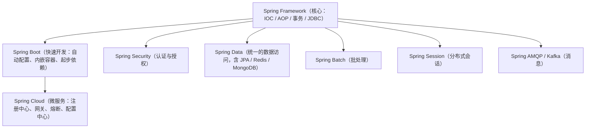

# 01 Spring 简介

Spring 是 Java 世界里最负盛名的一站式企业级开发框架。本文带你从"它是什么、为什么出现、全家桶怎么排布"出发，再用一个最小可运行的例子亲手跑通第一个 Spring 程序，为后面 IOC、Bean、AOP、事务四篇打基础。

## 一、Spring 是什么

一句话：**Spring 是一个分层的、轻量级的、开源的 Java SE/EE 一站式开发框架**。

"一站式"的意思是，无论你想写 Web 层、业务层、数据访问层，还是做事务、安全、调度，Spring 都提供了对应的解决方案，你基本不需要再引入别的重量级框架。"轻量级"则体现在：它不强制你继承它的类、不强制你实现它的接口，核心容器仅依赖少量 jar 包即可运行，部署到一个普通 Servlet 容器（如 Tomcat）就能跑起来。

官方对自己的定位是 **"Spring 是 Java 开发的事实标准基础设施"**。它的核心理念只有两条：

- **控制反转（Inversion of Control，IOC）**：把对象的创建与依赖组装交给容器，而不是写在业务代码里。
- **面向切面编程（Aspect-Oriented Programming，AOP）**：把日志、事务、权限这些"横切逻辑"从业务代码里抽出来，统一织入。

正是这两个核心理念，撑起了后面所有高级特性（事务、Security、Data……）。

## 二、Spring 的两大核心

用生活化的话说：

- **IOC 像"外卖平台"**：你（业务代码）不再自己下厨（自己 `new` 对象），而是由平台（容器）把做好的菜（Bean）送到你手上。你只管吃，不用关心菜是怎么来的。
- **AOP 像"餐厅的中央厨房"**：每道菜里都要放盐、要装盘、要贴标签，这些琐碎又重复的动作，统一由中央厨房（切面）完成，厨师（业务方法）只专注炒菜本身。

```text
业务代码（专心炒菜）
   │
   ├── IOC：对象从哪来？→ 容器给你
   └── AOP：公共逻辑（日志/事务/权限）从哪来？→ 切面统一织入
```

后面我们会专门用两篇（02 IOC 容器、04 AOP）来拆开讲，本篇先把概念立在心里就行。

## 三、为什么要学 Spring

回想"没有 Spring 的时代"，Java 企业开发主要靠 **EJB（Enterprise JavaBeans）**：

- EJB 是**重量级**的：写一个会话 Bean 要继承一堆接口、写好几个文件、部署到昂贵的重量级应用服务器（WebLogic、WebSphere）。
- 对象之间**强耦合**：`A a = new A()`，A 直接依赖 B 的具体实现，想换实现就得改代码、重新编译。
- 代码里**到处 `new`**：对象生命周期全靠手写，大型项目里依赖关系乱成一团麻。

Spring 带来了三个关键转变：

1. **解耦**：依赖关系由容器注入，面向接口编程，换实现零改动。
2. **声明式**：事务、缓存、异步这些"样板代码"只需一个注解（`@Transactional`、`@Cacheable`、`@Async`），不用手写。
3. **生态**：它不是一个孤零零的框架，而是一整套全家桶（见下一节），几乎所有 Java 后端中间件都提供 Spring 集成。

可以说，今天国内 90% 以上的 Java 后端岗位，招聘要求里都写着"精通 Spring / Spring Boot"，学会它几乎是入行的门票。

## 四、Spring 家族

Spring 早已不是当年那个单纯的 IOC 容器，而是一整个生态。它们的定位与学习顺序如下：



**学习顺序建议**：先吃透 `Spring Framework` 的核心（本专栏的重点），再用 `Spring Boot` 提速开发，最后在微服务场景下接触 `Spring Cloud`。`Spring Security`、`Spring Data` 等属于"用到再学"的模块化能力。

## 五、Spring 的版本与生态

当前主线版本：

- **Spring Framework 6.x**：要求 **JDK 17+**，并且基于 **Jakarta EE 9+**。
- **Spring Boot 3.x**：对应 Spring Framework 6。

这里有个**最容易踩的升级大坑**：从 Spring 5 / Boot 2 升级到 6 / 3 之后，包名从 `javax.*` 变成了 `jakarta.*`。例如：

- 老代码：`import javax.servlet.http.HttpServletRequest;`
- 新代码：`import jakarta.servlet.http.HttpServletRequest;`

如果你把老项目直接升到 Boot 3，而代码里还残留 `javax.persistence`、`javax.annotation` 等，编译期就会大面积报错。迁移时通常用 IDE 的"批量替换包名"功能，并且要注意第三方库是否也完成了 Jakarta 化。

## 六、IOC 思想的通俗解释

用一个"找对象"的比喻：

- **传统方式（主动找）**：你自己上相亲市场，挨个面试，相中一个 `new` 一个，还得负责装修房子（初始化）、买礼物（注入依赖）。累不累？
- **IOC 方式（被动接收）**：你加入一个婚恋中介（IOC 容器），告诉它"我需要一个温柔体贴的对象"，中介直接把一个现成的、调教好的对象送到你面前。

**"控制反转"到底反转了什么？** 反转的是"对象的创建权与控制权"——从"我（业务代码）主动创建并管理依赖"反转成"容器创建并管理依赖，我被动接收"。

对比一段代码就清楚了。没有 IOC 时：

```java
// 没有 IOC：自己 new，自己组装依赖，强耦合 UserDao 的具体实现
package com.canoe.spring.intro;

public class TraditionalApp {
    public static void main(String[] args) {
        // 每一步依赖都硬编码在代码里
        UserDao dao = new UserDao();
        UserService service = new UserService();
        service.setUserDao(dao);
        service.printUser(1L);
    }
}
```

有了 IOC，业务代码完全不碰 `new`，只声明"我需要什么"：

```java
// 有 IOC：依赖由容器注入，业务代码不知道 UserDao 是怎么来的
package com.canoe.spring.intro;

import org.springframework.context.ApplicationContext;
import org.springframework.context.support.ClassPathXmlApplicationContext;

public class IocApp {
    public static void main(String[] args) {
        ApplicationContext context = new ClassPathXmlApplicationContext("applicationContext.xml");
        // 只管从容器取，不关心创建细节
        UserService userService = context.getBean(UserService.class);
        userService.printUser(1L);
    }
}
```

## 七、DI 依赖注入

**IOC 是思想，DI（Dependency Injection，依赖注入）是 IOC 的一种具体实现方式**。容器在创建 Bean 的同时，把它所依赖的其他 Bean"注射"进去，这个过程就是依赖注入。

依赖注入有三种常见方式：

1. **构造器注入**：通过构造方法传参。优点最多，见下一篇详述。
2. **Setter 注入**：通过 `setXxx()` 方法赋值，适合可选依赖。
3. **字段注入**：直接在字段上写 `@Autowired`，最省事但不推荐。

```java
package com.canoe.spring.intro;

import com.canoe.spring.intro.UserDao;

// 三种注入方式对比
public class UserService {

    // 1. 字段注入（不推荐：无法 final、不易测试、可能 NPE）
    // @Autowired
    // private UserDao userDao;

    private final UserDao userDao;

    // 2. 构造器注入（推荐：依赖不可变、必填、易测试）
    public UserService(UserDao userDao) {
        this.userDao = userDao;
    }

    // 3. Setter 注入（适合可选依赖）
    // public void setUserDao(UserDao userDao) { this.userDao = userDao; }

    public void printUser(Long id) {
        System.out.println("查询到：" + userDao.findNameById(id));
    }
}
```

**结论先行**：现代 Spring 开发**强烈推荐构造器注入**——依赖可以是 `final` 不可变、启动期就能发现缺依赖、单元测试也更好写。

## 八、第一个 Spring 程序

下面用最朴素的方式跑通一个 Spring 程序：Maven 依赖 → XML 配置 → Bean 类 → 启动类。

**1）Maven 依赖**（`pom.xml` 片段）：

```xml
<dependencies>
    <dependency>
        <groupId>org.springframework</groupId>
        <artifactId>spring-context</artifactId>
        <version>6.1.4</version>
    </dependency>
</dependencies>
```

**2）Bean 类**：

```java
package com.canoe.spring.intro;

// 数据访问层：模拟查数据库
public class UserDao {
    public String findNameById(Long id) {
        return "用户-" + id;
    }
}
```

```java
package com.canoe.spring.intro;

// 业务层：依赖 UserDao
public class UserService {
    private UserDao userDao;

    public void setUserDao(UserDao userDao) {
        this.userDao = userDao;
    }

    public void printUser(Long id) {
        System.out.println("查询到：" + userDao.findNameById(id));
    }
}
```

**3）XML 配置**（`resources/applicationContext.xml`）：

```xml
<?xml version="1.0" encoding="UTF-8"?>
<beans xmlns="http://www.springframework.org/schema/beans"
       xmlns:xsi="http://www.w3.org/2001/XMLSchema-instance"
       xsi:schemaLocation="http://www.springframework.org/schema/beans
           http://www.springframework.org/schema/beans/spring-beans.xsd">

    <bean id="userDao" class="com.canoe.spring.intro.UserDao"/>
    <bean id="userService" class="com.canoe.spring.intro.UserService">
        <property name="userDao" ref="userDao"/>
    </bean>
</beans>
```

**4）启动类**：

```java
package com.canoe.spring.intro;

import org.springframework.context.ApplicationContext;
import org.springframework.context.support.ClassPathXmlApplicationContext;

public class XmlApp {
    public static void main(String[] args) {
        ApplicationContext context =
                new ClassPathXmlApplicationContext("applicationContext.xml");
        UserService userService = context.getBean(UserService.class);
        userService.printUser(1L);
        ((ClassPathXmlApplicationContext) context).close();
    }
}
```

**注解版（更常用）**：用 `@Configuration` + `@Bean` 替代 XML。

```java
package com.canoe.spring.intro;

import org.springframework.context.annotation.Bean;
import org.springframework.context.annotation.Configuration;

@Configuration
public class AppConfig {

    @Bean
    public UserDao userDao() {
        return new UserDao();
    }

    @Bean
    public UserService userService() {
        UserService service = new UserService();
        service.setUserDao(userDao());
        return service;
    }
}
```

```java
package com.canoe.spring.intro;

import org.springframework.context.ApplicationContext;
import org.springframework.context.annotation.AnnotationConfigApplicationContext;

public class AnnotationApp {
    public static void main(String[] args) {
        ApplicationContext context =
                new AnnotationConfigApplicationContext(AppConfig.class);
        UserService userService = context.getBean(UserService.class);
        userService.printUser(1L);
        ((AnnotationConfigApplicationContext) context).close();
    }
}
```

两种方式输出完全一致：`查询到：用户-1`。注解版没有一行 XML，也是 Spring Boot 的默认形态。

## 九、Spring 的优缺点

要客观看待 Spring，它并非银弹：

**优点**

- **解耦**：依赖由容器注入，面向接口编程，替换实现零成本。
- **AOP 能力**：日志、事务、权限等横切逻辑一处编写、处处生效。
- **声明式事务**：一个 `@Transactional` 搞定子事务提交与回滚（详见 05 事务篇）。
- **生态庞大**：几乎任何 Java 中间件都有 Spring 集成。
- **测试友好**：依赖可注入，单元测试可以轻松 mock。

**缺点**

- **配置复杂**：早期 XML 配置繁琐冗长——这恰恰是 **Spring Boot 出现的原因**（自动配置 + 起步依赖大幅简化）。
- **学习曲线陡峭**：IOC、AOP、生命周期、事务传播……概念密集，初学者容易"会用但讲不清"。
- **反射带来少量性能开销**：Bean 创建走反射，但相比业务耗时通常可忽略，且单例 Bean 只创建一次。

## 本篇小结

- **Spring 是分层的、轻量级的 Java 一站式开源框架**，核心是 IOC 与 AOP。
- **IOC 反转的是对象的创建权与控制权**，由容器而非业务代码负责 `new`。
- **DI 是 IOC 的具体实现**，推荐用**构造器注入**保证依赖不可变、易测试。
- **两大核心解决的是解耦与横切逻辑复用**这两个根本痛点。
- **Spring 家族**以 Framework 为核心，向上长出 Boot 与 Cloud，向外扩展 Security / Data 等。
- **Spring 6 / Boot 3 要求 JDK 17+**，并完成了 `javax.*` → `jakarta.*` 的包名迁移。
- **第一个 Spring 程序**只需 Maven 依赖 + 配置 + Bean + 启动类四步即可跑通。
- **注解版（`@Configuration` + `@Bean`）是主流**，已取代大部分 XML 配置。
- **Spring 的优点是解耦、AOP、事务、生态与测试友好**。
- **Spring 的缺点是配置复杂、学习曲线陡、反射有微量开销**——前者由 Boot 解决。
- **理解 Spring 是 Java 后端入行的门票**，后续 IOC、Bean、AOP、事务四篇层层递进。

## 参考链接

- [Spring 官方文档（Spring Framework）](https://docs.spring.io/spring-framework/docs/current/reference/html/)
- [Spring Boot 官方文档](https://docs.spring.io/spring-boot/docs/current/reference/htmlsingle/)
- [Spring 官方 GitHub 仓库](https://github.com/spring-projects/spring-framework)
- [Spring IoC 容器与 Bean 官方文档](https://docs.spring.io/spring-framework/docs/current/reference/html/core.html#beans)
- [《Spring 实战（第 6 版）》](https://www.manning.com/books/spring-in-action-sixth-edition)
- [Baeldung：Spring 入门教程](https://www.baeldung.com/spring-tutorial)
- [廖雪峰的 Spring 教程](https://www.liaoxuefeng.com/wiki/1252599548343744)

下一篇 → [02 IOC 容器](/java/spring/ioc)
