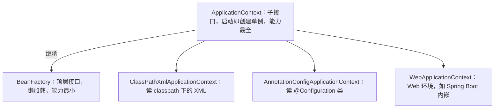
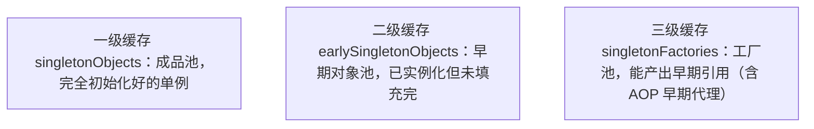
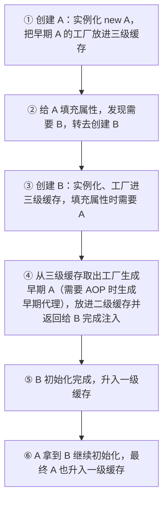

# 02 IOC 容器

IOC 容器是 Spring 的心脏——它负责"生产 Bean、组装依赖、管理生命周期"。本文从 `BeanFactory` 与 `ApplicationContext` 的区别讲起，把 Bean 的定义方式、组件扫描、三种依赖注入、作用域、循环依赖、条件装配和扩展点一次性讲透，并给出可运行的代码。

## 一、IOC 容器是什么

通俗地说，**IOC 容器就是一个"管理 Bean 的工厂"**：你告诉它要哪些 Bean、它们之间怎么依赖，它就在启动时（或需要时）把对象造好、装配好、缓存好，随用随取。

Spring 里有两个核心接口：

- **`BeanFactory`**：最底层的容器，提供 `getBean()` 等基础能力，**默认懒加载**——用到某个 Bean 时才创建。
- **`ApplicationContext`**：`BeanFactory` 的子接口，**启动时就把所有单例 Bean 创建好**（饿汉式），并且额外提供事件发布、国际化（MessageSource）、资源加载、AOP 集成等能力。**日常开发用的几乎都是它**。



**记忆点**：`BeanFactory` 像是"按需供货的小卖部"，`ApplicationContext` 像是"开门前就备好所有货的超市"。生产环境永远用 `ApplicationContext`。

## 二、Bean 的定义方式

把"一个类交给 Spring 管理"叫"注册 Bean"。Spring 提供至少五种方式：

**① XML `<bean>`**（最古老，逐步淘汰）

```xml
<bean id="userDao" class="com.canoe.spring.ioc.UserDao"/>
```

**② `@Component` 系列注解**（最常用，自己写的类）

```java
package com.canoe.spring.ioc;

import org.springframework.stereotype.Component;

@Component
public class UserDao {
    public String findNameById(Long id) {
        return "用户-" + id;
    }
}
```

`@Component`、`@Service`、`@Repository`、`@Controller` 本质一样，只是语义不同，需配合组件扫描。

**③ `@Configuration` + `@Bean`**（第三方类 / 需要自定义构造逻辑）

```java
package com.canoe.spring.ioc;

import org.springframework.context.annotation.Bean;
import org.springframework.context.annotation.Configuration;

@Configuration
public class AppConfig {

    // 适合把第三方库（如 RedisTemplate、DataSource）交给 Spring 管理
    @Bean
    public OrderService orderService() {
        return new OrderService();
    }
}
```

**④ `@Import`**（批量导入配置类）

```java
package com.canoe.spring.ioc;

import org.springframework.context.annotation.Configuration;
import org.springframework.context.annotation.Import;

@Configuration
@Import(OtherConfig.class)
public class AppConfig {
}
```

**⑤ `FactoryBean`**（创建"特殊/复杂"对象，如 MyBatis 的 `SqlSessionFactoryBean`）

```java
package com.canoe.spring.ioc;

import org.springframework.beans.factory.FactoryBean;

// 实现 FactoryBean 接口，容器 getBean("tool") 拿到的是 getObject() 的返回值
public class ToolFactoryBean implements FactoryBean<Tool> {

    @Override
    public Tool getObject() {
        return new Tool("由工厂创建");
    }

    @Override
    public Class<?> getObjectType() {
        return Tool.class;
    }
}
```

**选择建议**：**自己写的业务类用 `@Component` 系列；第三方的、或者需要复杂构造逻辑的类用 `@Bean`**；`FactoryBean` 只在造"非普通 new 能搞定"的对象时才用。

## 三、组件扫描

`@Component` 系列注解只是"贴了标签"，还得靠**组件扫描**把它们找出来。

```java
package com.canoe.spring.ioc;

import org.springframework.context.annotation.ComponentScan;
import org.springframework.context.annotation.Configuration;

@Configuration
@ComponentScan(basePackages = "com.canoe.spring.ioc")
public class ScanConfig {
}
```

扫描范围控制：

- `basePackages`：指定要扫的包。
- `includeFilters` / `excludeFilters`：按注解或类型包含/排除。

**Spring Boot 的默认规则**：`@SpringBootApplication` 上的 `@ComponentScan` 默认只扫描**启动类所在包及其所有子包**。

```text
com
 └── canoe
     └── app
         ├── AppApplication.java   ← 启动类
         ├── service               ← 能被扫到（子包）
         └── dao                   ← 能被扫到（子包）
     └── other                     ← 扫不到！（与 app 平级）
```

**重点坑**：把启动类放在根包（如 `com.canoe.app`）下，保证所有业务代码都是它的子包；否则会出现"明明加了 `@Service` 却注入为 null"的诡异问题。

## 四、依赖注入的三种方式

| 方式 | 写法 | 优点 | 缺点 | 推荐度 |
| --- | --- | --- | --- | --- |
| 字段注入 | `@Autowired` 直接写在字段 | 代码最少 | 不能 `final`、难单测、可能 NPE、循环依赖藏得深 | 不推荐 |
| 构造器注入 | 写在构造方法参数 | 依赖不可变、必填、启动即校验、易测试 | 参数多时构造方法略长 | **推荐** |
| Setter 注入 | `setXxx()` + `@Autowired` | 适合可选依赖、可重新装配 | 依赖可变、可能被误改 | 可选 |

**为什么构造器注入最推荐？**

```java
package com.canoe.spring.ioc;

import org.springframework.stereotype.Service;

@Service
public class UserService {

    // 构造器注入：userDao 是 final 不可变，启动期若缺依赖直接报错
    private final UserDao userDao;

    public UserService(UserDao userDao) {
        this.userDao = userDao;
    }

    public String getName(Long id) {
        return userDao.findNameById(id);
    }
}
```

- `final` 保证依赖注入后不再被改动，天然线程安全；
- 单元测试时直接 `new UserService(fakeDao)` 即可，无需启动容器；
- 缺依赖会在**启动时就失败**，而不是运行时 NPE。

## 五、@Autowired 的细节

`@Autowired` 默认**按类型（byType）注入**。当同一类型有多个实现时，需要配合其他注解：

```java
package com.canoe.spring.ioc;

import org.springframework.beans.factory.annotation.Qualifier;
import org.springframework.stereotype.Component;

// 两个实现
@Component
public class EmailService implements MessageService {
    public String send() { return "邮件"; }
}

@Component
public class SmsService implements MessageService {
    public String send() { return "短信"; }
}

// 注入时指定名字
@Component
public class NoticeService {
    private final MessageService service;

    // @Qualifier 按 Bean 名字精确指定
    public NoticeService(@Qualifier("emailService") MessageService service) {
        this.service = service;
    }
}
```

常用细节：

- **`required = false`**：找不到 Bean 也不报错（注入 `null`），谨慎使用。
- **`@Primary`**：标记"首选实现"，有多个同类型 Bean 时优先用它，不用每次写 `@Qualifier`。
- **`@Resource`（JDK 自带，在 `jakarta.annotation` 包）**：**按名称（byName）注入**，与 `@Autowired`（按类型）互补。
- **一个接口多个实现怎么一次性注入？** 用集合注入：

```java
package com.canoe.spring.ioc;

import java.util.List;
import org.springframework.stereotype.Component;

@Component
public class MultiSender {
    // 容器会把所有 MessageService 实现装进 List
    private final List<MessageService> senders;

    public MultiSender(List<MessageService> senders) {
        this.senders = senders;
    }

    public void sendAll() {
        senders.forEach(s -> System.out.println(s.send()));
    }
}
```

如果想按名字当 key，还可以注入 `Map<String, MessageService>`，key 就是 Bean 的名字。

## 六、Bean 的作用域

通过 `@Scope` 指定，Spring 内置六种作用域：

| 作用域 | 含义 | 适用 |
| --- | --- | --- |
| `singleton`（默认） | 整个容器只有一个实例 | 绝大多数无状态 Bean |
| `prototype` | 每次获取都新建一个 | 有状态 / 每次需独立的对象 |
| `request` | 每个 HTTP 请求一个 | Web 环境 |
| `session` | 每个 HTTP Session 一个 | Web 环境 |
| `application` | 整个 ServletContext 一个 | Web 环境 |
| `websocket` | 每个 WebSocket 一个 | Web 环境 |

```java
package com.canoe.spring.ioc;

import org.springframework.beans.factory.config.ConfigurableBeanFactory;
import org.springframework.context.annotation.Scope;
import org.springframework.stereotype.Component;

@Component
@Scope(ConfigurableBeanFactory.SCOPE_PROTOTYPE)
public class TempTask {
    // 每次注入 / getBean 都拿到全新实例
}
```

**经典坑：singleton 里注入 prototype**。默认情况下，singleton Bean 只在启动时创建一次，它持有的 prototype 依赖也"只注入一次"，于是你每次拿到的 prototype 其实是同一个——根本没"原型"效果。两种解法：

```java
package com.canoe.spring.ioc;

import org.springframework.beans.factory.ObjectProvider;
import org.springframework.context.annotation.Scope;
import org.springframework.stereotype.Component;
import org.springframework.beans.factory.config.ConfigurableBeanFactory;

@Component
public class OrderProcessor {

    // 解法一：注入 ObjectProvider，每次 get() 才真正去拿一个新的 prototype
    private final ObjectProvider<TempTask> taskProvider;

    public OrderProcessor(ObjectProvider<TempTask> taskProvider) {
        this.taskProvider = taskProvider;
    }

    public void process() {
        TempTask task = taskProvider.get(); // 每次都是新实例
        System.out.println(task);
    }
}
```

```java
package com.canoe.spring.ioc;

import org.springframework.beans.factory.annotation.Lookup;
import org.springframework.stereotype.Component;
import org.springframework.beans.factory.config.ConfigurableBeanFactory;

@Component
// 解法二：@Lookup 方法注入，容器每次调用该方法都返回一个新的 prototype
public abstract class ReportGenerator {

    @Lookup
    public abstract TempTask createTask();

    public void run() {
        TempTask task = createTask(); // 每次都是新实例
        System.out.println(task);
    }
}
```

## 七、Bean 的线程安全

**结论：singleton Bean 只有"无状态"时才线程安全。** 容器里那个唯一的单例对象会被所有请求线程共享，如果你在里面定义了**可变的成员变量**，就会出并发问题。

```java
package com.canoe.spring.ioc;

import org.springframework.stereotype.Component;

// 错误示例：单例 Bean 里放了可变状态
@Component
public class UnsafeCounter {
    private int count = 0; // 多线程同时 ++ 会丢失计数

    public void increment() {
        count++; // 非原子操作，线程不安全！
    }
}
```

```java
package com.canoe.spring.ioc;

import org.springframework.stereotype.Component;

// 正确示例：无状态，只有方法没有可变字段，天生线程安全
@Component
public class SafeService {

    public int add(int a, int b) {
        return a + b; // 不依赖任何成员变量
    }
}
```

**经验法则**：单例 Bean 里只放"依赖引用"，不放"业务数据"；需要保存请求级数据时，把它放在方法参数或 `ThreadLocal` 里。

## 八、循环依赖

循环依赖指 A 依赖 B、B 又依赖 A。它能不能解决，取决于注入方式：

- **构造器注入的循环依赖无法解决**：A 要创建先要 B，B 要创建先要 A，死锁，直接抛 `BeanCurrentlyInCreationException`。
- **字段 / Setter 注入的循环依赖可以解决**：靠**三级缓存**提前暴露"半成品"对象。





**重要变化**：**Spring Boot 2.6 起默认禁止循环依赖**（`spring.main.allow-circular-references=false`）。遇到循环依赖，优先考虑**重构设计**（抽公共逻辑、改注入方式），而不是开开关放行。

## 九、条件装配

`@Conditional` 家族让"某些 Bean 只在满足条件时才生效"，这正是 **Spring Boot 自动配置（AutoConfiguration）的基石**。

```java
package com.canoe.spring.ioc;

import org.springframework.boot.autoconfigure.condition.ConditionalOnClass;
import org.springframework.boot.autoconfigure.condition.ConditionalOnMissingBean;
import org.springframework.boot.autoconfigure.condition.ConditionalOnProperty;
import org.springframework.context.annotation.Bean;
import org.springframework.context.annotation.Configuration;

@Configuration
public class ConditionalDemo {

    // 类路径存在 RedisTemplate 时才装配
    @Bean
    @ConditionalOnClass(name = "org.springframework.data.redis.core.RedisTemplate")
    public CacheClient redisCache() {
        return new RedisCacheClient();
    }

    // 用户没自己定义 CacheClient 时才用默认实现（自动配置的经典手法）
    @Bean
    @ConditionalOnMissingBean(CacheClient.class)
    public CacheClient defaultCache() {
        return new LocalCacheClient();
    }

    // 配置项 feature.flag=true 时才生效
    @Bean
    @ConditionalOnProperty(name = "feature.flag", havingValue = "true")
    public FeatureFlag feature() {
        return new FeatureFlag();
    }
}
```

此外还有 `@Profile`（按环境 `dev` / `test` / `prod` 切换 Bean），常用于区分开发与生产数据源。

## 十、常用扩展点

Spring 在 Bean 生命周期的各个节点留了"钩子"，掌握它们能理解很多高级特性的来源：

| 扩展点 | 作用 | 典型应用 |
| --- | --- | --- |
| `BeanFactoryPostProcessor` | 容器启动后、Bean 实例化前修改 Bean 定义 | 占位符 `${}` 解析（`PropertySourcesPlaceholderConfigurer`） |
| `BeanPostProcessor` | Bean 初始化前后加工 | **AOP 动态代理就是在这里生成** |
| `InitializingBean` | 初始化回调 `afterPropertiesSet()` | 自定义初始化逻辑 |
| `DisposableBean` | 销毁回调 `destroy()` | 释放资源 |
| `@PostConstruct` / `@PreDestroy` | JSR 规范的初始化/销毁注解 | 最常用的生命周期钩子 |
| `ApplicationListener` | 监听容器事件 | 上下文刷新、启动完成等 |
| `Aware` 接口族 | 拿到容器底层对象 | `ApplicationContextAware`、`BeanNameAware` 等 |

这些扩展点在 03 Bean 生命周期篇会逐一展开，尤其是 `BeanPostProcessor`——它几乎是 Spring 一切"魔法"的发动机。

## 本篇小结

- **IOC 容器是管理 Bean 的工厂**，`ApplicationContext` 比 `BeanFactory` 能力更全且启动即建单例。
- **Bean 定义有五种方式**，自己写的类用 `@Component`，第三方类用 `@Bean`。
- **组件扫描默认只覆盖启动类所在包及子包**，包位置放错会导致注入为 `null`。
- **构造器注入最推荐**：依赖可 `final`、易测试、启动即校验。
- **`@Autowired` 按类型注入**，`@Qualifier` 指定名字，`@Resource` 按名称，`@Primary` 设首选。
- **集合注入 `List` / `Map` 可一次拿到某接口的全部实现**，适合策略模式。
- **singleton 是默认作用域**，prototype 每次新建；singleton 注入 prototype 要用 `ObjectProvider` 或 `@Lookup`。
- **单例 Bean 必须无状态**，不要在里面定义可变成员变量，否则线程不安全。
- **构造器循环的依赖无解会报错，字段/Setter 循环靠三级缓存解决**，Boot 2.6 起默认禁止循环依赖。
- **条件装配（`@Conditional` 系列）是 Spring Boot 自动配置的基础**。
- **`BeanPostProcessor` 是 AOP 代理的生成点**，是 Spring 高级特性的核心钩子。

## 参考链接

- [Spring 官方文档：IoC 容器](https://docs.spring.io/spring-framework/docs/current/reference/html/core.html#beans)
- [Spring 官方文档：Bean 作用域](https://docs.spring.io/spring-framework/docs/current/reference/html/core.html#beans-factory-scopes)
- [Spring 官方文档：自定义 Bean 性质（Aware/生命周期）](https://docs.spring.io/spring-framework/docs/current/reference/html/core.html#beans-factory-nature)
- [Spring Boot 官方文档：条件注解](https://docs.spring.io/spring-boot/docs/current/reference/htmlsingle/#features.developing-auto-configuration.condition-annotations)
- [Baeldung：Spring Bean 作用域](https://www.baeldung.com/spring-bean-scopes)
- [Baeldung：Spring 循环依赖](https://www.baeldung.com/spring-circle-dependency)
- [《Spring 实战（第 6 版）》](https://www.manning.com/books/spring-in-action-sixth-edition)

下一篇 → [03 Bean 生命周期](/java/spring/bean)
