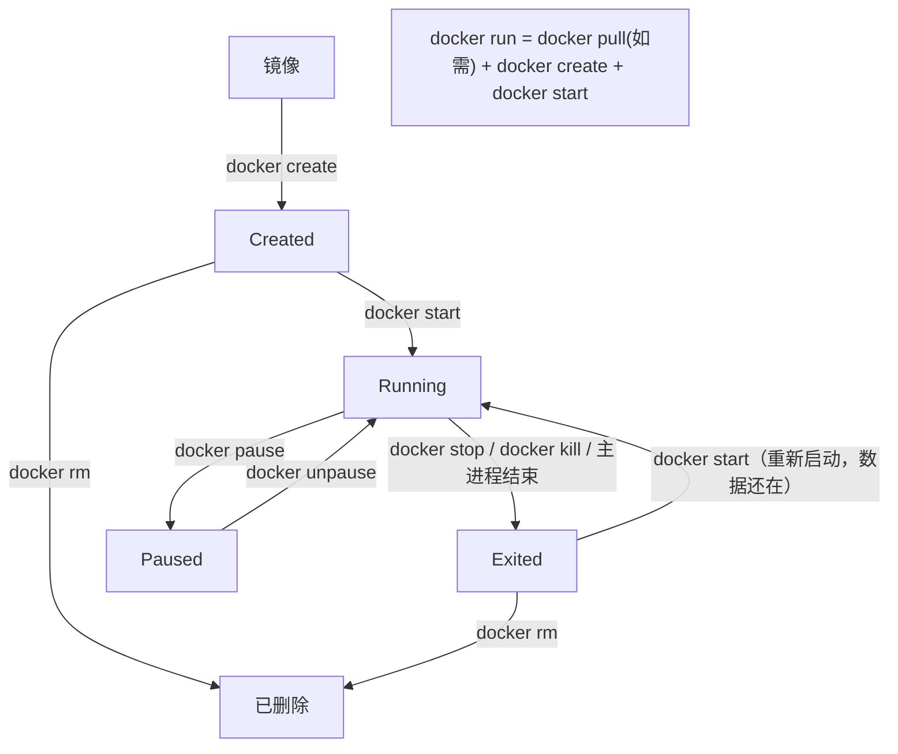

# 03 容器与常用命令

> 本篇解决什么问题：容器起来了之后怎么管理？怎么进去看日志、改配置、拷文件？怎么限制一个容器最多用多少内存和 CPU？容器挂了怎么自动重启？为什么有的容器 `docker ps` 看不见？读完本篇，你能熟练使用容器生命周期的全部命令，能定位线上容器的问题，能合理地给容器配置资源限制和重启策略。

## 一、容器的生命周期

### 1.1 状态流转图



### 1.2 七种状态

| 状态 | 说明 | 是否占用 CPU | 是否占用内存 |
|---|---|---|---|
| **Created** | 已创建，从未启动过 | 否 | 否（但占磁盘） |
| **Running (Up)** | 运行中 | 是 | 是 |
| **Paused** | 暂停（进程被冻结，类似虚拟机挂起） | 否 | **是**（内存里的数据还在） |
| **Exited** | 已停止 | 否 | 否 |
| **Restarting** | 正在重启中（用了 `--restart` 策略） | — | — |
| **Dead** | 异常状态，无法正常停止（罕见，通常是底层资源出问题） | — | — |
| **Removing** | 正在被删除 | — | — |

`docker ps` 默认只显示 Running 的容器；加 `-a` 显示全部。

## 二、容器命令全解

### 2.1 创建与启动

```bash
# 最常用：创建并启动（一条命令干三件事）
docker run [选项] 镜像 [命令]

# 后台运行 + 命名 + 端口映射（最标准的用法）
docker run -d --name my-redis -p 6379:6379 redis:7.4-alpine

# 前台运行（不加 -d），Ctrl+C 会停止容器
docker run --name test -it ubuntu:22.04 /bin/bash

# 交互式运行，退出后自动删除容器（临时代调试神器）
docker run -it --rm alpine:3.20 sh
```

`docker run` 的常用选项表（这张表建议收藏）：

| 选项 | 作用 | 示例 |
|---|---|---|
| `-d` | 后台运行（detached） | `docker run -d nginx` |
| `--name` | 给容器起名字 | `--name my-nginx` |
| `-p` | 端口映射 `宿主机:容器` | `-p 8080:80`、`-p 127.0.0.1:8080:80` |
| `-P` | 随机映射所有 EXPOSE 的端口 | `-P` |
| `-e` | 设置环境变量 | `-e MYSQL_ROOT_PASSWORD=123456` |
| `--env-file` | 从文件读环境变量 | `--env-file ./app.env` |
| `-v` | 挂载数据卷或目录 | `-v /data:/var/lib/mysql` |
| `--mount` | 挂载（新语法，更严谨） | `--mount type=bind,src=/data,dst=/app` |
| `--network` | 指定网络 | `--network my-net` |
| `--link` | 容器互联（**已废弃**，用网络代替） | — |
| `-it` | 交互式 + 伪终端（`i` + `t`） | `docker run -it ubuntu bash` |
| `--rm` | 容器停止后自动删除 | `--rm` |
| `--restart` | 重启策略 | `--restart unless-stopped` |
| `-m` / `--memory` | 限制内存 | `-m 512m` |
| `--cpus` | 限制 CPU 核数 | `--cpus 1.5` |
| `--cpu-shares` | CPU 相对权重（默认 1024） | `--cpu-shares 512` |
| `-u` | 指定运行用户 | `-u 1000:1000` |
| `-w` | 指定工作目录 | `-w /app` |
| `--entrypoint` | 覆盖镜像的 ENTRYPOINT | `--entrypoint /bin/sh` |
| `--privileged` | 特权模式（**慎用**，几乎拥有宿主机全部权限） | — |
| `--add-host` | 添加 hosts 记录 | `--add-host db:192.168.1.10` |
| `--dns` | 指定 DNS | `--dns 8.8.8.8` |
| `-h` | 指定 hostname | `-h node1` |
| `--label` | 打标签（便于批量管理） | `--label env=prod` |

**一个完整的生产级运行示例：**

```bash
docker run -d \
  --name order-service \
  --restart unless-stopped \
  -p 8080:8080 \
  -e SPRING_PROFILES_ACTIVE=prod \
  -e TZ=Asia/Shanghai \
  -v /data/order/logs:/app/logs \
  -v /data/order/config:/app/config:ro \
  --memory=1g \
  --memory-swap=1g \
  --cpus=2 \
  --log-opt max-size=100m \
  --log-opt max-file=3 \
  --health-cmd "curl -f http://localhost:8080/actuator/health || exit 1" \
  --health-interval=30s \
  registry.cn-hangzhou.aliyuncs.com/canoe-ns/order-service:1.0.0
```

### 2.2 查看容器

```bash
# 查看运行中的容器
docker ps

# 查看所有容器（含已停止）
docker ps -a

# 只显示容器 ID
docker ps -q

# 显示最近创建的 N 个容器
docker ps -n 5

# 显示容器大小（SIZE 列显示可写层大小）
docker ps -s
# CONTAINER ID   IMAGE   SIZE
# 3f8a5c1b9e2d   nginx   2B (virtual 187MB)
#                        ↑可写层  ↑镜像总大小

# 自定义输出
docker ps --format "table {{.Names}}\t{{.Status}}\t{{.Ports}}"

# 按条件过滤
docker ps -f "status=exited"
docker ps -f "name=order"
docker ps -f "label=env=prod"
```

**输出列解读：**

```text
CONTAINER ID   IMAGE     COMMAND                  CREATED         STATUS         PORTS                   NAMES
3f8a5c1b9e2d   nginx     "/docker-entrypoint.…"   2 minutes ago   Up 2 minutes   0.0.0.0:80->80/tcp      my-nginx
│              │         │                        │               │              │                       │
│              │         │                        │               │              └─ 端口映射             └─ 容器名
│              │         │                        │               └─ 状态（Up/Exited/health:healthy）
│              │         │                        └─ 创建时间
│              │         └─ 启动命令
│              └─ 基于的镜像
└─ 容器 ID（前 12 位）
```

**STATUS 列的几种显示：**

| 显示 | 含义 |
|---|---|
| `Up 2 minutes` | 运行中，已运行 2 分钟 |
| `Up 2 minutes (healthy)` | 运行中，健康检查通过 |
| `Up 2 minutes (unhealthy)` | 运行中，健康检查失败 |
| `Up 2 minutes (health: starting)` | 运行中，健康检查还在启动宽限期 |
| `Exited (0) 5 seconds ago` | 已退出，退出码 0（正常结束） |
| `Exited (1) 5 seconds ago` | 已退出，退出码 1（程序报错） |
| `Exited (137)` | 被 SIGKILL 杀掉（**通常是内存超限 OOM**） |
| `Restarting (1) 3 seconds ago` | 正在重启，已重启 1 次 |

### 2.3 启动 / 停止 / 重启

```bash
# 停止（发 SIGTERM，等 10 秒，超时发 SIGKILL）
docker stop 容器名或ID
docker stop my-nginx

# 指定等待时间（秒），超时后强制杀
docker stop -t 30 my-nginx

# 立即杀死（直接 SIGKILL，不给清理机会）
docker kill my-nginx

# 启动已停止的容器
docker start my-nginx

# 重启（= stop + start）
docker restart my-nginx
docker restart -t 30 my-nginx    # 指定超时

# 暂停（冻结进程，内存不释放）
docker pause my-nginx
docker unpause my-nginx

# 批量操作（配合 -q）
docker stop $(docker ps -q)              # 停止所有运行中的容器
docker restart $(docker ps -aq)          # 重启所有容器
```

::: tip docker stop 和 docker kill 的区别
- `docker stop`：先发 **SIGTERM**（优雅终止信号），应用可以捕获它做清理（关闭连接、保存状态、结束未完成任务），默认等 10 秒，超时才发 SIGKILL 强杀
- `docker kill`：直接发 **SIGKILL**，进程立即死亡，没有清理机会，可能造成数据丢失

**生产环境用 `stop`。** 对于 Java 应用，可以在代码里注册 shutdown hook 响应 SIGTERM，实现优雅停机。
:::

### 2.4 删除容器

```bash
# 删除已停止的容器
docker rm my-nginx

# 强制删除运行中的容器
docker rm -f my-nginx

# 删除时同时删除挂载的匿名卷
docker rm -v my-nginx

# 删除所有已停止的容器（常用清理命令）
docker container prune
# 或者
docker rm $(docker ps -aq -f "status=exited")

# 强制删除所有容器（危险！）
docker rm -f $(docker ps -aq)
```

## 三、进入容器与执行命令

### 3.1 docker exec（最常用）

`docker exec` 用于在**正在运行的容器里执行命令**。最重要的是进入容器的交互式 shell：

```bash
# 进入容器的 bash（最常用）
docker exec -it my-nginx /bin/bash

# alpine 镜像没有 bash，用 sh
docker exec -it my-alpine /bin/sh

# 以 root 身份进入（容器默认是非 root 用户时）
docker exec -u root -it my-app /bin/bash

# 指定工作目录
docker exec -w /app -it my-app sh

# 不进入交互，只执行单条命令并返回结果
docker exec my-nginx cat /etc/nginx/nginx.conf
docker exec my-redis redis-cli info
docker exec my-mysql mysql -uroot -p123456 -e "show databases;"
```

`-it` 是两个参数：

| 参数 | 全称 | 作用 |
|---|---|---|
| `-i` | `--interactive` | 保持标准输入（STDIN）打开，让你能输入命令 |
| `-t` | `--tty` | 分配一个伪终端，让输出有颜色、能支持 vim 等全屏程序 |

**退出容器：`exit` 或 Ctrl+D。** 注意：exec 进去再 exit，**容器不会停止**（因为退出的是你新起的 shell 进程，不是容器的主进程）。

### 3.2 docker attach（了解即可）

```bash
docker attach my-nginx
```

把当前终端"附着"到容器的**主进程**上。

::: danger attach 的坑
`docker attach` 进去后，**按 Ctrl+C 会直接停掉容器主进程**！因为 Ctrl+C 发送 SIGINT 给的是 PID 1（主进程）。

- 想"进去看看" → 用 `docker exec -it`
- 想看实时输出 → 用 `docker logs -f`
- `attach` 基本不用，知道它是什么就行
:::

### 3.3 文件拷贝 docker cp

容器和宿主机之间拷文件（不需要容器在运行）：

```bash
# 从容器拷到宿主机
docker cp my-nginx:/etc/nginx/nginx.conf ./nginx.conf

# 从宿主机拷到容器
docker cp ./nginx.conf my-nginx:/etc/nginx/nginx.conf

# 拷贝整个目录
docker cp ./config my-app:/app/config

# 从容器拷出来后改好再拷回去（修改容器配置的常见操作）
docker cp my-app:/app/config/application.yml ./
vi application.yml
docker cp ./application.yml my-app:/app/config/application.yml
docker restart my-app
```

::: tip docker cp 的局限
`docker cp` 是一次性拷贝，**修改只在当前容器生效**，容器重建就没了。而且改配置要进容器再重启，不符合"不可变基础设施"的理念。

**更好的做法：把配置文件挂载到容器外**（`-v /host/config:/app/config`），改宿主机文件再重启；或者干脆把配置打进镜像。第 04 章详细讲挂载。
:::

## 四、查看日志与监控

### 4.1 docker logs

```bash
# 查看全部日志
docker logs my-app

# 实时跟踪（类似 tail -f）
docker logs -f my-app

# 只看最后 100 行
docker logs --tail 100 my-app

# 只看最近 30 分钟的日志
docker logs --since 30m my-app

# 看某个时间点之后的
docker logs --since "2026-09-21T10:00:00" my-app

# 看某个时间点之前的
docker logs --until "2026-09-21T12:00:00" my-app

# 显示时间戳
docker logs -t my-app

# 组合：实时跟踪 + 时间戳 + 最后 200 行
docker logs -f -t --tail 200 my-app

# 按关键词过滤（docker logs 本身不支持 grep，需要管道）
docker logs my-app 2>&1 | grep ERROR
docker logs my-app 2>&1 | grep -A 10 -B 5 "Exception"
```

::: tip 日志去哪了
默认情况下容器的 stdout/stderr 会被 Docker 捕获，以 JSON 格式存在：

```
/var/lib/docker/containers/<容器ID>/<容器ID>-json.log
```

所以 **`docker logs` 读的就是这个文件**。也因此：
- 应用必须**把日志输出到标准输出**（console），而不是写到容器里的文件，否则 `docker logs` 看不到
- Spring Boot 默认是输出到 console 的，正好符合
- 这个文件会无限增长，所以第 01 章强调要配 `log-opts` 做轮转
:::

### 4.2 docker stats —— 实时资源监控

```bash
# 实时查看所有容器的资源占用（类似 top）
docker stats
# CONTAINER ID   NAME        CPU %   MEM USAGE / LIMIT   MEM %   NET I/O       BLOCK I/O   PIDS
# 3f8a5c1b9e2d   my-app      0.35%   245MiB / 1GiB       23.94%  1.2MB / 800kB 0B / 12MB   35

# 只看某个容器
docker stats my-app

# 只显示一次（不持续刷新，适合脚本采集）
docker stats --no-stream

# 自定义输出格式
docker stats --format "table {{.Name}}\t{{.CPUPerc}}\t{{.MemUsage}}"
```

### 4.3 docker top —— 查看容器内的进程

```bash
docker top my-app
# UID    PID    PPID   C   STIME   TTY   TIME       CMD
# root   12345  12320  0   10:00   ?     00:00:05   java -jar app.jar
```

注意这里的 `PID` 是**宿主机视角的 PID**。因为容器用 pid namespace 隔离，容器内部看到的 PID 1 在宿主机上其实是 12345。

### 4.4 docker inspect —— 查看全部细节

`docker inspect` 返回一个巨大的 JSON，包含容器的所有配置和状态。

```bash
# 查看全部
docker inspect my-app

# 用 --format 提取特定字段（Go template 语法）
docker inspect -f '{{.State.Status}}' my-app              # running
docker inspect -f '{{.State.Pid}}' my-app                 # 主进程在宿主机的 PID
docker inspect -f '{{.NetworkSettings.IPAddress}}' my-app # 容器 IP
docker inspect -f '{{.HostConfig.Memory}}' my-app         # 内存限制（字节）
docker inspect -f '{{json .Mounts}}' my-app               # 挂载信息
docker inspect -f '{{json .NetworkSettings.Ports}}' my-app # 端口映射
docker inspect -f '{{range .Config.Env}}{{println .}}{{end}}' my-app  # 环境变量
```

常用排查场景：

```bash
# 1. 容器为什么退出了？看退出码和错误信息
docker inspect -f '{{.State.ExitCode}} {{.State.Error}}' my-app

# 2. 容器的 IP 是多少？
docker inspect -f '{{range .NetworkSettings.Networks}}{{.IPAddress}}{{end}}' my-app

# 3. 容器挂载了哪些目录？
docker inspect -f '{{range .Mounts}}{{.Source}} -> {{.Destination}}{{"\n"}}{{end}}' my-app

# 4. 容器的日志路径在哪？
docker inspect -f '{{.LogPath}}' my-app
```

### 4.5 docker events —— 实时事件流

```bash
# 监听 Docker 的所有事件（创建、启动、停止、删除、健康检查...）
docker events

# 只看某类事件
docker events --filter 'event=die'      # 容器死亡
docker events --filter 'event=oom'      # 内存溢出
docker events --filter 'container=my-app'

# 看最近 10 分钟的事件
docker events --since 10m
```

排查"容器莫名其妙挂了"时很好用。

## 五、资源限制（非常重要）

**不给容器设资源限制，是生产环境的重大隐患。** 一个容器内存泄漏，会把整个宿主机拖垮，上面所有服务全部遭殃。

### 5.1 内存限制

```bash
# 限制容器最多用 512MB 内存
docker run -d --memory=512m --name app nginx

# 限制内存 + swap 总共 1G
docker run -d --memory=512m --memory-swap=1g nginx

# 禁止使用 swap（性能更可预测，推荐）
docker run -d --memory=1g --memory-swap=1g nginx

# 软限制（内存紧张时才生效）
docker run -d --memory=1g --memory-reservation=512m nginx

# OOM 时是否杀掉容器（默认 true）
docker run -d --memory=512m --oom-kill-disable=false nginx
```

| 参数 | 说明 |
|---|---|
| `-m` / `--memory` | 硬限制，容器最多能用多少物理内存。超过会触发 OOM |
| `--memory-swap` | 内存 + swap 的总限制。**设为和 `--memory` 相同即表示禁用 swap** |
| `--memory-reservation` | 软限制，宿主机内存紧张时才强制执行，平时可以超过 |
| `--oom-kill-disable` | 内存超限时是否禁止内核 OOM killer 杀进程。**不建议关**，关了会导致宿主机卡死 |

::: danger Java 应用必须注意
**JDK 8u191 之前的版本不识别容器内存限制！** JVM 会按宿主机的全部内存来算默认堆大小，导致容器被 OOM 杀掉。

解决办法（JDK 8u191+ 和 JDK 11+ 默认开启容器感知）：

```bash
# 加上这个 JVM 参数，让 JVM 按容器限制而非宿主机内存的百分比分配堆
docker run -d -m 1g \
  -e JAVA_OPTS="-XX:+UseContainerSupport -XX:MaxRAMPercentage=75.0" \
  my-java-app
```

- `-XX:+UseContainerSupport`：启用容器支持（JDK 8u191+ 默认开）
- `-XX:MaxRAMPercentage=75.0`：最大堆占容器限制内存的 75%（留 25% 给元空间、线程栈、直接内存）

**JDK 17+ 已经默认开启且默认 MaxRAMPercentage=25**，如果你的容器只跑 Java，可以适当调大到 70~75。
:::

### 5.2 CPU 限制

```bash
# 最多用 1.5 个 CPU 核
docker run -d --cpus=1.5 nginx

# 限制只能用第 0 和第 1 个核
docker run -d --cpuset-cpus="0,1" nginx

# 相对权重（默认 1024，只在 CPU 争抢时生效，不限制上限）
docker run -d --cpu-shares=512 nginx

# 限制 CPU 时间片配额（更底层的参数，一般用 --cpus 就行）
docker run -d --cpu-period=100000 --cpu-quota=50000 nginx   # = 0.5 核
```

| 参数 | 说明 | 特点 |
|---|---|---|
| `--cpus=1.5` | 硬上限，最多用 1.5 核 | **最直观，推荐** |
| `--cpuset-cpus="0,1"` | 绑定到指定 CPU 核 | 减少上下文切换，NUMA 架构下有用 |
| `--cpu-shares=512` | 相对权重，默认 1024 | **只在 CPU 繁忙时生效**，空闲时可以超额用 |

**`--cpus` vs `--cpu-shares` 的区别：**

- `--cpus=1`：无论宿主机多空闲，这个容器**最多**只能用 1 核（硬限制）
- `--cpu-shares=512`：宿主机空闲时，这个容器想用多少用多少；宿主机 CPU 打满时，它只分到别人一半的时间片（软限制）

### 5.3 磁盘 IO 限制（了解）

```bash
# 限制写入速度为 10MB/s
docker run -d --device-write-bps /dev/sda:10mb nginx

# 限制每秒 IOPS
docker run -d --device-write-iops /dev/sda:100 nginx
```

实践中用得不多，一般用 cgroup v2 或者直接靠存储层（云盘 QoS）来控制。

### 5.4 查看实际限制是否生效

```bash
# 看容器的内存限制
docker inspect -f '{{.HostConfig.Memory}}' my-app
# 1073741824  （字节数，除以 1024/1024/1024 = 1GB）

# 进容器看它"认为"自己有多少内存（验证 cgroup 是否生效）
docker exec my-app cat /sys/fs/cgroup/memory.max    # cgroup v2
docker exec my-app cat /sys/fs/cgroup/memory/memory.limit_in_bytes  # cgroup v1

# 看 CPU 限制
docker exec my-app cat /sys/fs/cgroup/cpu.max
```

## 六、重启策略（--restart）

容器因为各种原因退出后，要不要自动重启？这就是重启策略。

```bash
# 容器退出时总是重启
docker run -d --restart=always nginx

# 除了手动 docker stop 之外都重启（推荐！）
docker run -d --restart=unless-stopped nginx

# 非正常退出（退出码非 0）时才重启，最多重试 3 次
docker run -d --restart=on-failure:3 nginx

# 默认值，永不自动重启
docker run -d --restart=no nginx
```

| 策略 | 行为 | 适用场景 |
|---|---|---|
| `no` | 不自动重启（默认） | 一次性任务、批处理 |
| `on-failure[:N]` | **退出码非 0** 时重启，可指定最多 N 次 | 任务型容器，失败重试几次 |
| `always` | 只要容器停止就重启（包括正常退出、手动 stop 后 daemon 重启） | 常驻服务 |
| `unless-stopped` | 和 always 类似，但**手动 `docker stop` 后不再重启** | **推荐使用**，常驻服务 |

::: tip always vs unless-stopped（容易混淆）
两者的区别只在一个场景：**Docker daemon 重启时（比如你 `systemctl restart docker` 或服务器重启）**。

- `always`：daemon 重启后，容器会被重新拉起（**哪怕你之前手动 stop 过**）
- `unless-stopped`：daemon 重启后，**只有那些不是被你手动 stop 的容器**才会被拉起

也就是说 `unless-stopped` 更尊重人的意愿：你手动停掉的，Docker 不会再偷偷启动它。**生产环境推荐用 `unless-stopped`。**
:::

**给已存在的容器修改重启策略：**

```bash
docker update --restart=unless-stopped my-app
```

`docker update` 还能动态修改资源限制（无需重建容器）：

```bash
# 动态调整内存限制
docker update --memory=2g --memory-swap=2g my-app

# 动态调整 CPU
docker update --cpus=4 my-app
```

## 七、容器日志管理

### 7.1 配置日志轮转（必须做）

不配置的话，容器日志会无限增长，几个月后磁盘就满了。

**方式一：全局配置（`/etc/docker/daemon.json`，对所有新容器生效）**

```json
{
  "log-driver": "json-file",
  "log-opts": {
    "max-size": "100m",
    "max-file": "3"
  }
}
```

**方式二：单个容器配置（运行时指定）**

```bash
docker run -d \
  --log-opt max-size=50m \
  --log-opt max-file=5 \
  --name my-app \
  my-image
```

意思是：每个日志文件最大 50MB，最多保留 5 个文件（即最多占用 250MB）。

### 7.2 日志驱动

| 驱动 | 说明 |
|---|---|
| `json-file` | **默认**，日志存为本地 JSON 文件，用 `docker logs` 查看 |
| `local` | 本地存储但格式更紧凑，性能更好（Docker 20.10+） |
| `syslog` | 发送到 syslog 服务 |
| `journald` | 发送到 systemd journald，可用 `journalctl` 查看 |
| `fluentd` | 发送到 Fluentd 收集器 |
| `gelf` | 发送到 Graylog |
| `awslogs` / `gcplogs` | 发送到云厂商日志服务 |
| `none` | 不记录日志（**不推荐**，出问题没法排查） |

```bash
# 用 local 驱动（比 json-file 更省空间）
docker run -d --log-driver=local --log-opt max-size=100m my-app

# 发送到 syslog
docker run -d --log-driver=syslog --log-opt syslog-address=udp://1.2.3.4:1111 my-app
```

::: tip 生产环境建议
容器日志交给专业的日志系统（ELK / Loki / 云厂商日志服务），而不是留在本地文件里。这样容器删了日志还在，还能集中检索和告警。
:::

## 八、容器的导入导出

### 8.1 docker export / import（容器快照）

```bash
# 把容器当前的文件系统导出为 tar
docker export my-app > my-app-snapshot.tar

# 从快照导入为镜像
docker import my-app-snapshot.tar my-image:from-container

# 导入时指定一些配置
docker import -c 'CMD ["java","-jar","/app.jar"]' my-app-snapshot.tar my-image:v1
```

**和 `docker save/load` 的区别（重要）：**

| 对比 | `save` / `load` | `export` / `import` |
|---|---|---|
| 操作对象 | **镜像** | **容器** |
| 保存内容 | 完整镜像（所有层、历史、元数据、ENV、CMD） | 只有容器当前的文件系统（扁平化成一层） |
| 保留 Dockerfile 历史 | ✅ | ❌ |
| 保留 ENV / CMD / EXPOSE | ✅ | ❌（要重新指定） |
| 体积 | 较大（含所有层） | 较小（只有最终状态） |
| 典型用途 | 镜像备份迁移 | 制作裸基础镜像、导出容器状态 |

**日常用 `save/load`。**

### 8.2 docker commit（不推荐）

```bash
# 把容器的当前状态提交为一个新镜像
docker commit my-app my-image:v2

# 带一些配置
docker commit -c 'CMD ["nginx","-g","daemon off;"]' -c 'EXPOSE 80' my-app my-image:v2
```

::: danger 为什么不建议用 docker commit
`docker commit` 把容器的可写层固化成镜像，看起来很方便（"我在容器里改好了，直接存成镜像"），但它有严重问题：

1. **不可复现**：没人知道你在容器里到底改了什么，没有 Dockerfile 记录
2. **镜像臃肿**：会包含所有中间产物（apt 缓存、临时文件、日志文件）
3. **无法版本管理**：改动无法 review、无法 diff、无法回滚
4. **黑盒**：三个月后没人敢动这个镜像

**正确做法：所有镜像都通过 Dockerfile 构建。** 需要调试时进容器试，试好了把命令写回 Dockerfile 重新 build。
:::

## 九、实战：部署一套常用中间件

用前面学的知识，把开发常用的中间件一次性跑起来（第 05 章会用 Compose 更优雅地做这件事）。

### 9.1 MySQL

```bash
docker run -d \
  --name mysql \
  --restart unless-stopped \
  -p 3306:3306 \
  -e MYSQL_ROOT_PASSWORD=root123 \
  -e TZ=Asia/Shanghai \
  -v /data/mysql/data:/var/lib/mysql \
  -v /data/mysql/conf:/etc/mysql/conf.d \
  --memory=2g \
  mysql:8.0 \
  --character-set-server=utf8mb4 \
  --collation-server=utf8mb4_unicode_ci
```

注意最后那两个 `--character-set-server` 是**传给 mysqld 的参数**（因为 mysql 镜像的 ENTRYPOINT 是 `docker-entrypoint.sh`，它会把这些转发给 mysqld）。

### 9.2 Redis

```bash
docker run -d \
  --name redis \
  --restart unless-stopped \
  -p 6379:6379 \
  -v /data/redis/data:/data \
  -v /data/redis/redis.conf:/usr/local/etc/redis/redis.conf \
  --memory=1g \
  redis:7.4-alpine \
  redis-server /usr/local/etc/redis/redis.conf
```

### 9.3 Nginx（静态站点 + 反向代理）

```bash
docker run -d \
  --name nginx \
  --restart unless-stopped \
  -p 80:80 -p 443:443 \
  -v /data/nginx/html:/usr/share/nginx/html:ro \
  -v /data/nginx/conf/nginx.conf:/etc/nginx/nginx.conf:ro \
  -v /data/nginx/logs:/var/log/nginx \
  nginx:1.25-alpine
```

`:ro` 表示**只读挂载**，容器内不能修改，防止容器里的程序篡改宿主机文件（安全实践）。

### 9.4 RabbitMQ

```bash
docker run -d \
  --name rabbitmq \
  --restart unless-stopped \
  -p 5672:5672 -p 15672:15672 \
  -e RABBITMQ_DEFAULT_USER=admin \
  -e RABBITMQ_DEFAULT_PASS=admin123 \
  -v /data/rabbitmq:/var/lib/rabbitmq \
  --memory=1g \
  rabbitmq:4.0-management-alpine
```

### 9.5 一键清理脚本

```bash
#!/bin/bash
# clean-docker.sh —— 清理 Docker 无用资源（生产环境执行前请确认！）

echo "=== 清理前磁盘占用 ==="
docker system df

echo ""
echo "=== 停止的容器 ==="
docker ps -a -f "status=exited" --format "table {{.Names}}\t{{.Image}}\t{{.Status}}"

read -p "确认删除以上停止的容器？(y/N) " confirm
if [ "$confirm" = "y" ]; then
  docker container prune -f
fi

echo ""
echo "=== 虚悬镜像 ==="
docker images -f "dangling=true"

read -p "确认删除虚悬镜像？(y/N) " confirm2
if [ "$confirm2" = "y" ]; then
  docker image prune -f
fi

echo ""
echo "=== 清理后磁盘占用 ==="
docker system df
```

## 十、常见问题排查

### 10.1 容器启动失败怎么查

```bash
# 1. 先看容器状态（注意退出码）
docker ps -a
# Exited (1)  → 程序报错
# Exited (127) → 命令不存在（比如 alpine 里用 bash）
# Exited (137) → 被 SIGKILL，通常是 OOM

# 2. 看日志（90% 的问题在这里能找到答案）
docker logs my-app
docker logs --tail 200 -t my-app

# 3. 看 inspect 里的错误详情
docker inspect -f '{{.State.Error}}' my-app

# 4. 如果容器起不来没法 exec，用同样镜像起一个能挂住的容器进去看
docker run -it --rm --entrypoint sh my-image
# 进去后手动执行原本的 CMD，看报什么错
```

### 10.2 端口映射不通

```bash
# 1. 确认容器真的在监听
docker ps    # 看 PORTS 列有没有 0.0.0.0:8080->8080/tcp

# 2. 确认容器内的服务真的在跑（注意：容器内监听 127.0.0.1 是访问不到的！）
docker exec my-app netstat -tlnp
# 如果是 127.0.0.1:8080 → 改成监听 0.0.0.0:8080
# Spring Boot: server.address=0.0.0.0

# 3. 宿主机端口是否被占用
netstat -tlnp | grep 8080

# 4. 防火墙 / 安全组
firewall-cmd --list-ports
firewall-cmd --add-port=8080/tcp --permanent && firewall-cmd --reload
```

::: danger 最常见的坑：应用监听 127.0.0.1
这是新手最常踩的坑：**容器里的应用如果只监听 `127.0.0.1`，端口映射是无效的**。因为 `127.0.0.1` 是容器自己的回环地址，外部流量进不来。

必须监听 `0.0.0.0`（所有网卡）：
- Spring Boot：`server.address=0.0.0.0`（默认就是）
- Nginx：`listen 0.0.0.0:80`
- Node.js：`app.listen(3000, '0.0.0.0')`
- Python Flask：`app.run(host='0.0.0.0')`
:::

### 10.3 容器时间不对

```bash
# 方式一：挂载宿主机的时区文件（推荐，不用改镜像）
docker run -d \
  -v /etc/localtime:/etc/localtime:ro \
  -v /etc/timezone:/etc/timezone:ro \
  my-app

# 方式二：环境变量
docker run -d -e TZ=Asia/Shanghai my-app

# Java 应用额外加 JVM 参数
docker run -d -e JAVA_OPTS="-Duser.timezone=Asia/Shanghai" my-app
```

### 10.4 修改运行中容器的配置

有些配置 `docker run` 时忘了加，不想删容器重建怎么办？

```bash
# 可以动态修改的：重启策略、资源限制
docker update --restart=unless-stopped my-app
docker update --memory=2g --cpus=2 my-app

# 不能动态修改的：端口映射、环境变量、挂载卷
# 这些只能 docker commit 成新镜像再 run（或者重建容器）
# 这也是第 05 章推荐使用 Compose 的原因——改配置改文件重新 up 就行
```

### 10.5 命令速查表

| 分类 | 命令 |
|---|---|
| 运行 | `docker run -d --name x -p 80:80 image` |
| 查看 | `docker ps` / `docker ps -a` |
| 启停 | `docker start/stop/restart/kill/pause/unpause` |
| 删除 | `docker rm [-f]` / `docker container prune` |
| 进入 | `docker exec -it 容器 sh|bash` |
| 执行 | `docker exec 容器 命令` |
| 日志 | `docker logs [-f] [--tail N] [--since 30m]` |
| 详情 | `docker inspect -f`（配合 Go template 提取字段） |
| 进程 | `docker top 容器` |
| 资源 | `docker stats` |
| 拷贝 | `docker cp 容器:路径 本地路径`（双向） |
| 更新 | `docker update --memory=2g --restart=unless-stopped` |
| 事件 | `docker events` |
| 导出 | `docker export` / `docker commit`（不推荐 commit） |

## 本篇小结

- **容器状态流转**：Created → Running → Exited；`docker run` = pull + create + start。
- `docker ps` 只看运行中的，**加 `-a` 才能看到已停止的容器**。
- **`-d` 后台运行、`-p 宿端口:容器端口`、`--name` 命名** 是 run 的三个最常用选项。
- `docker exec -it 容器 sh` **进入容器**，exit 退出后容器不会停止；**`docker attach` 进去 Ctrl+C 会停掉容器**，不要用。
- **`docker stop` 发 SIGTERM 允许优雅停机，`docker kill` 直接 SIGKILL**，生产用 stop。
- `docker logs` 读的是容器 stdout 的 JSON 日志文件，**应用必须把日志输出到控制台**。
- `docker inspect -f` 配合 Go template 提取特定字段（如 `.State.Status`、`.NetworkSettings.IPAddress`），排查问题时非常有用。
- **资源限制必须配**：`-m/--memory` 限内存、`--cpus` 限 CPU；不配的话一个容器内存泄漏会拖垮整台宿主机。
- **Java 应用要加 `-XX:+UseContainerSupport -XX:MaxRAMPercentage=75.0`**，否则 JVM 按宿主机内存算堆大小会被 OOM 杀掉。
- `--cpus` 是硬限制，`--cpu-shares` 是相对权重（只在 CPU 争抢时生效）。
- **重启策略推荐 `unless-stopped`**：常驻服务用它，手动 stop 后不会被 daemon 重启偷偷拉起。
- **`docker update` 能动态改内存/CPU/重启策略**，但端口映射和挂载卷改不了，得重建容器。
- **日志必须配轮转**（`max-size` + `max-file`），否则几个月后磁盘满。
- **不要用 `docker commit` 造镜像**（黑盒、臃肿、不可复现），一切都走 Dockerfile。
- **`save/load` 操作镜像，`export/import` 操作容器**，前者保留完整历史元数据，日常用前者。
- **最常见的访问不通原因**：应用监听了 `127.0.0.1` 而不是 `0.0.0.0`，端口映射形同虚设。
- 退出码速记：**0 正常、1 程序报错、127 命令不存在、137 被 OOM 杀掉**。

## 参考链接

- [docker run 官方参考](https://docs.docker.com/reference/cli/docker/container/run/)
- [容器资源限制（Runtime options）](https://docs.docker.com/config/containers/resource_constraints/)
- [容器重启策略](https://docs.docker.com/config/containers/start-containers-automatically/)
- [日志驱动配置](https://docs.docker.com/config/containers/logging/configure/)
- [docker exec 官方参考](https://docs.docker.com/reference/cli/docker/container/exec/)
- [Java 与容器内存限制](https://developers.redhat.com/articles/2022/04/19/java-17-whats-new-openjdks-container-awareness)
- [docker inspect 模板语法](https://docs.docker.com/reference/cli/docker/container/inspect/)

下一篇 → [04 数据卷与网络](/ops/docker/network)
