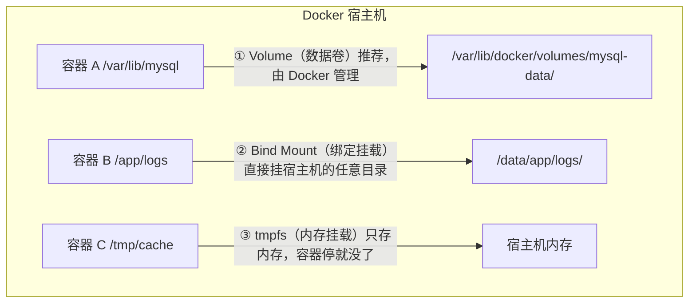
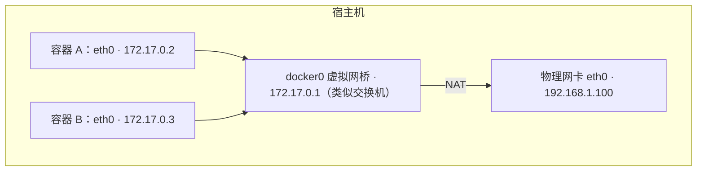
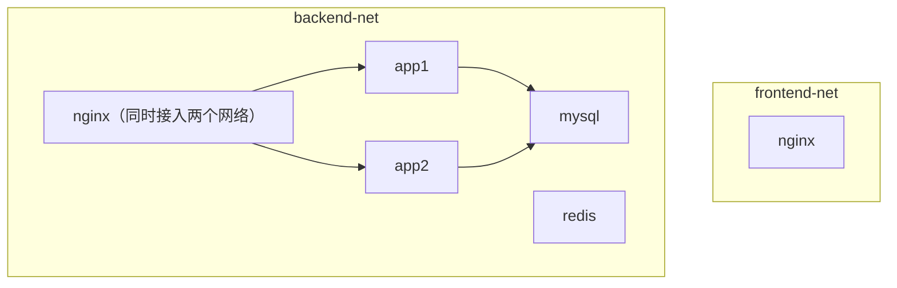

# 04 数据卷与网络

> 本篇解决什么问题：容器删了数据就没了怎么办？MySQL 跑在容器里数据存在哪？容器之间怎么互相访问？为什么容器里连不上宿主机的 MySQL？端口映射、host 网络、bridge 网络有什么区别？读完本篇，你能正确持久化容器数据、配置容器间通信、理解 Docker 的四种网络模式并知道什么时候该用哪种。

## 一、为什么需要数据持久化

### 1.1 问题：容器的数据是临时的

回顾第 02 章讲的：容器的文件改动都在**可写层**，容器一删，可写层就没了。

来看一个残酷的演示：

```bash
# 1. 启动一个 MySQL 容器
docker run -d --name mysql-test -e MYSQL_ROOT_PASSWORD=123456 mysql:8.0

# 2. 进去建库建表插数据
docker exec -it mysql-test mysql -uroot -p123456
# mysql> CREATE DATABASE demo;
# mysql> USE demo;
# mysql> CREATE TABLE user(id INT, name VARCHAR(20));
# mysql> INSERT INTO user VALUES(1, '张三');
# mysql> exit

# 3. 删掉容器
docker rm -f mysql-test

# 4. 用同一个镜像再起一个
docker run -d --name mysql-test2 -e MYSQL_ROOT_PASSWORD=123456 mysql:8.0
docker exec -it mysql-test2 mysql -uroot -p123456 -e "SHOW DATABASES;"
# +--------------------+
# | Database           |
# +--------------------+
# | information_schema |
# | mysql              |
# | performance_schema |
# | sys                |
# +--------------------+
# demo 库不见了！刚才的数据全没了！
```

**这就是问题所在：容器的可写层随容器删除而消失。**

### 1.2 三种解决方案

Docker 提供了三种把数据存到容器外的方式：



| 方式 | 数据存在哪 | 生命周期 | 适用场景 |
|---|---|---|---|
| **Volume（数据卷）** | `/var/lib/docker/volumes/` 下，由 Docker 管理 | 独立于容器，容器删了还在 | **数据库数据、应用数据（推荐）** |
| **Bind Mount（绑定挂载）** | 宿主机的任意指定目录 | 由宿主机文件系统管理 | **配置文件、日志、源码（开发时用）** |
| **tmpfs** | 宿主机内存 | 容器停止即消失 | 敏感数据（如密钥）、临时缓存 |

## 二、Volume（数据卷）—— 推荐方式

### 2.1 什么是数据卷

数据卷是 **Docker 管理的、存在于宿主机文件系统某处的一个目录**。你不需要关心它具体在哪（虽然可以查），只要通过卷名引用它。

**优点：**

- 由 Docker 管理，跨平台一致（不用管 Linux/Windows 路径差异）
- 可以用 `docker volume` 命令统一管理（创建、查看、备份、删除）
- 支持卷驱动，可以存到远程存储（NFS、云盘）
- 权限处理更规范（Docker 会自动处理 SELinux 标签等）
- **可以被多个容器共享**

### 2.2 数据卷命令

```bash
# 创建一个具名数据卷
docker volume create mysql-data

# 列出所有数据卷
docker volume ls
# DRIVER    VOLUME NAME
# local     mysql-data

# 查看数据卷详情（能看到它在宿主机上的真实路径）
docker volume inspect mysql-data
# [
#     {
#         "CreatedAt": "2026-09-21T10:00:00+08:00",
#         "Driver": "local",
#         "Labels": null,
#         "Mountpoint": "/var/lib/docker/volumes/mysql-data/_data",   ← 真实路径
#         "Name": "mysql-data",
#         "Options": null,
#         "Scope": "local"
#     }
# ]

# 删除数据卷（必须没有被容器使用）
docker volume rm mysql-data

# 删除所有未被使用的数据卷（谨慎！）
docker volume prune

# 查看哪些容器在用某个卷
docker ps -a --filter volume=mysql-data
```

### 2.3 使用数据卷

**方式一：`-v 卷名:容器路径`（最常用）**

```bash
docker run -d \
  --name mysql \
  -e MYSQL_ROOT_PASSWORD=root123 \
  -v mysql-data:/var/lib/mysql \
  mysql:8.0
```

如果 `mysql-data` 这个卷不存在，Docker 会**自动创建**它。

**方式二：`--mount`（新语法，更明确，推荐在生产用）**

```bash
docker run -d \
  --name mysql \
  -e MYSQL_ROOT_PASSWORD=root123 \
  --mount type=volume,src=mysql-data,dst=/var/lib/mysql \
  mysql:8.0
```

`--mount` 用键值对明确指定类型、源、目标，可读性更好，也不容易写错顺序。

::: tip -v 和 --mount 怎么选
- `-v`（`--volume`）：简洁，`-v 源:目标[:选项]`，三个字段用冒号分隔。**缺点：路径里有冒号时会解析错**
- `--mount`：冗长但明确，`type=xxx,src=xxx,dst=xxx`

**日常用 `-v` 足够；写 compose 文件时建议用长语法或明确的 volume 声明。**
:::

### 2.4 数据卷的读写权限

```bash
# 只读挂载（容器内不能修改，防止程序篡改配置）
docker run -d -v /host/config:/app/config:ro my-app

# 读写（默认）
docker run -d -v /host/config:/app/config:rw my-app
```

### 2.5 多个容器共享数据卷

```bash
# 容器 A 写数据
docker run -it --name writer -v shared-data:/data alpine sh
# echo "hello" > /data/test.txt
# exit

# 容器 B 读数据
docker run -it --rm -v shared-data:/data alpine cat /data/test.txt
# hello
```

典型应用：**Nginx + 应用容器共享静态资源**，或者**数据容器模式**（一个容器专门持有数据卷，其他容器 `--volumes-from` 引用）。

```bash
# --volumes-from：继承另一个容器的所有挂载（了解即可，现在用得少了）
docker run -d --name app2 --volumes-from app1 my-image
```

### 2.6 数据卷的备份与恢复

因为数据卷在宿主机上就是个普通目录，备份就是打包那个目录：

```bash
# 备份：起一个临时容器，同时挂载数据卷和宿主机备份目录，在容器内打包
docker run --rm \
  -v mysql-data:/source:ro \
  -v /backup:/backup \
  alpine tar czf /backup/mysql-backup-$(date +%Y%m%d).tar.gz -C /source .

# 恢复：反过来解压
docker run --rm \
  -v mysql-data:/target \
  -v /backup:/backup:ro \
  alpine tar xzf /backup/mysql-backup-20260921.tar.gz -C /target
```

这个技巧很实用：**用一个带 tar 的临时容器（`--rm`，用完即删）同时挂载源和目标，在容器里做打包/解包。**

::: tip 数据库的备份还是用官方工具
上面的方式是通用的文件级备份。对于 MySQL，**推荐用 `mysqldump`** 做逻辑备份，因为直接打包正在写入的数据文件可能得到不一致的快照：

```bash
docker exec mysql mysqldump -uroot -proot123 --all-databases > backup.sql
```
:::

## 三、Bind Mount（绑定挂载）

### 3.1 什么是绑定挂载

直接把**宿主机的一个具体目录**挂载到容器里。容器内外看到的是同一份文件，双向同步。

```bash
# 把宿主机的 /data/app/logs 挂到容器的 /app/logs
docker run -d \
  -v /data/app/logs:/app/logs \
  my-app
```

**和数据卷的区别：**

| 对比 | Volume | Bind Mount |
|---|---|---|
| 路径 | `卷名:容器路径`，位置由 Docker 决定 | `/宿主机绝对路径:容器路径`，位置你指定 |
| Docker 是否管理 | ✅ 由 Docker 创建管理 | ❌ 只是引用已有目录，Docker 不管 |
| 目录不存在时 | 自动创建，**并且会把镜像里的初始内容复制过去** | 自动创建，**但为空，会覆盖（遮蔽）镜像里原有的内容** |
| 能否用相对路径 | ❌ 只能用卷名 | ❌ 必须用绝对路径（`$PWD` 可以） |
| 跨平台一致性 | 好 | 差（Windows 路径格式不同） |
| 典型用途 | 数据库数据、持久化存储 | 配置文件、日志、开发时挂载源码 |

### 3.2 一个重要差异：初始内容

这是新手容易踩的坑：

```bash
# Docker 会自动把镜像里 /app/config 目录的内容，复制到新创建的 my-config 卷里
docker run -d -v my-config:/app/config my-app
# 结果：卷里有镜像自带的默认配置文件 ✅

# 绑定挂载：宿主机 /tmp/empty 是空目录，挂载后容器里 /app/config 变成空的！
docker run -d -v /tmp/empty:/app/config my-app
# 结果：镜像里的默认配置被"遮蔽"了，容器看到的是空目录 ❌
```

**结论：**
- 想保留镜像自带的内容 → 用 **volume**
- 想完全用宿主机的文件覆盖容器内容（比如配置文件） → 用 **bind mount**（这正是我们想要的）

### 3.3 典型用法

**挂载配置文件（最常见）：**

```bash
docker run -d \
  -v /data/nginx/nginx.conf:/etc/nginx/nginx.conf:ro \
  -v /data/nginx/conf.d:/etc/nginx/conf.d:ro \
  nginx:alpine
```

改宿主机上的配置 → `docker restart nginx` 生效，不用进容器。

**挂载日志目录（方便采集和排查）：**

```bash
docker run -d \
  -v /data/logs/order:/app/logs \
  order-service:1.0.0
```

宿主机上直接 `tail -f /data/logs/order/app.log`，或者用 Filebeat 采集。

**开发环境挂载源码（热更新）：**

```bash
# 前端项目：挂载源码目录，改代码立即生效，不用重新 build 镜像
docker run -d \
  -p 3000:3000 \
  -v $(pwd)/src:/app/src \
  -v /app/node_modules \    # 注意：这行是匿名卷，防止 node_modules 被覆盖
  node:20-alpine \
  npm run dev
```

::: tip 那个 `-v /app/node_modules` 是什么意思
这是个**匿名卷**（只写容器路径，不写源）。作用是：让 `/app/node_modules` 这个目录**不被上面的 bind mount 影响**，使用镜像里本来就装好的依赖。

如果宿主机的 `src` 目录里没有 `node_modules`，而 bind mount 又把 `/app` 整目录覆盖了，容器就找不到依赖了。用匿名卷把 node_modules 单独"保护"起来。
:::

### 3.4 权限问题（常见坑）

Linux 下容器内外是同一份文件，但**用户 UID 可能不一致**：

```text
宿主机上的文件：属主是 UID 1000 的用户
容器里的应用：以 UID 1001 的 app 用户运行
结果：app 用户读写不了这些文件 → Permission denied
```

解决办法：

```bash
# 1. 查看宿主机目录的属主和 UID
ls -ln /data/app/logs
# drwxr-xr-x 2 1000 1000 4096 ... /data/app/logs

# 2. 启动时用对应的 UID 运行
docker run -d -u 1000:1000 -v /data/app/logs:/app/logs my-app

# 3. 或者改宿主机目录权限（简单粗暴）
chmod 777 /data/app/logs

# 4. 或者在 Dockerfile 里创建相同 UID 的用户
RUN groupadd -g 1000 app && useradd -u 1000 -g app app
```

::: tip SELinux 系统（CentOS/RHEL）额外注意
启用了 SELinux 的系统上，bind mount 会被 SELinux 拦截，需要在挂载选项后加 `:z` 或 `:Z`：

```bash
# :z —— 共享标签，多个容器可以共享这个目录
docker run -d -v /data/app:/app:z my-app

# :Z —— 私有标签，只有这个容器能用
docker run -d -v /data/app:/app:Z my-app
```
:::

## 四、tmpfs（内存挂载）

```bash
# 挂载到内存，不落盘
docker run -d --tmpfs /tmp my-app

# 指定大小
docker run -d --mount type=tmpfs,dst=/tmp,tmpfs-size=100m my-app
```

**特点：**
- 数据只存在于宿主机内存中，**容器停止即消失**
- 读写极快
- 不占磁盘，不产生 IO

**适用场景：**
- 存放敏感信息（密码、token），避免落盘被泄露
- 临时文件、缓存
- 需要高性能的临时目录

## 五、Docker 网络基础

### 5.1 默认的网络

安装 Docker 后会自动创建三个网络：

```bash
$ docker network ls
NETWORK ID     NAME      DRIVER    SCOPE
a1b2c3d4e5f6   bridge    bridge    local
g7h8i9j0k1l2   host      host      local
m3n4o5p6q7r8   none      null      local
```

| 网络 | 驱动 | 说明 |
|---|---|---|
| **bridge** | bridge | **默认网络**。不指定 `--network` 时容器就加入它。容器间可通过 IP 互通，有独立的 IP 段 |
| **host** | host | 容器**直接使用宿主机的网络栈**，没有独立 IP，端口直接占用宿主机端口 |
| **none** | null | 完全无网络，只有 lo 回环。用于需要完全隔离的场景 |

### 5.2 四种网络模式对比

| 模式 | 命令 | IP | 端口 | 性能 | 隔离性 | 适用场景 |
|---|---|---|---|---|---|---|
| **bridge（默认）** | `--network bridge` | 有独立 IP（如 172.17.0.2） | 需要 `-p` 映射 | 较好（有一次 NAT） | 好 | **绝大多数场景** |
| **host** | `--network host` | 用宿主机 IP | 直接用宿主机端口，不需要 `-p` | **最好**（无 NAT） | 差（端口直接冲突） | 高性能要求、需要大量端口 |
| **none** | `--network none` | 只有 lo | 无 | — | 最好 | 完全隔离、只用本地计算 |
| **container** | `--network container:名字` | 共享另一个容器的网络 | 共享 | 好 | — | 特殊场景（如 sidecar 抓包） |

### 5.3 bridge 模式详解（最重要）

这是默认模式，理解它就能理解 Docker 网络的大部分。

**工作原理：**



- Docker 启动时在宿主机创建一个**虚拟网桥 `docker0`**（可以想象成一个虚拟交换机）
- 每个容器启动时创建一对 **veth pair**（虚拟网卡对）：一端在容器里叫 `eth0`，另一端连到 `docker0` 网桥上
- 容器之间就像接在同一个交换机上的两台电脑，可以通过 IP 互相访问
- 容器访问外网时，通过 **NAT**（iptables 的 MASQUERADE 规则）把源 IP 换成宿主机 IP

**查看网桥：**

```bash
# Linux 上查看 docker0
ip addr show docker0
# 4: docker0: <BROADCAST,MULTICAST,UP,LOWER_UP> mtu 1500 ...
#     inet 172.17.0.1/16 brd 172.17.255.255 scope global docker0

# 查看 iptables NAT 规则（Docker 自动添加的）
iptables -t nat -L -n | grep -i docker
```

### 5.4 端口映射

```bash
# 映射单个端口：宿主机 8080 → 容器 80
docker run -d -p 8080:80 nginx

# 指定监听地址（只让本机访问，更安全）
docker run -d -p 127.0.0.1:8080:80 nginx

# 不指定宿主机端口，随机分配（49153~65535）
docker run -d -p 80 nginx
docker port 容器名     # 查看被分配到了哪个端口

# 映射 UDP 端口
docker run -d -p 53:53/udp dns-server

# 映射多个端口
docker run -d -p 8080:80 -p 8443:443 nginx

# 映射一段端口
docker run -d -p 8000-8010:8000-8010 my-app

# -P 大写：自动映射 Dockerfile 里 EXPOSE 声明的所有端口
docker run -d -P nginx
```

**查看端口映射：**

```bash
docker ps
# PORTS
# 0.0.0.0:8080->80/tcp

docker port my-nginx
# 80/tcp -> 0.0.0.0:8080
```

### 5.5 host 模式

```bash
docker run -d --network host nginx
# 容器直接占用宿主机的 80 端口，不需要 -p
curl http://localhost   # 直接访问
```

| 优点 | 缺点 |
|---|---|
| 性能最好（无 NAT 开销） | 端口直接冲突（两个容器不能都用 80） |
| 容器能看到宿主机的所有网络接口 | 隔离性差 |
| 适合需要绑定大量端口的服务 | 只在 Linux 上真正生效（Windows/Mac 的 Docker Desktop 上是虚拟机网络） |

::: tip 什么时候用 host 模式
- **高性能网络应用**（如高频交易、大量短连接的代理）
- **需要监听宿主机上动态范围端口**的服务（如 FTP 被动模式、SIP）
- **想让容器监控宿主机网络状态**

一般情况下用默认的 bridge 就够了。
:::

### 5.6 none 模式

```bash
docker run -d --network none my-app
docker exec my-app ip addr
# 1: lo: <LOOPBACK,UP,LOWER_UP>
#     inet 127.0.0.1/8 scope host lo
# 只有 lo，没有其他网卡
```

用于需要完全网络隔离的场景（如跑不可信的代码、纯计算任务）。

## 六、自定义网络（重点）

### 6.1 为什么要用自定义网络

默认的 `bridge` 网络有一个重要限制：**容器之间只能通过 IP 互相访问，不能通过容器名**。

```bash
# 默认 bridge 网络下
docker run -d --name app1 nginx
docker run -d --name app2 alpine sleep 3600

docker exec app2 ping app1
# ping: bad address 'app1'    ← 解析不了容器名！

# 只能通过 IP
docker inspect -f '{{.NetworkSettings.IPAddress}}' app1   # 172.17.0.2
docker exec app2 ping 172.17.0.2    # 通
```

**而且容器 IP 每次重启都可能变**，靠 IP 通信不可靠。

**自定义网络解决了这个问题：同一自定义网络下的容器可以通过容器名互相解析（Docker 内置 DNS）。**

### 6.2 创建和使用自定义网络

```bash
# 创建网络
docker network create my-net

# 指定网段和网关
docker network create \
  --driver bridge \
  --subnet 172.20.0.0/16 \
  --gateway 172.20.0.1 \
  --ip-range 172.20.1.0/24 \
  my-net

# 查看网络列表
docker network ls

# 查看详情（能看到接入了哪些容器）
docker network inspect my-net

# 删除网络（必须先断开所有容器）
docker network rm my-net

# 清理未被使用的网络
docker network prune
```

**使用自定义网络：**

```bash
# 启动容器时加入网络
docker run -d --name mysql --network my-net \
  -e MYSQL_ROOT_PASSWORD=root123 \
  -v mysql-data:/var/lib/mysql \
  mysql:8.0

docker run -d --name app --network my-net \
  -p 8080:8080 \
  -e SPRING_DATASOURCE_URL="jdbc:mysql://mysql:3306/demo" \   # ← 直接写容器名！
  my-app
```

**关键：应用连数据库时，主机名直接写 `mysql`（容器名）就行，Docker 的内置 DNS 会解析它。**

验证：

```bash
docker exec app ping mysql
# PING mysql (172.20.0.2) 56(84) bytes of data.
# 64 bytes from mysql.my-net (172.20.0.2): icmp_seq=1 ttl=64 time=0.1 ms
```

### 6.3 把已运行的容器接入/断开网络

一个容器可以同时加入多个网络：

```bash
# 接入网络
docker network connect my-net app

# 指定 IP
docker network connect --ip 172.20.0.10 my-net app

# 断开网络
docker network disconnect my-net app

# 给容器在网络里起别名（多个名字都能解析）
docker network connect --alias db --alias database my-net mysql
# 之后其他容器 ping db、ping database、ping mysql 都能通
```

### 6.4 自定义网络的优势总结

| 优势 | 说明 |
|---|---|
| **DNS 自动解析** | 容器名即域名，不用记 IP，容器重启 IP 变了也没关系 |
| **更好的隔离** | 不同网络之间默认不通。比如 `frontend-net` 和 `backend-net` 隔离，数据库只对后端可见 |
| **可以动态接入** | 容器运行中也能 `connect`/`disconnect` |
| **网络别名** | 一个容器可以有多个名字，方便灰度切换、重命名 |

**推荐的网络规划：**



MySQL 和 Redis 只接入 backend-net，**前端网络和它们不通**，从网络层面保证了安全。

### 6.5 --link（已废弃，了解即可）

```bash
# 老式的容器互联方式，官方已不推荐
docker run -d --name app --link mysql:db my-image
# 会在 app 容器的 /etc/hosts 里加一条：172.17.0.2 db
```

**不要用 `--link`**，它已被废弃。用自定义网络代替——功能更强（双向、动态、支持多网络）。

## 七、容器访问宿主机

这是个高频需求：容器里的应用要连宿主机上的 MySQL、Redis。

### 7.1 方法一：用特殊域名（Docker 18.03+，推荐）

```text
host.docker.internal
```

Docker 会自动把这个域名解析到宿主机的 IP。

```bash
# Linux 上需要额外加这个参数（Windows/Mac 的 Docker Desktop 默认支持）
docker run -d --add-host=host.docker.internal:host-gateway my-app
```

然后应用里配置：

```yaml
spring:
  datasource:
    url: jdbc:mysql://host.docker.internal:3306/demo
```

### 7.2 方法二：用 docker0 网桥的 IP

```bash
ip addr show docker0
# inet 172.17.0.1/16

# 容器里访问 172.17.0.1 就是宿主机
```

```yaml
spring:
  datasource:
    url: jdbc:mysql://172.17.0.1:3306/demo
```

**缺点：** docker0 的 IP 在某些配置下可能变化，不够可靠。

### 7.3 方法三：host 网络模式

```bash
docker run -d --network host my-app
# 容器的 localhost 就是宿主机的 localhost
```

最简单粗暴，但牺牲了隔离性。

### 7.4 三种方式对比

| 方式 | 命令 | 优点 | 缺点 |
|---|---|---|---|
| `host.docker.internal` | `--add-host=host.docker.internal:host-gateway` | **推荐**，语义清晰 | Linux 上要手动加参数 |
| docker0 IP | 直接用 `172.17.0.1` | 不用改启动命令 | IP 可能变，可读性差 |
| host 网络 | `--network host` | 最简单 | 隔离性差，端口冲突 |

## 八、实战：搭建一套完整的开发环境

用数据卷 + 自定义网络，把 Spring Boot + MySQL + Redis + Nginx 跑起来。

### 8.1 创建网络和数据卷

```bash
# 创建后端网络
docker network create app-net

# 创建数据卷
docker volume create mysql-data
docker volume create redis-data
```

### 8.2 启动 MySQL

```bash
docker run -d \
  --name mysql \
  --network app-net \
  --restart unless-stopped \
  -e MYSQL_ROOT_PASSWORD=root123 \
  -e MYSQL_DATABASE=demo \
  -e TZ=Asia/Shanghai \
  -v mysql-data:/var/lib/mysql \
  -v /data/mysql/conf:/etc/mysql/conf.d:ro \
  -p 3306:3306 \
  --memory=2g \
  mysql:8.0 \
  --character-set-server=utf8mb4 \
  --collation-server=utf8mb4_unicode_ci \
  --default-time-zone=+08:00
```

### 8.3 启动 Redis

```bash
docker run -d \
  --name redis \
  --network app-net \
  --restart unless-stopped \
  -v redis-data:/data \
  -p 6379:6379 \
  --memory=512m \
  redis:7.4-alpine \
  redis-server --appendonly yes --requirepass redis123
```

### 8.4 启动应用

```bash
docker run -d \
  --name order-service \
  --network app-net \
  --restart unless-stopped \
  -p 8080:8080 \
  -e SPRING_PROFILES_ACTIVE=prod \
  -e SPRING_DATASOURCE_URL="jdbc:mysql://mysql:3306/demo?useUnicode=true&characterEncoding=utf8&serverTimezone=Asia/Shanghai" \
  -e SPRING_DATASOURCE_USERNAME=root \
  -e SPRING_DATASOURCE_PASSWORD=root123 \
  -e SPRING_DATA_REDIS_HOST=redis \
  -e SPRING_DATA_REDIS_PASSWORD=redis123 \
  -e TZ=Asia/Shanghai \
  -v /data/order/logs:/app/logs \
  --memory=1g \
  --cpus=2 \
  order-service:1.0.0
```

**注意数据库地址写的是 `mysql`（容器名），Redis 写的是 `redis`**，因为它们在同一个自定义网络 `app-net` 里。

### 8.5 启动 Nginx 做反向代理

```bash
docker run -d \
  --name nginx \
  --network app-net \
  --restart unless-stopped \
  -p 80:80 \
  -v /data/nginx/nginx.conf:/etc/nginx/nginx.conf:ro \
  -v /data/nginx/logs:/var/log/nginx \
  nginx:1.25-alpine
```

`/data/nginx/nginx.conf` 内容：

```nginx
worker_processes auto;

events {
    worker_connections 1024;
}

http {
    include       /etc/nginx/mime.types;
    default_type  application/octet-stream;
    sendfile      on;
    keepalive_timeout 65;

    upstream backend {
        server order-service:8080;     # ← 直接写容器名，Docker DNS 会解析
    }

    server {
        listen 80;
        server_name localhost;

        location / {
            proxy_pass http://backend;
            proxy_set_header Host $host;
            proxy_set_header X-Real-IP $remote_addr;
            proxy_set_header X-Forwarded-For $proxy_add_x_forwarded_for;
        }
    }
}
```

### 8.6 验证

```bash
# 查看所有容器
docker ps

# 查看网络里有哪些容器
docker network inspect app-net

# 从 app 容器里测试能否访问 mysql
docker exec order-service ping -c 2 mysql

# 访问应用
curl http://localhost:8080/actuator/health

# 通过 nginx 访问
curl http://localhost/api/orders

# 看日志
docker logs -f order-service
```

## 九、常见坑清单

### 9.1 挂载后容器里的目录被清空了

**现象：** 挂载了一个空目录到容器的 `/app/config`，发现容器里原有的配置文件不见了。

**原因：** bind mount 会**遮蔽（shadow）**镜像里的原内容。宿主机目录是空的，容器里看到的就是空的。

**解决：**
- 如果要用宿主机的配置覆盖 → 这是期望行为，把配置文件准备好再挂
- 如果想保留镜像自带内容 → 改用 **volume**（会自动复制初始内容）

### 9.2 数据卷删除不了

```text
Error response from daemon: remove mysql-data: volume is in use
```

**原因：** 还有容器在用这个卷（**包括已停止的容器**）。

```bash
# 查看谁在用
docker ps -a --filter volume=mysql-data

# 删除那些容器后再删卷
docker rm -f <容器>
docker volume rm mysql-data
```

### 9.3 容器之间 ping 不通

排查步骤：

```bash
# 1. 确认两个容器在同一个网络
docker inspect app1 -f '{{json .NetworkSettings.Networks}}'
docker inspect app2 -f '{{json .NetworkSettings.Networks}}'

# 2. 如果用的是默认 bridge，容器名解析不了 —— 改用自定义网络
docker network create my-net
docker network connect my-net app1
docker network connect my-net app2

# 3. 确认容器里应用监听的是 0.0.0.0 而不是 127.0.0.1
docker exec app1 netstat -tlnp
```

### 9.4 端口映射后外部访问不了

完整的排查清单：

```bash
# 1. 端口映射存在吗？
docker ps    # 看 PORTS 列

# 2. 容器内服务在跑吗？
docker exec my-app netstat -tlnp

# 3. 容器内监听 0.0.0.0 吗？（不是 127.0.0.1）

# 4. 宿主机端口通吗？
curl http://127.0.0.1:8080
netstat -tlnp | grep 8080

# 5. 防火墙放行了吗？
firewall-cmd --list-ports
iptables -L -n | grep 8080

# 6. 云服务器安全组放行了吗？（阿里云/腾讯云控制台）

# 7. Docker 的 iptables 规则正常吗？
iptables -t nat -L DOCKER -n
```

### 9.5 修改挂载的配置文件不生效

```bash
# 改了宿主机上的 nginx.conf，但容器里还是旧的？
# 1. 确认挂载生效了
docker inspect -f '{{json .Mounts}}' nginx

# 2. 大部分服务需要重启或 reload 才生效
docker exec nginx nginx -s reload    # nginx 热重载
docker restart my-app                 # 其他服务一般要重启

# 3. 如果挂载的是单个文件，注意：某些编辑器（vim）保存时是"重命名新文件"，
#    会导致挂载的 inode 变化，容器里看到的还是旧文件！
#    解决：用 echo/cat 覆盖写入，或者挂载整个目录
```

::: danger 挂载单个文件的 inode 陷阱
`vim` 保存文件时，默认会创建一个新文件再重命名覆盖，**文件的 inode 就变了**。而 bind mount 是按 inode 绑定的，所以容器里看到的还是原来那个（已被删除但句柄还在的）旧文件。

**解决办法：**
1. 用 `echo "..." > file` 或 `cat > file` 的方式写入（不换 inode）
2. 或者挂载整个目录而不是单个文件（推荐）
3. 或者 vim 里 `:set backupcopy=yes`
:::

### 9.6 数据卷占用空间越来越大

```bash
# 查看各卷占用
docker system df -v

# 查看某个卷的实际大小
docker volume inspect mysql-data        # 拿到 Mountpoint
du -sh /var/lib/docker/volumes/mysql-data/_data

# 清理无主卷（谨慎）
docker volume prune
```

## 本篇小结

- **容器的可写层随容器删除而消失**，数据持久化必须靠挂载。
- 三种挂载方式：**Volume**（Docker 管理，推荐存数据）、**Bind Mount**（挂宿主机任意目录，适合配置/日志/源码）、**tmpfs**（只存内存）。
- **Volume 会把镜像里的初始内容复制过去，Bind Mount 会遮蔽（覆盖）原内容**——这是两者最重要的差异。
- 备份数据卷的技巧：**用临时容器同时挂载源卷和备份目录，在容器内 tar 打包**。
- 数据库备份优先用 `mysqldump` 等逻辑备份工具，而不是直接打包数据文件。
- **四种网络模式**：bridge（默认，有独立 IP、需 `-p` 映射）、host（用宿主机网络，无 NAT 性能最好）、none（无网络）、container（共享其他容器网络）。
- bridge 的原理：`docker0` 虚拟网桥 + veth pair + iptables NAT。
- **默认 bridge 网络下容器名无法解析**，只能通过 IP 通信（而且 IP 会变）。
- **自定义网络提供内置 DNS**：同一网络内的容器**可以直接用容器名互相访问**，这是容器编排的基础。
- 一个容器可以加入多个网络，用 `docker network connect/disconnect` 动态调整。
- 推荐网络规划：前端网络和后端网络分离，数据库只接入后端网络，从网络层面做隔离。
- **`--link` 已废弃**，用自定义网络代替。
- **容器访问宿主机**推荐用 `host.docker.internal`（Linux 需加 `--add-host=host.docker.internal:host-gateway`）。
- 挂载单个文件时，**vim 保存会改变 inode 导致挂载失效**，建议挂载整个目录或用 `echo >` 写入。
- **权限问题**：容器内外 UID 不一致会 Permission denied，用 `-u 宿主UID:组ID` 或在 Dockerfile 里创建同 UID 用户。

## 参考链接

- [Docker 存储官方文档](https://docs.docker.com/storage/)
- [数据卷 Volumes](https://docs.docker.com/storage/volumes/)
- [绑定挂载 Bind mounts](https://docs.docker.com/storage/bind-mounts/)
- [Docker 网络官方文档](https://docs.docker.com/network/)
- [Bridge 网络驱动](https://docs.docker.com/network/drivers/bridge/)
- [容器网络教程](https://docs.docker.com/network/network-tutorial-standalone/)
- [docker network 命令参考](https://docs.docker.com/reference/cli/docker/network/)

下一篇 → [05 Docker Compose 编排实战](/ops/docker/compose)
