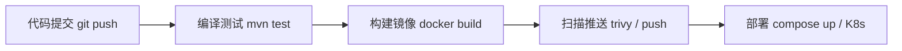
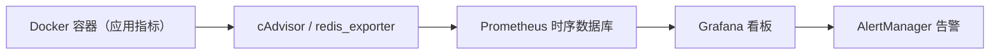
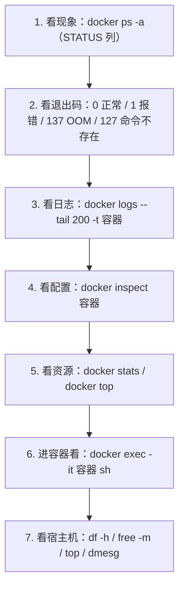
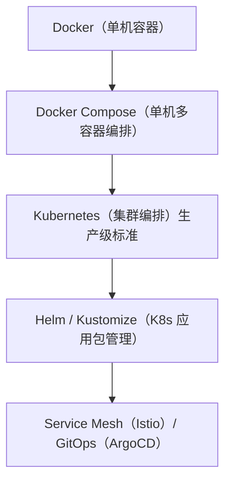

# 06 生产实践与踩坑

> 本篇解决什么问题：前面的章节让你"会用"Docker，本篇让你"用好"Docker。生产环境和本地开发有哪些不同的要求？镜像怎么管理、怎么和 CI/CD 流水线集成？容器出问题了怎么排查？Java 应用在容器里有哪些特殊调优？Docker 之后该学什么？读完本篇，你具备把 Docker 用到生产环境的完整认知。

## 一、生产环境的 Docker 最佳实践

### 1.1 一份检查清单

把下面这张表当成上线前的自检表：

| 分类 | 检查项 | 为什么重要 |
|---|---|---|
| **镜像** | 使用明确版本 tag，不用 `latest` | 可追溯、可回滚 |
| | 使用官方或可信来源的基础镜像 | 避免后门 |
| | 多阶段构建，镜像尽量小 | 拉取快、攻击面小 |
| | 非 root 用户运行 | 降低被突破后的危害 |
| | 镜像漏洞扫描通过 | 安全合规 |
| | 不在镜像里放密钥、配置文件 | 镜像可能被分发到不可信环境 |
| **容器** | 配置了 `--restart` 重启策略 | 故障自动恢复 |
| | 配置了内存和 CPU 限制 | 防止拖垮宿主机 |
| | 配置了日志轮转 | 防止磁盘写满 |
| | 配置了健康检查 | 编排系统能感知状态 |
| | 数据用数据卷持久化 | 容器可随时重建 |
| | 只暴露必要的端口 | 减少攻击面 |
| **配置** | 配置外置（环境变量 / 挂载 / 配置中心） | 同一镜像适应多环境 |
| | 敏感信息用 secret 管理 | 不落明文 |
| | `.dockerignore` 已配置 | 加快构建、防止泄露 |
| **运维** | 有监控和告警 | 出问题能第一时间知道 |
| | 有日志采集 | 事后能排查 |
| | 有备份策略（数据卷） | 能恢复 |
| | 有回滚方案 | 发布失败能快速退回 |

### 1.2 容器的十二要素（Twelve-Factor App）

这是 Heroku 提出的云原生应用方法论，很重要的一条是：**容器应该是无状态、可随时销毁重建的。**

| 原则 | 在 Docker 里的体现 |
|---|---|
| **一份代码库，多份部署** | 同一个镜像，用不同环境变量部署到 dev/test/prod |
| **显式声明依赖** | 依赖写在 Dockerfile 里，不靠宿主机预装 |
| **配置存于环境** | 用 `-e` / `env_file` / 配置中心注入，不写死在镜像里 |
| **后端服务当作附加资源** | MySQL、Redis 通过网络访问，地址写服务名 |
| **严格分离构建和运行** | 多阶段构建：构建阶段 ≠ 运行阶段 |
| **进程无状态** | 容器里不存 session、不存文件，随时可杀 |
| **通过端口绑定提供服务** | 应用自己监听端口并暴露，不依赖外部 web server |
| **并发通过进程模型扩展** | 用 `--scale` 或编排工具横向扩容，而不是把单个容器做大 |
| **快速启动、优雅终止** | 响应 SIGTERM 做清理，启动要快 |
| **开发/生产环境等价** | 同一个镜像，减少差异 |
| **日志当作事件流** | 输出到 stdout，`docker logs` 和日志系统采集 |
| **管理任务一次性运行** | `docker compose run --rm` 执行一次性任务 |

::: tip 最重要的一条：容器无状态
如果你的应用在容器里写文件（上传的图片、生成的报表、本地缓存），那这个容器就是"有状态"的，**不能随意重建和扩缩容**。

正确做法：
- 文件 → 对象存储（MinIO、OSS、S3）
- 缓存 → Redis
- Session → Spring Session + Redis
- 数据库 → 外部数据库服务
:::

## 二、镜像仓库与版本管理

### 2.1 仓库选型

| 方案 | 优点 | 缺点 | 适用 |
|---|---|---|---|
| **Docker Hub** | 免费、公共镜像最全 | 国内访问慢；私有仓库有限额 | 个人项目、开源 |
| **阿里云 ACR** | 国内速度快、有免费个人版 | 绑定阿里云 | **国内团队首选** |
| **腾讯云 TCR / 华为云 SWR** | 同上 | 绑定云厂商 | 对应云上用户 |
| **Harbor（自建）** | 功能最全（权限、扫描、复制、审计）、数据自主 | 要自己运维 | 中大型企业、合规要求 |
| **GitHub GHCR / GitLab Registry** | 和代码仓库集成好 | 偏向 CI 场景 | 用 GitHub/GitLab 的团队 |

### 2.2 镜像 tag 策略

**推荐：语义化版本 + git commit sha 双标签**

```bash
#!/bin/bash
# build-and-push.sh

set -e

REGISTRY="registry.cn-hangzhou.aliyuncs.com/canoe-ns"
IMAGE="order-service"
VERSION=$(cat VERSION)                       # 如 1.2.0
GIT_SHA=$(git rev-parse --short HEAD)         # 如 a3f9c21
BUILD_TIME=$(date +%Y%m%d%H%M)

FULL_TAG="${VERSION}-${GIT_SHA}"

echo "构建镜像：${IMAGE}:${FULL_TAG}"

# 构建（打多个标签）
docker build \
  --build-arg JAR_FILE=target/*.jar \
  -t ${REGISTRY}/${IMAGE}:${VERSION} \
  -t ${REGISTRY}/${IMAGE}:${FULL_TAG} \
  -t ${REGISTRY}/${IMAGE}:${GIT_SHA} \
  .

# 安全扫描（可选，有 trivy 的话）
# trivy image --exit-code 1 --severity HIGH,CRITICAL ${REGISTRY}/${IMAGE}:${FULL_TAG}

# 推送
docker push ${REGISTRY}/${IMAGE}:${VERSION}
docker push ${REGISTRY}/${IMAGE}:${FULL_TAG}
docker push ${REGISTRY}/${IMAGE}:${GIT_SHA}

echo "推送完成"
echo "部署时使用：${REGISTRY}/${IMAGE}:${FULL_TAG}"
```

这样你在生产环境看到的镜像标签 `1.2.0-a3f9c21`，既能看出版本，又能直接反查到是哪次 git 提交构建的。

### 2.3 镜像保留与清理策略

镜像仓库会越堆越大（每个版本几十上百 MB），需要清理策略：

- **保留最近 N 个版本**
- **保留所有生产环境正在用的版本**（打上 `protect` 标签防止被清理）
- **定期清理带 git sha 的中间构建版本**（保留最近 30 天）
- **清理没有 tag 的悬空镜像**

阿里云 ACR、Harbor 都提供生命周期管理规则，可以在控制台配置。

## 三、CI/CD 集成

### 3.1 典型流水线



### 3.2 GitHub Actions 示例

`.github/workflows/build.yml`：

```yaml
name: Build and Push Docker Image

on:
  push:
    branches: [ main ]
    tags: [ 'v*' ]

env:
  REGISTRY: registry.cn-hangzhou.aliyuncs.com
  NAMESPACE: canoe-ns
  IMAGE_NAME: order-service

jobs:
  build:
    runs-on: ubuntu-latest
    steps:
      # 1. 拉取代码
      - name: Checkout
        uses: actions/checkout@v4

      # 2. 准备 JDK 和 Maven 缓存
      - name: Set up JDK 17
        uses: actions/setup-java@v4
        with:
          java-version: '17'
          distribution: 'temurin'
          cache: maven

      # 3. 编译测试
      - name: Build with Maven
        run: mvn -B clean package -DskipTests

      # 4. 设置 Docker Buildx（支持多平台构建和更好的缓存）
      - name: Set up Docker Buildx
        uses: docker/setup-buildx-action@v3

      # 5. 登录镜像仓库
      - name: Login to Aliyun ACR
        uses: docker/login-action@v3
        with:
          registry: ${{ env.REGISTRY }}
          username: ${{ secrets.ACR_USERNAME }}
          password: ${{ secrets.ACR_PASSWORD }}

      # 6. 生成镜像标签
      - name: Extract metadata
        id: meta
        uses: docker/metadata-action@v5
        with:
          images: ${{ env.REGISTRY }}/${{ env.NAMESPACE }}/${{ env.IMAGE_NAME }}
          tags: |
            type=ref,event=branch
            type=semver,pattern={{version}}
            type=sha,prefix={{branch}}-

      # 7. 构建并推送（利用 GitHub Actions 缓存加速）
      - name: Build and push
        uses: docker/build-push-action@v6
        with:
          context: .
          push: true
          tags: ${{ steps.meta.outputs.tags }}
          labels: ${{ steps.meta.outputs.labels }}
          cache-from: type=gha
          cache-to: type=gha,mode=max

      # 8. 漏洞扫描（可选）
      - name: Scan image
        uses: aquasecurity/trivy-action@master
        with:
          image-ref: ${{ env.REGISTRY }}/${{ env.NAMESPACE }}/${{ env.IMAGE_NAME }}:main
          format: 'table'
          exit-code: '0'      # 设为 1 则发现高危漏洞会阻断流水线
          severity: 'CRITICAL,HIGH'
```

### 3.3 GitLab CI 示例

`.gitlab-ci.yml`：

```yaml
stages:
  - build
  - docker
  - deploy

variables:
  IMAGE_NAME: registry.cn-hangzhou.aliyuncs.com/canoe-ns/order-service
  MAVEN_OPTS: "-Dmaven.repo.local=.m2/repository"

cache:
  paths:
    - .m2/repository

build:
  stage: build
  image: maven:3.9-eclipse-temurin-17
  script:
    - mvn -B clean package -DskipTests
  artifacts:
    paths:
      - target/*.jar
    expire_in: 1 hour

docker-build:
  stage: docker
  image: docker:27
  services:
    - docker:27-dind        # Docker-in-Docker，用于在 CI 里跑 docker 命令
  before_script:
    - echo "$ACR_PASSWORD" | docker login registry.cn-hangzhou.aliyuncs.com -u "$ACR_USERNAME" --password-stdin
  script:
    - docker build -t $IMAGE_NAME:$CI_COMMIT_SHORT_SHA -t $IMAGE_NAME:latest .
    - docker push $IMAGE_NAME:$CI_COMMIT_SHORT_SHA
    - docker push $IMAGE_NAME:latest
  only:
    - main

deploy:
  stage: deploy
  image: alpine:latest
  before_script:
    - apk add --no-cache openssh-client
    - eval $(ssh-agent -s)
    - echo "$SSH_PRIVATE_KEY" | ssh-add -
  script:
    - ssh -o StrictHostKeyChecking=no $DEPLOY_USER@$DEPLOY_HOST
      "cd /opt/order-system &&
       docker compose pull &&
       docker compose up -d"
  only:
    - main
```

### 3.4 部署脚本示例

生产服务器上一个典型的部署脚本：

```bash
#!/bin/bash
# deploy.sh —— 滚动更新应用服务

set -e    # 任何命令失败就退出

COMPOSE_FILE="docker-compose.yml"
SERVICE="order-service"
NEW_TAG="$1"        # 新镜像 tag，从命令行传入

if [ -z "$NEW_TAG" ]; then
  echo "用法：./deploy.sh <镜像tag>"
  exit 1
fi

echo "=== 1. 备份当前配置 ==="
cp .env .env.bak.$(date +%Y%m%d%H%M)

echo "=== 2. 更新镜像 tag ==="
# 用 sed 替换 .env 里的 APP_VERSION
sed -i "s/^APP_VERSION=.*/APP_VERSION=${NEW_TAG}/" .env

echo "=== 3. 拉取新镜像 ==="
docker compose pull $SERVICE

echo "=== 4. 记录旧容器 ID（用于回滚） ==="
OLD_IMAGE=$(docker inspect -f '{{.Config.Image}}' $SERVICE 2>/dev/null || echo "")
echo "旧镜像：$OLD_IMAGE"

echo "=== 5. 启动新版本 ==="
docker compose up -d --no-deps $SERVICE

echo "=== 6. 等待健康检查 ==="
for i in $(seq 1 30); do
  STATUS=$(docker inspect -f '{{.State.Health.Status}}' $SERVICE 2>/dev/null || echo "none")
  echo "  [$i/30] 健康状态：$STATUS"
  if [ "$STATUS" = "healthy" ]; then
    echo "✅ 服务启动成功"
    exit 0
  fi
  sleep 5
done

echo "❌ 健康检查超时，开始回滚"

echo "=== 回滚 ==="
sed -i "s/^APP_VERSION=.*/APP_VERSION=${OLD_IMAGE##*:}/" .env
docker compose up -d --no-deps $SERVICE

echo "=== 输出日志 ==="
docker compose logs --tail 100 $SERVICE

exit 1
```

**这个脚本体现了生产部署的几个要点**：
1. 用镜像 tag 而不是 `latest`（可回滚）
2. 部署后等待健康检查确认
3. 失败自动回滚
4. 失败时输出日志便于排查

## 四、镜像安全

### 4.1 常见的镜像安全问题

| 问题 | 说明 | 解决办法 |
|---|---|---|
| **基础镜像有漏洞** | 基础镜像的 OS 包有 CVE | 选官方镜像、定期更新、扫描 |
| **镜像里有密钥** | Dockerfile 里写了密码、token | 改用运行时注入 / secret |
| **以 root 运行** | 被突破后危害大 | `USER` 切换非 root |
| **包含不必要的工具** | 有 curl、wget、shell 方便攻击者 | 用 distroless 或 alpine |
| **来源不明的第三方镜像** | 可能被植入后门 | 只用官方或公司内部镜像 |
| **ARG 传了密钥** | 会留在镜像历史里 | 绝对不要 |

### 4.2 漏洞扫描工具

```bash
# 安装 Trivy（macOS / Linux）
# 详见 https://github.com/aquasecurity/trivy

# 扫描镜像
trivy image nginx:1.25-alpine

# 只看高危和严重漏洞
trivy image --severity HIGH,CRITICAL myapp:1.0

# 输出为表格并发现高危就退出码 1（CI 里用）
trivy image --exit-code 1 --severity CRITICAL myapp:1.0

# 扫描 Dockerfile（不用构建就能发现一些问题）
trivy config ./Dockerfile

# 输出 JSON 报告
trivy image -f json -o report.json myapp:1.0
```

其他工具：
- **Docker Scout**（Docker 官方，`docker scout cves myapp:1.0`）
- **Grype**（Anchore 出品）
- **Clair**（CoreOS 出品，Harbor 内置）
- **Snyk**（商业，集成好）

### 4.3 镜像签名（了解）

为了防止镜像在传输过程中被篡改，可以给镜像签名：

```bash
# Docker Content Trust（DCT）
export DOCKER_CONTENT_TRUST=1
docker push myapp:1.0      # 推送时会自动签名
docker pull myapp:1.0      # 拉取时会验证签名

# 更现代的方案：cosign（Sigstore 项目）
cosign sign myapp:1.0
cosign verify myapp:1.0
```

生产环境（尤其金融、政务）建议开启。

## 五、Java 应用的容器化调优

这一节是 Java 后端开发者特别需要关注的。

### 5.1 JVM 内存与容器

**问题：JDK 8u191 之前的 JVM 不认识容器的内存限制。**

```bash
# 宿主机 32G 内存，容器限制 1G
docker run -m 1g --memory-swap=1g my-java-app

# 老版本 JVM 会认为：我有 32G 可用，默认最大堆 = 32G / 4 = 8G
# 结果：应用在用到 1G 时被 Docker OOM 杀掉，退出码 137
```

**解决办法：**

```bash
docker run -m 1g \
  -e JAVA_OPTS="-XX:+UseContainerSupport -XX:MaxRAMPercentage=75.0" \
  my-java-app
```

| JVM 参数 | 说明 |
|---|---|
| `-XX:+UseContainerSupport` | 启用容器感知（**JDK 8u191+ 和 11+ 默认开启**） |
| `-XX:MaxRAMPercentage=75.0` | 最大堆 = 容器限制内存 × 75% |
| `-XX:InitialRAMPercentage=50.0` | 初始堆 = 容器限制内存 × 50% |
| `-XX:MaxMetaspaceSize=256m` | 限制元空间（默认无上限，可能吃内存） |
| `-XX:MaxDirectMemorySize=128m` | 限制堆外直接内存（Netty、NIO 用） |
| `-Xss512k` | 线程栈大小（默认 1MB，线程多的话很占内存） |
| `-XX:+ExitOnOutOfMemoryError` | OOM 时立即退出（让容器重启，而不是僵死） |
| `-XX:+HeapDumpOnOutOfMemoryError` | OOM 时生成堆转储（记得挂载到数据卷） |

::: tip 为什么不能把 100% 内存都给堆
JVM 进程的总内存 = **堆** + **元空间** + **线程栈** + **直接内存** + **GC 开销** + **JIT 代码缓存**。

如果堆占了 100%，其他部分没空间就会 OOM。一般留 25%~30% 给非堆区域。JDK 17+ 默认的 `MaxRAMPercentage` 是 25（比较保守），对于只跑 Java 的容器可以调到 70~75。
:::

### 5.2 JVM CPU 与容器

```bash
# 限制 2 核
docker run --cpus=2 my-java-app
```

JVM 会自动读取 cgroup 的 CPU 限制来决定：
- `Runtime.availableProcessors()` 返回的核数
- GC 线程数（`ParallelGCThreads`）
- JIT 编译线程数（`CICompilerCount`）

JDK 8u191+ 和 11+ 默认感知。如果不放心，可以显式指定：

```bash
-XX:ActiveProcessorCount=2
-XX:ParallelGCThreads=2
-XX:ConcGCThreads=1
```

::: tip ForkJoinPool 的坑
`ForkJoinPool.commonPool()` 的并行度默认等于 CPU 核数。在容器里如果 JVM 读不到正确的核数（老版本 JDK），会按宿主机核数创建大量线程，导致上下文切换暴涨、内存占用高。

解决：显式设置 `-Djava.util.concurrent.ForkJoinPool.common.parallelism=4`
:::

### 5.3 推荐的 Java 容器 JVM 参数

```bash
JAVA_OPTS="
-server
-XX:+UseContainerSupport
-XX:MaxRAMPercentage=75.0
-XX:InitialRAMPercentage=50.0
-XX:MaxMetaspaceSize=256m
-XX:MaxDirectMemorySize=128m
-Xss512k
-XX:+UseG1GC
-XX:MaxGCPauseMillis=200
-XX:+HeapDumpOnOutOfMemoryError
-XX:HeapDumpPath=/app/logs/dumps
-XX:+ExitOnOutOfMemoryError
-Xlog:gc*:file=/app/logs/gc.log:time,uptime:filecount=5,filesize=50m
-Dfile.encoding=UTF-8
-Duser.timezone=Asia/Shanghai
-Djava.security.egd=file:/dev/./urandom
"
```

最后那个 `-Djava.security.egd` 是为了加快随机数生成（Tomcat 的 session id 生成用 `SecureRandom`，在容器里 `/dev/random` 熵不足会阻塞）。

### 5.4 Spring Boot 容器化的注意事项

| 事项 | 说明 |
|---|---|
| **配置外置** | 用环境变量 `SPRING_DATASOURCE_URL` 等，Spring Boot 支持环境变量自动绑定（`spring.datasource.url` ↔ `SPRING_DATASOURCE_URL`） |
| **优雅停机** | Spring Boot 2.3+ 支持 `server.shutdown=graceful` + `spring.lifecycle.timeout-per-shutdown-phase=30s` |
| **Actuator 健康检查** | 加 `spring-boot-starter-actuator`，暴露 `/actuator/health` 给 Docker HEALTHCHECK |
| **日志输出** | 默认输出到 console，符合 Docker 要求；**不要用 `logback-spring.xml` 把日志只写到文件** |
| **多环境** | 用 `SPRING_PROFILES_ACTIVE` 环境变量切换 profile |
| **端口** | `server.address=0.0.0.0`（默认就是），**千万别设成 127.0.0.1** |

**优雅停机配置：**

```yaml
server:
  shutdown: graceful          # 优雅停机：先停止接收新请求，等现有请求处理完
spring:
  lifecycle:
    timeout-per-shutdown-phase: 30s    # 最多等 30 秒，超时强制退出
```

配合 Dockerfile 的 exec 格式 CMD（让 java 成为 PID 1 能收到 SIGTERM），以及 `docker stop -t 40`（超时要比上面的 30s 长）。

## 六、监控与日志

### 6.1 监控方案



**cAdvisor**（Google 出品，容器资源监控）：

```yaml
# docker-compose.yml 片段
services:
  cadvisor:
    image: gcr.io/cadvisor/cadvisor:latest
    container_name: cadvisor
    restart: unless-stopped
    ports:
      - "8080:8080"
    volumes:
      - /:/rootfs:ro
      - /var/run:/var/run:ro
      - /sys:/sys:ro
      - /var/lib/docker/:/var/lib/docker:ro
      - /dev/disk/:/dev/disk:ro
    devices:
      - /dev/kmsg
    privileged: true
```

**核心监控指标：**

| 指标 | 告警阈值建议 | 说明 |
|---|---|---|
| 容器 CPU 使用率 | > 80% 持续 5 分钟 | 可能需要扩容或优化 |
| 容器内存使用率 | > 85% 持续 5 分钟 | **接近 OOM 危险** |
| 容器重启次数 | 5 分钟内 > 3 次 | 应用在崩溃循环 |
| 容器健康检查 | unhealthy 持续 2 分钟 | 服务不可用 |
| 宿主机磁盘使用率 | > 85% | Docker 数据目录要满了 |
| 容器网络流量 | 突增/突降 | 异常流量或服务故障 |
| OOM 事件 | 出现即告警 | `docker events --filter 'event=oom'` |

### 6.2 日志方案

**方案一：json-file + Filebeat → ELK**

```yaml
services:
  filebeat:
    image: docker.elastic.co/beats/filebeat:8.18.0
    container_name: filebeat
    restart: unless-stopped
    user: root
    volumes:
      - ./filebeat.yml:/usr/share/filebeat/filebeat.yml:ro
      - /var/lib/docker/containers:/var/lib/docker/containers:ro
      - /var/run/docker.sock:/var/run/docker.sock:ro
    networks:
      - elk
```

**方案二：Loki + Promtail + Grafana**（轻量，推荐中小团队）

**方案三：直接输出到云厂商日志服务**

```yaml
services:
  app:
    logging:
      driver: aliyun_logs      # 需要装插件
      options:
        aliyun-log-project: my-project
        aliyun-log-store: app-logs
```

::: tip 日志的几个原则
1. **输出到 stdout/stderr**，不要只写文件
2. **结构化日志**（JSON 格式）便于检索，Spring Boot 可以用 logstash-logback-encoder
3. **带 traceId**，能串联一次请求的全部日志
4. **日志分级**，生产用 INFO，排查时临时调 DEBUG
5. **不要打敏感信息**（密码、身份证、token）
:::

## 七、故障排查手册

### 7.1 通用排查流程



### 7.2 常见故障对照表

| 现象 | 可能原因 | 排查命令 | 解决办法 |
|---|---|---|---|
| **容器启动后立刻 Exited(0)** | 主进程执行完就结束了（如 `CMD ["echo","hi"]`） | `docker logs`、`docker inspect` 看 Cmd 配置 | 换成前台运行的命令 |
| **容器 Exited(1)** | 应用启动报错（配置错、连不上 DB） | `docker logs --tail 200 容器` | 看日志修问题 |
| **容器 Exited(137)** | 被 OOM kill | `docker inspect` 看 OOMKilled 字段、`dmesg \| grep -i oom` | 加大内存限制 / 调 JVM 参数 / 修内存泄漏 |
| **容器 Exited(127)** | 命令不存在（如 alpine 里用 bash） | `docker logs` | alpine 用 `sh` 不是 `bash` |
| **容器反复重启** | 应用崩溃循环 | `docker inspect` 看 RestartCount、`docker logs --tail 200` | 看日志，先去掉 restart 策略排查 |
| **端口访问不通** | ① 应用监听 127.0.0.1 ② 防火墙 ③ 安全组 ④ 端口映射错 | `docker ps`（看 PORTS） `netstat -tlnp` `docker exec 容器 netstat -tlnp` | 监听 0.0.0.0；放行端口 |
| **容器间连不上** | ① 不在同一网络 ② 用了默认 bridge | `docker network inspect 网络` | 用自定义网络，用服务名访问 |
| **拉取镜像超时** | Docker Hub 访问慢 | `docker pull` 卡住 | 配镜像加速器 |
| **`no space left on device`** | 磁盘满了 | `df -h` `docker system df` | 清理镜像/容器/日志；配日志轮转 |
| **`Cannot connect to the Docker daemon`** | dockerd 没启动 | `systemctl status docker` | `systemctl start docker` |
| **容器内时间差 8 小时** | 时区不对 | `docker exec 容器 date` | `-e TZ=Asia/Shanghai` 或挂 `/etc/localtime` |
| **中文乱码** | 字符集 | `docker exec 容器 locale` | `ENV LANG=C.UTF-8` |
| **Permission denied（挂载目录）** | UID 不匹配 | `ls -ln 目录` `docker exec 容器 id` | `-u` 指定 UID 或改目录属主 |
| **镜像构建慢** | 上下文太大 / 无缓存 | 看 `transferring context` 大小 | 配 `.dockerignore`；优化 Dockerfile 顺序 |
| **Compose 启动报端口占用** | 宿主机端口被占 | `netstat -tlnp \| grep 端口` | 换端口或不映射 |
| **容器 CPU 100%** | 死循环 / GC 频繁 / 被挖矿 | `docker stats` `docker top 容器` | 进去看线程栈（`jstack`） |

### 7.3 Java 应用容器内的排查

容器里通常没有 `jstack`、`jmap` 等工具（尤其用了 JRE 或 alpine 镜像），排查内存/CPU 问题时要特殊处理。

**办法一：在主容器里装 JDK 工具（不推荐，镜像变大）**

**办法二：用 sidecar 容器（推荐）**

```yaml
services:
  app:
    image: myapp
    # 开启 JMX 远程监控
    environment:
      JAVA_OPTS: >
        -Dcom.sun.management.jmxremote
        -Dcom.sun.management.jmxremote.port=9010
        -Dcom.sun.management.jmxremote.rmi.port=9010
        -Dcom.sun.management.jmxremote.authenticate=false
        -Dcom.sun.management.jmxremote.ssl=false
        -Djava.rmi.server.hostname=app
    ports:
      - "9010:9010"    # 仅内网开放！

  # 调试容器：和 app 共享 PID namespace，就能用 jstack 看 app 的进程
  debug:
    image: eclipse-temurin:17-jdk
    pid: "service:app"       # 共享 app 的进程命名空间
    privileged: true
    command: sleep infinity
```

然后：

```bash
docker compose exec debug bash
# jps                  # 能看到 app 的 java 进程
# jstack <pid>         # 抓线程栈
# jmap -heap <pid>     # 看堆使用情况
```

**办法三：用 `kubectl debug` 的思路（K8s 环境）**

**办法四：JDK 工具内置进镜像但只在排查时启用**（用多阶段构建时把 jdk 的 bin 复制进运行镜像）

::: tip 生产环境推荐做法
与其事后排查，不如**提前把可观测性做好**：
- 接入 Actuator + Prometheus（Micrometer 暴露 JVM 指标）
- 配置 `-XX:+HeapDumpOnOutOfMemoryError` 并把 dump 目录挂到数据卷
- 接入 APM（SkyWalking、Pinpoint、Arthas）
- 日志带 traceId
:::

## 八、Docker 的替代与演进

### 8.1 Docker 生态现状

Docker 把很多组件拆出来捐给了 CNCF，形成了现在的生态：

| 组件 | 作用 | 现状 |
|---|---|---|
| **containerd** | 容器运行时（管理容器生命周期） | **CNCF 毕业**，已成为事实标准，K8s 默认用它 |
| **runc** | 真正创建容器的底层工具 | CNCF 毕业，containerd 调用它 |
| **CRI-O** | K8s 专用的轻量运行时 | CNCF，Red Hat 主推 |
| **Podman** | 无守护进程的 Docker 替代品 | Red Hat 出品，**rootless，兼容 Docker 命令** |
| **Buildah** | 专门构建镜像的工具 | Red Hat 出品 |
| **Skopeo** | 镜像仓库操作工具（复制、检查） | Red Hat 出品 |
| **nerdctl** | containerd 的 Docker 风格 CLI | 兼容 docker 命令，直接操作 containerd |

**重要认知：Kubernetes 从 1.24 起已经移除了对 Docker 的直接支持（dockershim），但 Docker 构建的镜像依然能在 K8s 上运行**——因为镜像格式是 OCI 标准，K8s 通过 containerd 运行时来跑。

**所以学 Docker 完全不会过时**：镜像构建、Dockerfile、Compose 这些技能在 K8s 时代依然有用。

### 8.2 Podman 简介

```bash
# Podman 的命令和 Docker 几乎一样
podman run -d -p 80:80 nginx
podman ps
podman images
podman build -t myapp .

# 甚至可以直接设别名
alias docker=podman
```

| 对比 | Docker | Podman |
|---|---|---|
| 架构 | Client-Server，需要 daemon | **无 daemon**，直接 fork 进程 |
| root 权限 | 默认需要 root（或 docker 组） | **默认 rootless**，更安全 |
| 命令兼容 | — | 高度兼容 |
| K8s 集成 | 需要额外工具 | 支持生成 K8s YAML（`podman kube generate`） |
| 生态 | 最成熟 | 相对小众 |

**什么时候用 Podman**：安全合规要求（不允许有 root daemon）、RHEL/CentOS 环境（Red Hat 主推）、想直接生成 K8s 清单。

### 8.3 下一步学什么



如果你已经掌握本专栏的 6 章内容，接下来的学习路径建议：

1. **Kubernetes 基础**：Pod / Service / Deployment / ConfigMap / Secret / Ingress
2. **kubectl 常用命令与 YAML 编写**
3. **Helm 包管理**
4. **CI/CD 与 GitOps**
5. **可观测性**（Prometheus + Grafana + Loki + Jaeger）

## 九、Docker 命令终极速查表

### 9.1 镜像

```bash
docker images                       # 列出镜像
docker pull nginx:1.25              # 拉取
docker rmi nginx                    # 删除
docker tag nginx my-nginx:v1        # 打标签
docker build -t myapp:1.0 .         # 构建
docker push myapp:1.0               # 推送
docker history nginx                # 看分层历史
docker inspect nginx                # 看详情
docker save -o a.tar nginx          # 导出
docker load -i a.tar                # 导入
docker image prune                  # 清理虚悬镜像
docker system df                    # 磁盘占用
```

### 9.2 容器

```bash
docker run -d --name x -p 80:80 image      # 创建并启动
docker ps / docker ps -a                   # 查看
docker start / stop / restart / kill       # 启停
docker rm [-f] 容器                         # 删除
docker exec -it 容器 sh                     # 进入
docker exec 容器 命令                        # 执行
docker logs [-f] [--tail N] [--since 30m]  # 日志
docker inspect 容器                         # 详情
docker top 容器                             # 进程
docker stats                               # 资源
docker cp 容器:路径 本地                     # 拷贝
docker update --memory=2g 容器              # 改配置
docker commit 容器 镜像                      # 提交（不推荐）
docker container prune                     # 清理停止的容器
```

### 9.3 数据卷与网络

```bash
docker volume create / ls / inspect / rm / prune
docker network create / ls / inspect / rm / prune
docker network connect 网络 容器
docker network disconnect 网络 容器
```

### 9.4 Compose

```bash
docker compose up -d                 # 启动
docker compose down [-v]             # 销毁
docker compose ps                    # 状态
docker compose logs -f [服务]         # 日志
docker compose exec 服务 sh           # 进入
docker compose config                # 校验配置
docker compose build / pull / push   # 构建/拉取/推送
docker compose restart 服务           # 重启
docker compose top                   # 进程
docker compose stats                 # 资源
```

### 9.5 系统

```bash
docker version                       # 版本
docker info                          # 系统信息
docker system df                     # 磁盘占用
docker system prune [-a]             # 清理
docker events                        # 事件流
docker login / logout                # 登录仓库
```

## 十、面试常见问题速答

| 问题 | 简答要点 |
|---|---|
| **Docker 和虚拟机的区别？** | 虚拟机虚拟硬件、每个带完整 Guest OS（GB 级、分钟级启动）；容器共享宿主机内核、只打包应用和库（MB 级、秒级启动），隔离性稍弱但更轻快 |
| **镜像和容器的关系？** | 镜像是只读模板（类），容器是运行实例（对象）；容器 = 镜像只读层 + 一层可写层 |
| **Docker 的底层技术？** | Namespace 做隔离（pid/net/mnt/uts/ipc/user）、Cgroups 做资源限制、UnionFS 做分层存储 |
| **CMD 和 ENTRYPOINT 的区别？** | CMD 会被 `docker run` 后面的命令整体覆盖；ENTRYPOINT 一定执行，后面的内容当参数传入。推荐组合使用 |
| **为什么容器一启动就退出？** | 容器生命周期和主进程绑定，主进程结束容器就退出。容器里必须有前台进程 |
| **如何减小镜像体积？** | 小基础镜像（alpine/slim/distroless）、多阶段构建、合并 RUN 并同层清理、`.dockerignore` |
| **数据怎么持久化？** | Volume（Docker 管理，推荐）、Bind Mount（挂宿主机目录）、tmpfs（内存） |
| **容器间怎么通信？** | 用自定义网络，同一网络内容器可以用容器名（Docker 内置 DNS）互相访问 |
| **`depends_on` 能保证服务就绪吗？** | 不能，只保证启动顺序。要配 healthcheck + `condition: service_healthy`，应用层也要有重试 |
| **Java 应用在容器要注意什么？** | 加 `-XX:+UseContainerSupport -XX:MaxRAMPercentage=75.0`，否则 JVM 按宿主机内存算堆会被 OOM；用 exec 格式 CMD 保证能收到 SIGTERM |
| **`docker stop` 和 `docker kill`？** | stop 发 SIGTERM 允许优雅停机（等 10 秒后 SIGKILL）；kill 直接 SIGKILL |
| **latest 标签有什么问题？** | latest 只是普通 tag，不代表最新版本，无法确定跑的是哪一版也无法回滚。生产必须指定版本 |
| **退出码 137 是什么？** | 128 + 9 = SIGKILL，通常是容器内存超限被 OOM killer 杀掉 |

## 本篇小结

- **生产环境的容器应该是无状态、可随时销毁重建的**——文件存对象存储、缓存存 Redis、Session 外置。
- 上线前按清单检查：**镜像固定 tag、非 root 运行、资源限制、日志轮转、健康检查、重启策略、数据持久化、监控告警**。
- **镜像 tag 用「语义化版本 + git sha」双标签**，既能看版本又能反查提交，出问题秒回滚。
- CI/CD 流水线典型流程：**代码提交 → 编译测试 → 构建镜像 → 漏洞扫描 → 推送 → 部署**，GitHub Actions / GitLab CI 都有成熟的 docker 插件。
- **部署脚本要有健康检查确认和自动回滚**，不能"推上去就完事"。
- 镜像安全四要点：**官方基础镜像、非 root、不装多余工具、不塞密钥**（尤其别用 ARG 传密钥，会留在历史里）。用 Trivy 等工具扫描。
- **Java 容器化必须加 `-XX:+UseContainerSupport -XX:MaxRAMPercentage=75.0`**，否则 JVM 按宿主机内存算堆大小会被 OOM 杀掉；堆不能占满全部容器内存（留 25% 给元空间、线程栈、直接内存）。
- Spring Boot 容器化：配置用环境变量外置、开 `server.shutdown=graceful` 优雅停机、用 Actuator 做健康检查、日志输出到 console。
- 监控推荐 **cAdvisor + Prometheus + Grafana**，核心告警指标：内存 >85%、重启次数、健康检查失败、OOM 事件、磁盘 >85%。
- 日志必须输出 stdout 并采集到集中日志系统，**配 `max-size` + `max-file` 轮转**防止撑爆磁盘。
- **故障排查口诀**：看状态 → 看退出码 → 看日志 → 看配置 → 看资源 → 进容器。退出码 137 是 OOM，127 是命令不存在。
- 容器内排查 Java 问题用 **sidecar 容器共享 pid namespace**（`pid: "service:app"`），避免在生产镜像里装完整 JDK。
- **Docker 没有过时**：镜像格式是 OCI 标准，Docker 构建的镜像在 K8s 上照样跑。K8s 移除的是 dockershim（直接调用 Docker 的适配层），底层仍用 containerd。
- 后续学习路径：**Docker → Compose → Kubernetes → Helm → GitOps / Service Mesh**。

## 参考链接

- [Docker 生产最佳实践](https://docs.docker.com/develop/dev-best-practices/)
- [Dockerfile 最佳实践](https://docs.docker.com/develop/develop-images/dockerfile_best-practices/)
- [容器安全最佳实践](https://docs.docker.com/engine/security/)
- [Trivy 漏洞扫描](https://github.com/aquasecurity/trivy)
- [Docker 官方 GitHub Actions](https://github.com/docker/build-push-action)
- [Twelve-Factor App 方法论](https://12factor.net/zh_cn/)
- [Java 容器化最佳实践](https://developers.redhat.com/articles/2022/04/19/java-17-whats-new-openjdks-container-awareness)
- [cAdvisor 容器监控](https://github.com/google/cadvisor)
- [Kubernetes 官方文档](https://kubernetes.io/zh-cn/docs/home/)
- [Podman 官方网站](https://podman.io/)

下一篇 → 回到 [01 Docker 入门与安装](/ops/docker/overview)（Docker 篇到此结束）
