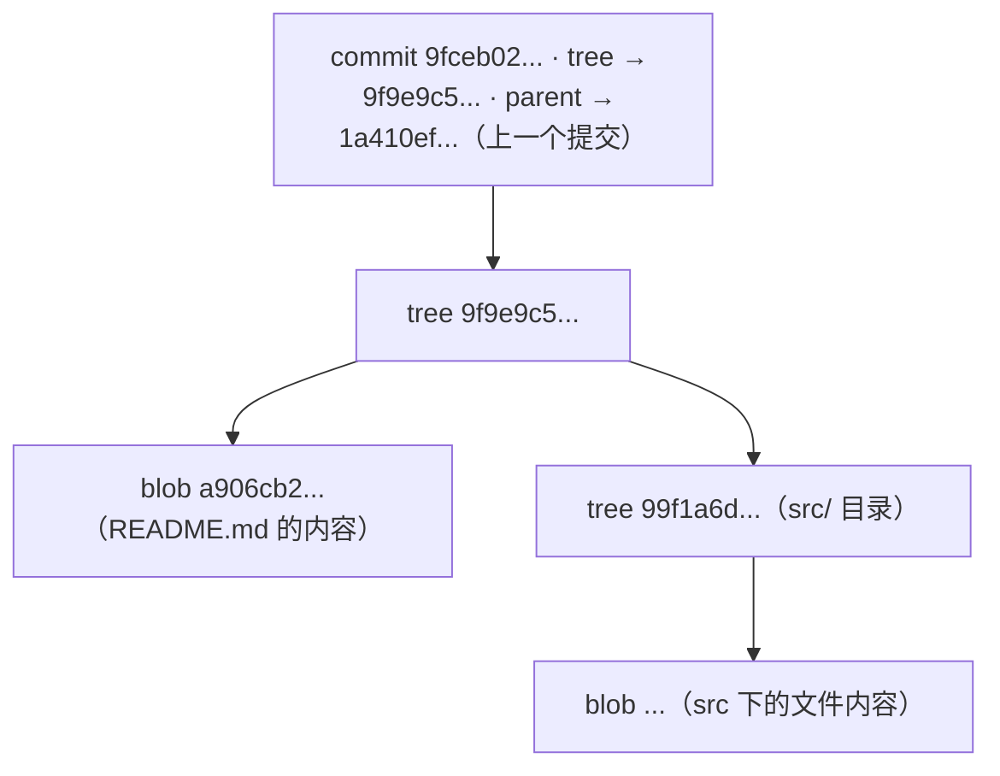
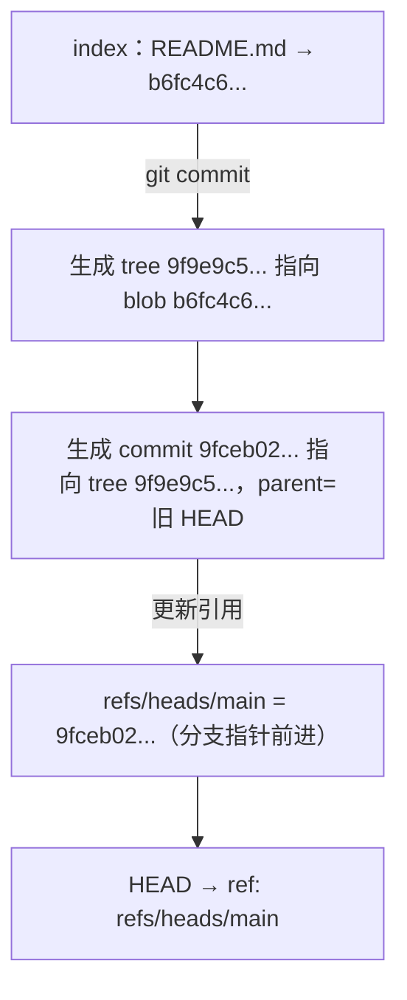
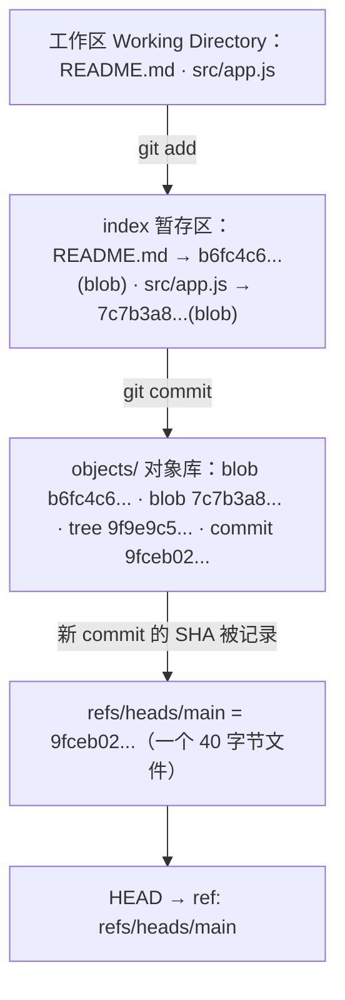

# 02 Git 内部原理与对象模型

> 本篇导读：会用 `git add`/`git commit` 不等于懂 Git。本篇掀开 `.git` 目录的盖子，带你看见 Git 真正的"引擎室"：四种对象（blob/tree/commit/tag）如何互相指向、组成一张内容寻址的网络；引用（ref）和 HEAD 又如何用"一个存着 40 位 SHA 的小文件"定位提交；以及一次 `add` 和一次 `commit` 内部到底写了哪些东西。读懂本篇，你再也不会被"游离头指针""reflog""pack 文件"吓到，因为它们背后不过是几个文件和 SHA。

## 一、.git 目录导览

在一个目录里 `git init`，Git 会创建 `.git` 文件夹，里面是**整个版本库的真相**。先整体看一眼：

```bash
git init demo && cd demo
find .git -maxdepth 2 | sort
# .git/config
# .git/HEAD
# .git/hooks
# .git/info/exclude
# .git/objects
# .git/refs/heads
```

常见成员逐一说清：

| 文件 / 目录 | 干什么 |
| --- | --- |
| `HEAD` | 当前"符号引用"，通常指向 `refs/heads/main`，即你正工作在哪个分支 |
| `config` | 本仓库本地配置，只作用于这个仓库 |
| `objects/` | **对象数据库**，所有 blob/tree/commit/tag 都存这里 |
| `objects/pack/` | 打包压缩后的对象（packfile），传输和 `git gc` 时产生 |
| `refs/heads/` | 本地分支指针，如 `refs/heads/main` 存 main 最新提交的 SHA |
| `refs/tags/` | 标签引用，如 `refs/tags/v1.0` 指向某个提交 |
| `refs/remotes/` | 远程跟踪分支，如 `refs/remotes/origin/main` |
| `index` | 暂存区（Staging Area）的二进制文件，记录"下次提交包含哪些文件及对应 blob" |
| `logs/` | **reflog** 日志，记录每次 HEAD 和分支指针移动，是"后悔药"关键 |
| `hooks/` | 钩子脚本目录（`pre-commit`、`commit-msg` 等），提交前后自动触发 |
| `info/exclude` | 本仓库私有忽略规则（类似 `.gitignore`，但不进版本库） |
| `ORIG_HEAD` | 危险操作（merge/reset）前旧 HEAD 的备份，便于回退 |

::: tip 记住一句就够了
`.git` 里**除 `objects/` 是真正数据，其余几乎都是"指向某个 SHA 的小文件或配置"**。理解这点，Git 就没秘密了。
:::

## 二、四种对象（本篇核心）

Git 底层只存**四种对象**，彼此用 SHA-1 哈希互相引用，构成一张有向图。

| 对象 | 存的是什么 | 一句话 |
| --- | --- | --- |
| **blob** | 文件的**内容**（不含文件名） | "一份文件数据" |
| **tree** | 一个目录的快照 | "目录下有哪些文件/子目录、各自名、对应哪个 blob/tree" |
| **commit** | 一次提交 | "指向一个 tree，记录父提交、作者、提交者、说明" |
| **tag** | 附注标签（annotated tag） | "给 commit 起有名有姓的标记，可带签名和说明" |

### 2.1 手动存一个对象，认识 blob

`git hash-object` 直接把一段内容写进对象库（加 `-w` 才写盘）：

```bash
echo "hello git" | git hash-object -w --stdin
# b6fc4c620b67d95f953a5c1c1230aa888f0145e3

find .git/objects -type f
# .git/objects/b6/fc4c620b67d95f953a5c1c1230aa888f0145e3
```

路径：`b6` 是 SHA 前两位做目录名，剩下 38 位是文件名——这就是**内容寻址**。

### 2.2 用 git cat-file 展开一个 commit（完整演示）

这是本篇最重要的动手环节。从一次提交一路拆到最底层文件内容。

先拿到最新提交 SHA：

```bash
git log --format=%H -1
# 9fceb02d0ae598e95dc970b74767f19372d61af8
```

`git cat-file -t` 看类型，`-p` 看内容：

```bash
git cat-file -t 9fceb02d0ae598e95dc970b74767f19372d61af8
# commit

# 展开 commit：指向一个 tree，记录父提交、作者、说明
git cat-file -p 9fceb02d0ae598e95dc970b74767f19372d61af8
# tree    9f9e9c5c7d8a96bc5e0e4b56c2a7c1f3e2b0d4a1
# parent  1a410efbd13591db1a33b3e6a6b9f6c2d8e0a7c2
# author  张三 <you@example.com> 1718000000 +0800
# committer 张三 <you@example.com> 1718000000 +0800
#
# 完善登录页样式

# 顺着 tree 看目录快照（含文件模式、名字、各自 SHA）
git cat-file -p 9f9e9c5c7d8a96bc5e0e4b56c2a7c1f3e2b0d4a1
# 100644 blob a906cb2a4a904a152e1c4a5b8e3d6f0c2b1a7e9c    README.md
# 040000 tree 99f1a6d12cb4876b9a0e2c3d4f5a6b7c8d9e0f1a    src

# 看 blob 的真实文件内容
git cat-file -p a906cb2a4a904a152e1c4a5b8e3d6f0c2b1a7e9c
# # 我的项目
# 这是一个用 Git 管理的示例仓库。
```

整条引用链：



::: tip 一个 commit 到底"存"了什么
一次提交 = 一个 **tree**（整棵目录树的根）+ 一个 **parent**（上一次提交）+ 作者/提交者/时间 + 说明。tree 再指向一堆 blob/tree。所以**一次提交完整描述"那一刻项目长什么样"**，不需要存差异。
:::

### 2.3 tag 对象（附注标签）

轻量标签只是指向 commit 的引用；**附注标签（annotated tag）是一项独立对象**，可带签名：

```bash
git cat-file -t v1.0^{}
# tag
git cat-file -p v1.0^{}
# object 9fceb02d0ae598e95dc970b74767f19372d61af8   ← 指向的 commit
# type   commit
# tag    v1.0
# tagger 张三 <you@example.com> 1718000000 +0800
#
# 发布 v1.0 正式版
```

> 💡 **在 IDEA 里**：这四种对象**没有对应的图形界面** —— IDE 不暴露 blob / tree / commit 对象本身，想看 `git cat-file` 的逐层展开只能回命令行。
> 能做的替代：Log 里右键某次提交 → **Copy Revision Number** 拿到完整 SHA；**Show Repository at Revision** 直接以「那个提交时刻的完整文件树」打开项目，效果约等于看 tree。

## 三、内容寻址：为什么这么设计

### 3.1 对象存在哪：objects/ab/cdef...

每个对象按 `SHA-1 前两位 / 后 38 位` 路径存放：

```text
objects/ 6f / c4c620b67d95f953a5c1c1230aa888f0145e37
         ^^   ^^^^^^^^^^^^^^^^^^^^^^^^^^^^^^^^^^^^^^
         |                                         |
         └── 前两位 = 子目录名
                                                   └── 后 38 位 = 文件名
```

前两位分目录，避免单个文件夹塞太多文件导致文件系统变慢。

### 3.2 同样内容只存一份（去重）

"对象地址 = 内容哈希"，所以**同内容必同地址**。两个文件内容都是 `"hello git"`，对象库里只占一个 blob：

```bash
echo "hello git" | git hash-object --stdin
# b6fc4c620b67d95f953a5c1c1230aa888f0145e3
echo "hello git" | git hash-object --stdin
# b6fc4c620b67d95f953a5c1c1230aa888f0145e3   ← 完全一样
```

哪怕该内容出现在 100 个提交里，对象库也只有一个 blob。

### 3.3 改一个字，整条链 SHA 全变

SHA-1 对输入极度敏感，**改一个字符，哈希面目全非**：

```bash
echo "hello git" | git hash-object --stdin
# b6fc4c620b67d95f953a5c1c1230aa888f0145e3
echo "hello Git" | git hash-object --stdin
# 7c7b3a8f0e1d2c9b4a5f6e7d8c9b0a1f2e3d4c5b   ← 只大写一个字母，完全不同
```

连锁反应：

```text
改了 README.md 一个字
   → 该文件 blob 的 SHA 变了
   → 包含它的 tree 的 SHA 变了（tree 记录了新 blob）
   → 引用该 tree 的 commit 的 SHA 变了
   → 指向该 commit 的分支指针（ref）也要更新
```

所以 Git 里"改一个字"在底层是**新生成一串对象**，而非就地修改。这解释了历史为何不可变、且每个提交独立可寻址。

## 四、引用（ref）与 HEAD

对象库是一堆无名 SHA，而**引用（ref）就是给这些 SHA 起的可读名字**——本质只是"一个存着 40 位哈希的小文件"。

### 4.1 常见引用文件

```bash
cat .git/refs/heads/main
# 9fceb02d0ae598e95dc970b74767f19372d61af8   ← 就一行 SHA

cat .git/refs/remotes/origin/main
# 1a410efbd13591db1a33b3e6a6b9f6c2d8e0a7c2   ← 远程分支的本地镜像

cat .git/refs/tags/v1.0
# 9fceb02d0ae598e95dc970b74767f19372d61af8
```

引用很多时，Git 会压缩进 **`packed-refs`**（`.git/packed-refs`）：

```bash
cat .git/packed-refs
# # pack-refs with: peeled fully-peeled sorted
# 9fceb02d0ae598e95dc970b74767f19372d61af8 refs/heads/main
# 1a410efbd13591db1a33b3e6a6b9f6c2d8e0a7c2 refs/remotes/origin/main
```

### 4.2 HEAD：符号引用

`HEAD` 特殊在它**不直接存 SHA，而是指向一个 ref**（"符号引用"）：

```bash
cat .git/HEAD
# ref: refs/heads/main
```

意思是"我在 main 分支上"。在 main 上提交时，Git 写新 commit 对象 → 把 `refs/heads/main` 更新成新 SHA → `HEAD` 继续指向 `refs/heads/main`。所以永远能用 `HEAD` 找到当前位置。

```bash
git symbolic-ref HEAD            # 查看符号引用：refs/heads/main
git symbolic-ref HEAD refs/heads/dev   # 相当于切到一个新分支指针

git rev-parse HEAD               # 把名字解析成 SHA
# 9fceb02d0ae598e95dc970b74767f19372d61af8
```

### 4.3 游离头指针（detached HEAD）

正常时 `HEAD` 指向 `refs/heads/xxx`。若直接 `checkout` 到具体提交 SHA（而非分支名），`HEAD` 就**直接指向 SHA**——叫**游离头指针（detached HEAD）**：

```bash
git checkout 1a410efbd13591db1a33b3e6a6b9f6c2d8e0a7c2
# Note: switching to '1a410ef...'. You are in 'detached HEAD' state...

cat .git/HEAD
# 1a410efbd13591db1a33b3e6a6b9f6c2d8e0a7c2   ← 直接是 SHA，不再指向 ref
```

**为什么危险**：游离状态下提交新内容，因无分支指针跟随，新提交**没有任何 ref 引用**，一但切回别的分支就成了"孤儿"，易被 GC 清掉。

**怎么处理**：
- 只想看历史：`git switch main` 切回去，无损失。
- 想保留改动：先建分支接住：`git switch -c temp-fix`，再决定合并或丢弃。

### 4.4 ORIG_HEAD

执行 `merge`/`rebase`/`reset` 等可能改写历史的操作前，Git 把操作前 `HEAD` 记入 `ORIG_HEAD`，搞砸了一键回退：

```bash
git reset --hard ORIG_HEAD   # 撤销刚才那次 merge/rebase/reset
```

> 💡 **在 IDEA 里**：引用与 HEAD 直接映射到界面 ——
> - **分支（`refs/heads/`）**：状态栏右下角的分支控件、Log 里每个提交上的彩色分支标签。
> - **HEAD**：Log 里当前提交上的 `HEAD` 标记，切换分支就是移动 HEAD。
> - **远程跟踪分支（`refs/remotes/`）**：分支控件里的 **Remote** 分组。
> - **游离头**：在 Log 里右键 **Checkout Revision** 就会进入；IDE 顶部会弹出一条黄色提示条，并给出 **New Branch from Here** 这个出口 —— 这正是脱离游离头的标准动作。

## 五、快照 vs 差异：packfile 与压缩

Git **提交时存快照**（每个文件内容一个 blob）。但 100 个版本的文件存 100 份完整 blob 太占地方，于是 Git 在**写磁盘（尤其传输、打包）时对相似对象做 delta 压缩**——只存与基准版本的差异。

```bash
git gc                  # 手动触发垃圾回收 + 打包
git count-objects -vH   # 看对象数量与占用空间（-H 人类可读）
# count: 12
# packs: 1
# size-pack: 12.00 KiB

git verify-pack -v .git/objects/pack/*.idx | head
# SHA-1 type size size-in-packfile offset-in-packfile depth base-SHA-1
# a906cb2... blob 42 31 12 1 b6fc4c6...
```

| 场景 | 快照还是差异 | 说明 |
| --- | --- | --- |
| 本地提交（对象库） | 快照（独立 blob） | 每个版本完整可寻址，速度快 |
| 写出磁盘 / 传输 | delta 压缩进 packfile | 省空间与带宽 |
| `git diff` 查看改动 | 实时计算差异 | 不存差异，但能随时算出 |

## 六、引用表达式全解

Git 提供一套"指向某个提交"的简写语法，熟练后能精准定位历史任意点。

| 表达式 | 含义 |
| --- | --- |
| `HEAD` | 当前提交（你正站在的那次提交） |
| `HEAD~1` / `HEAD~` | 当前提交的**父提交**（沿第一父链回退 1 步） |
| `HEAD~2` | 上上个父提交（回退 2 步） |
| `HEAD^` / `HEAD^1` | 第一个父提交（`^` 与 `~` 在第一父上等价） |
| `HEAD^2` | **第二个父提交**（仅 merge 提交有，指被合并进来的分支） |
| `main@{3}` | main 分支 **reflog 里倒数第 3 次**所在位置 |
| `@{yesterday}` | 当前分支"昨天此时"指向的提交 |
| `:/修复登录崩溃` | 从当前提交**逆向搜索，第一条含该关键字的提交** |
| `9fceb02` | 提交 SHA 前 6~7 位（足够唯一即可） |
| `main` / `origin/main` | 分支名 / 远程跟踪分支 |

`~` 与 `^` 最易混，记住：**`~` 沿父链直线后退（祖先），`^` 在 merge 提交上选第几父**：

```text
*   M          ← 合并提交：HEAD 就指向它，它有两个父
|\
| * F2         ← 第二父（feature 那一列）
* | P1         ← 第一父（main 那一列）
|/
* D            ← 两条线的共同祖先
```

逐个对上：

| 表达式 | 指向 | 说明 |
| --- | --- | --- |
| `HEAD` | `M` | 合并提交本身 |
| `HEAD^1` / `HEAD~1` | `P1` | 第一父：合并时你所在分支（main）上的提交 |
| `HEAD^2` | `F2` | 第二父：被合并进来的分支（feature）上的提交 |
| `HEAD~2` | `D` | 从 `M` 沿第一父回退两步，到达共同祖先 |

注意 `HEAD~2` 走的是"第一父再第一父"，**不是** `F2` 的父提交；要回到 feature 那条线得先 `HEAD^2` 再 `~1`。

常用示例：

```bash
git show HEAD~3            # 看 3 次前的提交
git log HEAD^2 --oneline   # 看 merge 进来的那条分支历史
git show :/修复登录崩溃     # 跳到含该关键字的提交
git rev-parse 9fceb02      # 短 SHA 解析成完整 SHA
```

## 七、数据流串讲：一次 add 与一次 commit 内部做了什么

### 7.1 git add 内部

`git add 文件` 干两件事：1) 把文件**内容**算 SHA，作为 blob 写进 `objects/`（已存在则复用）；2) 更新 `index`（暂存区）里该文件路径 → blob SHA 的映射。

```text
工作区:  README.md(内容="hello")
   │ git add README.md
   ▼
objects/: 写入 blob b6fc4c6...（内容 "hello"）
index   : 记录 README.md → b6fc4c6...
```

此时还没产生 commit、没动 refs，只是"内容入对象库 + 暂存登记"。

### 7.2 git commit 内部

`git commit` 是一次"封箱"：1) 根据 `index` 生成一棵 **tree** 对象（递归组织目录、blob），写入 `objects/`；2) 生成 **commit** 对象（指向刚生成的 tree、记录 parent=当前 HEAD、作者/提交者/说明），写入 `objects/`；3) 把当前分支 ref（如 `refs/heads/main`）更新成新 commit 的 SHA；4) `HEAD` 因指向该 ref 自然"前进"。



### 7.3 全景关系图



一句话：**add 负责"内容入对象库 + 暂存登记"，commit 负责"用 tree 封版 + 移动分支指针"**。

## 八、常见的"为什么"

### 8.1 为什么删了 .git 历史就没了？

因为**所有历史（对象、引用、日志）都只在 `.git` 目录里**。工作区只剩当前文件最新样子。删掉 `.git`，仓库退回普通文件夹，所有提交/分支/标签瞬间蒸发。这正是要 `push` 到远程备份的原因——远程的 `.git` 还在。

### 8.2 为什么分支创建几乎零成本？

因为一个分支（如 `refs/heads/dev`）**只是一个存着 40 位 SHA 的文件**，约 40 字节。创建分支 = 写一个小文件复制当前 commit 的 SHA；切换分支 = 改 `HEAD` 指向哪个 ref。比起 SVN 要拷贝整份目录，Git 分支廉价到"每个小功能都能开一个分支"。

```bash
git branch dev        # 往 .git/refs/heads/ 写一个文件
ls -l .git/refs/heads/
# -rw-r--r--  ... 41  .git/refs/heads/dev
# -rw-r--r--  ... 41  .git/refs/heads/main
```

### 8.3 为什么 clone 能拿到全部历史？

`git clone` 不是只拉最新文件，而是**把远程整个对象数据库（所有 blob/tree/commit/tag）和所有引用都复制过来**。克隆完本地就是功能完整的仓库，能离线看任意历史、建任意分支，无需再连服务器。这正是分布式"每人一份完整副本"的体现。

::: tip 顺带一提
仓库越大 clone 越慢。可用 `git clone --depth 1`（浅克隆，只拿最近一次）或 `git clone --filter=blob:none`（部分克隆，按需拉取）应对超大仓库。
:::

> 💡 **在 IDEA 里**：`.git` 目录在 Project 视图里默认被隐藏（标记为 excluded），但它**确实存在**，想看它请在系统文件管理器里打开。
> - **`.git/hooks`**：IDE 提交时会执行它（提交窗里的 **Run Git hooks** 选项，默认勾选，见 [08 篇](/ops/git/extras)）。
> - **reflog**：图形支持很有限，深度救援请回命令行（见 [06 篇](/ops/git/undo) 的三个剧本）。

## 本篇小结

- `.git` 里**除 `objects/` 是真实数据，其余几乎都是指向 SHA 的小文件或配置**（HEAD、config、refs、index、logs）。
- 四种对象：**blob（文件内容）、tree（目录快照）、commit（指向 tree+父提交+作者+说明）、tag（附注标签）**。
- 用 `git cat-file -t/-p` 能**从 commit 一路展开到 blob**，看清对象间引用链。
- **内容寻址**：对象地址 = 内容 SHA，`objects/ab/cdef...`（前两位做目录）；同内容只存一份（去重）；改一字整条链 SHA 全变。
- **ref 就是一个存 40 位 SHA 的文件**；`HEAD` 是符号引用，通常指向 `refs/heads/main`。
- **游离头指针（detached HEAD）** 因直接 `checkout` 到 SHA 而产生，新提交无分支接住会变孤儿；用 `git switch -c 新分支` 接住即可。
- `ORIG_HEAD` 记录危险操作前的 HEAD，`git reset --hard ORIG_HEAD` 可一键反悔。
- Git **逻辑上存快照、物理上用 delta 压缩进 packfile**；`git gc`/`count-objects`/`verify-pack` 管理打包。
- 引用表达式：`HEAD~2`（回退 2 步）、`HEAD^2`（merge 第二父）、`main@{3}`（reflog）、`@{yesterday}`、`:/关键字`、短 SHA 前 6~7 位。
- 数据流：`git add` 写 blob + 更新 index；`git commit` 写 tree + commit 并移动分支指针。
- 删 `.git` 历史即失；分支创建近乎零成本（只写 40 字节文件）；`clone` 拉的是**整个对象库**，故能离线拥有全部历史。

## 参考链接

- [Pro Git 第 10 章：Git 内部原理 - Git 对象](https://git-scm.com/book/zh/v2/Git-%E5%86%85%E9%83%A8%E5%8E%9F%E7%90%86-Git-%E5%AF%B9%E8%B1%A1)
- [Pro Git 第 10 章：Git 内部原理 - 引用](https://git-scm.com/book/zh/v2/Git-%E5%86%85%E9%83%A8%E5%8E%9F%E7%90%86-Git-%E5%BC%95%E7%94%A8)
- [git-cat-file 官方手册](https://git-scm.com/docs/git-cat-file)
- [git-rev-parse 官方手册](https://git-scm.com/docs/git-rev-parse)
- [git-gc 官方手册](https://git-scm.com/docs/git-gc)
- [git-hash-object 官方手册](https://git-scm.com/docs/git-hash-object)

下一篇 → [03 基础操作：提交、查看与忽略](/ops/git/basic)
