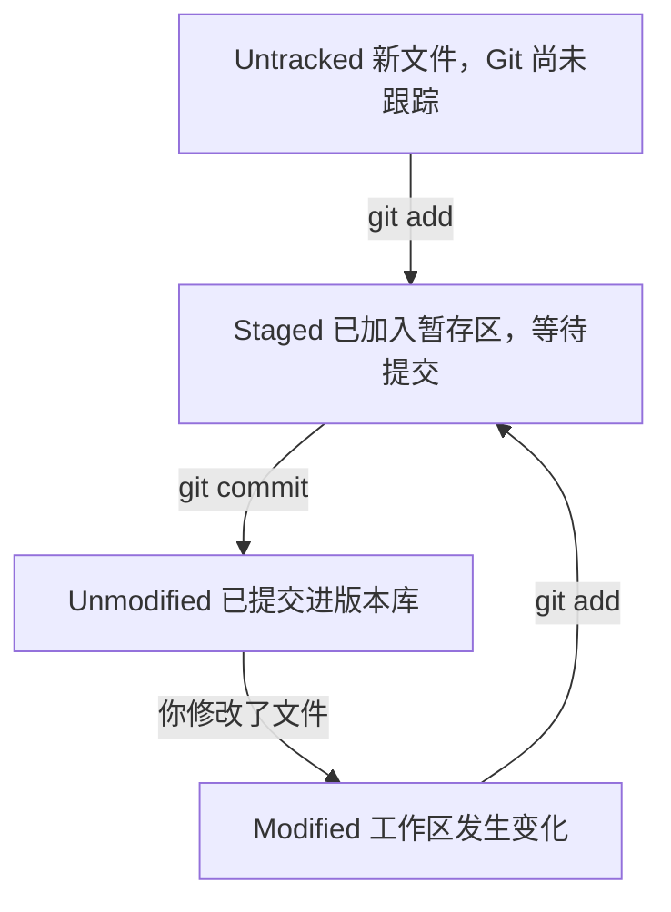

# 01 Git 入门与安装配置

> 本篇导读：很多新手一上来就被 `git add`、`git commit`、`git push` 这套流程劝退，却从没搞清"Git 到底在帮我解决什么问题"。本篇从"没有版本控制的痛"讲起，对比集中式与分布式，带你认识 Git 的出身与核心设计；接着一步步完成三大平台安装、首次 `git config` 配置（含换行符、别名、中文乱码等高频坑）、SSH/HTTPS 网络与凭据设置；再用"三个区域 + 四种状态"把心智模型立起来，最后跑通一个最小提交闭环，并给出命令地图与自学方法。

## 一、为什么需要版本控制

没有版本控制时，你大概率经历过这些：

- **文件副本地狱**：`需求文档_v3_最终版_真的最终.doc`——文件名硬扛"版本号"，却说不清每次改了什么、谁改的、为什么改。
- **改崩了回不去**：没有"时间机器"，大改动像赌博，一旦改坏只能靠手动备份或 Ctrl+Z 的历史深度，关掉文件就没了。
- **多人无法协作**：两人同时改一个文件，最后只能串行传递或直接覆盖，谁后保存谁说了算，前一个同事的改动悄无声息消失。

版本控制解决的就是这三件事：**记录每一次变化、随时回到任意历史、多人并行不冲突**。

集中式（SVN）把"真相"放在一台中央服务器上，分布式（Git）把"真相"复制给每一个人。对比见下表：

| 对比维度 | 集中式（SVN） | 分布式（Git） |
| --- | --- | --- |
| **离线工作** | 必须连中央服务器才能提交，断网寸步难行 | 几乎所有操作本地完成，断网照常提交、看历史 |
| **速度** | 每次提交/对比都走网络，慢 | 本地仓库操作，秒级响应 |
| **分支成本** | 建分支是"拷贝整份目录"，重且慢 | 分支只是一个 40 字节指针，创建/切换近乎零成本 |
| **单点故障** | 中央服务器挂了全员停工，坏了历史可能全丢 | 每人机器都有完整仓库副本，任一节点都能恢复 |

::: tip 一句话结论
集中式把真相放中央服务器，分布式把真相复制给每个人。Git 不是"更快的 SVN"，而是换了一套协作哲学——这是它今天几乎一统天下的根本原因。
:::

## 二、Git 是什么

- **出身**：Linus Torvalds（Linux 之父）在 **2005 年** 为管理 Linux 内核而写，起因是商业工具 BitKeeper 收回免费授权，他一怒之下动手，**据说约两周就写出雏形**。
- **快照而非差异**：老式系统（早期 SVN）记录"文件第 2 版比第 1 版改了哪几行"（差异）。Git 对每次提交时整个项目**拍一张快照**：文件没变就只存一个指向上次快照的链接，不重复复制。切换版本、比较历史因此极快。
- **本地优先**：看历史、对比、建分支、提交都不碰网络，只有 `clone`/`fetch`/`pull`/`push` 才需联网。
- **SHA-1 内容寻址**：每个对象（文件内容、目录、提交）都用内容算出 40 位 SHA-1 作为唯一 ID。同内容必得同哈希，不同内容几乎不可能撞哈希，天然去重、天然防篡改。

| 维度 | SVN | Git |
| --- | --- | --- |
| 版本号 | 全局递增整数（r1、r2…） | 每次提交一个 40 位 SHA-1 |
| 分支 | 服务器上的真实目录拷贝 | 本地一个轻量指针 |
| 提交 | 直接进中央服务器 | 先进本地仓库，再 `push` |
| 联网 | 必须 | 大多不用 |

## 三、安装 Git

先确认是否已安装：`git --version`，有形如 `git version 2.45.1` 的输出即可跳过。

### 3.1 Windows：Git for Windows

从 [git-scm.com](https://git-scm.com/)（国内可从腾讯/清华镜像）下载安装器。几个**关键选项**：

| 安装步骤 | 推荐选择 | 为什么 |
| --- | --- | --- |
| **默认编辑器** | 选你熟悉的（VS Code / Nano），不会 Vim 就别选 Vim | 写提交信息时打开的编辑器 |
| **Adjusting PATH** | **Git from the command line and also from 3rd-party software** | 让 cmd/PowerShell/IDE 都能调 `git` |
| **行尾转换（关键）** | **Checkout Windows-style, commit Unix-style** | 见 3.4 换行符说明 |

::: warning 关于"行尾转换"
Windows 用 `CRLF`（`\r\n`），Linux/macOS 用 `LF`（`\n`）。选 "Checkout Windows-style, commit Unix-style" 表示：检出到工作区转成 `CRLF`，提交进仓库转成 `LF`。Windows 上编辑舒服，仓库里存跨平台统一的 `LF`，协作最省心。
:::

### 3.2 macOS

```bash
xcode-select --install        # 装 Xcode Command Line Tools（自带旧版 git）
brew install git              # 推荐：用 Homebrew 装最新版
git --version
```

### 3.3 Linux

```bash
sudo yum install -y git      # RHEL / CentOS / Rocky / Alma（新版本用 dnf）
sudo apt install -y git      # Debian / Ubuntu
git --version
```

### 3.4 换行符：core.autocrlf（跨平台踩坑）

装 Windows 时选的"checkout Windows-style, commit Unix-style"背后就是这个开关：

```bash
git config --global core.autocrlf true     # Windows：工作区 CRLF，仓库 LF
git config --global core.autocrlf input    # macOS / Linux：统一 LF
```

| 平台 | 推荐值 | 含义 |
| --- | --- | --- |
| Windows | `true` | 工作区 CRLF，仓库 LF |
| macOS / Linux | `input` / `false` | 工作区和仓库都用 LF |

常见报错：`warning: LF will be replaced by CRLF` 或 `fatal: CRLF would be replaced by LF`。通常是 Windows 上 `core.autocrlf` 设成 `false` 而文件混了 `CRLF`。**统一团队换行约定 + 配对 `autocrlf`** 是根治办法。

## 四、首次配置：git config（重点）

Git 装好后**第一件事是告诉 Git"你是谁"**，否则首次提交会被拒绝。

### 4.1 三级作用域与优先级

| 作用域 | 参数 | 生效范围 | 配置文件 |
| --- | --- | --- | --- |
| 系统级 | `--system` | 整台机器所有用户 | `Git安装目录/etc/gitconfig` |
| 全局级 | `--global` | 当前用户所有仓库 | `~/.gitconfig` |
| 本地级 | `--local`（默认） | 当前这一个仓库 | `项目/.git/config` |

**优先级：本地 > 全局 > 系统**。日常配 `--global` 即可，单个仓库可用 `--local` 覆盖。

### 4.2 身份与常见全局配置

```bash
git config --global user.name  "你的名字"
git config --global user.email "you@example.com"   # 用注册 GitHub/Gitee 的邮箱，否则贡献图不记你
git config --global init.defaultBranch main        # 统一默认分支名
git config --global core.quotepath false           # 中文文件名不再显示成 \344\275... 乱码
git config --global core.editor "nano"             # 不会 Vim 就换个，否则提交会卡在 Vim 里
```

::: danger 邮箱要对得上远程账号
提交里的 `user.email` 会和远程平台账号匹配来算"贡献图"。邮箱对不上，提交不算到你名下，墙就空了。公司内网按规范用企业邮箱。
:::

### 4.3 常用别名（效率神器）

```bash
git config --global alias.st  status
git config --global alias.co  checkout
git config --global alias.br  branch
git config --global alias.cm  "commit -m"
```

最值得拥有的**漂亮 log 别名 `lg`**（整行复制执行）：

```bash
git config --global alias.lg "log --color --graph --pretty=format:'%Cred%h%Creset -%C(yellow)%d%Creset %s %Cgreen(%cr) %C(bold blue)<%an>%Creset' --abbrev-commit"
```

之后 `git lg` 能看到带颜色、分支图、相对时间的提交树：

```bash
git lg
# * 9fceb02 - (HEAD -> main) 完善登录页 (2小时前) <张三>
# * 1a410ef - 初始化项目骨架 (昨天) <张三>
```

### 4.4 查看配置：git config --list --show-origin

想知道某条配置**从哪个文件来、最终生效哪条**：

```bash
git config --list --show-origin
# file:/home/you/.gitconfig   user.name=你的名字
# file:.git/config            user.email=you@project.com

git config user.name      # 查看最终生效的名字
```

## 五、网络与凭据

### 5.1 SSH Key：最省心的登录方式

SSH 方式下，本机生成密钥对，把**公钥**贴到 GitHub/Gitee，之后 `push`/`pull` 靠密钥自动认证，无需输密码。

```bash
ssh-keygen -t ed25519 -C "you@example.com"   # 一路回车，默认生成 ~/.ssh/id_ed25519(.pub)
cat ~/.ssh/id_ed25519.pub                    # 复制整行公钥

# 把公钥粘到：
#   GitHub：Settings → SSH and GPG keys → New SSH key
#   Gitee ：设置 → 安全设置 → SSH 公钥 → 添加公钥

ssh -T git@gitee.com      # 首次输 yes，成功显示 Hi 你的用户名! ... authenticated
ssh -T git@github.com
```

::: warning 验证失败排查
- `Permission denied (publickey)`：公钥没贴对，或多密钥冲突。确认 `cat` 的是 `.pub` 文件，贴的是**公钥**而非私钥。
- SSH 方式不走 `http.proxy`，要加速需在 `~/.ssh/config` 配 `ProxyCommand`。
:::

### 5.2 HTTPS + 凭据管理器

不想配 SSH 可用 HTTPS（地址形如 `https://gitee.com/you/repo.git`），首次 `push` 输用户名密码后由凭据管理器记住：

```bash
git config --global credential.helper manager     # Windows（Git Credential Manager）
git config --global credential.helper osxkeychain # macOS 系统钥匙串
git config --global credential.helper store       # Linux 明文存 ~/.git-credentials（公共机慎用）
```

### 5.3 国内访问提速：代理与取消

```bash
git config --global http.proxy  http://127.0.0.1:7890   # 假设本地代理监听 7890
git config --global https.proxy http://127.0.0.1:7890
git config --global --unset http.proxy                  # 取消
git config --global --unset https.proxy
```

::: tip
代理只影响 Git 自身的 HTTP 流量；Gitee 是国内仓库一般**不需要**代理。给特定域名走代理用 `git config --global http.https://github.com.proxy ...`。
:::

> 💡 **在 IDEA 里**：IDEA 自己不存 Git 身份，它调用的就是你本机那个 `git`，所以上面 `git config` 写的 `user.name` / `user.email` 在 IDEA 里**同样生效，不需要重配**。
> - **指定 git 程序**：`Settings → Version Control → Git → Path to Git executable`，点 Test 确认可用。
> - **配置 SSH 密钥**：仍在命令行做（`ssh-keygen`），IDEA 只是复用 `~/.ssh` 里的密钥。
> - **托管平台账号**：`Settings → Version Control → GitHub / GitLab` 可登录，用于在 IDE 内发 PR（见 [05 篇](/ops/git/remote) 与 [11 篇](/ops/git/idea)）。
> - ⚠️ `Settings → Appearance & Behavior → System Settings → HTTP Proxy` 是 **IDE 自身**的代理，跟 `git` 的 `http.proxy` 是两套配置，别混。

## 六、三个区域与文件状态

### 6.1 三个区域

| 区域 | 英文名 | 作用 |
| --- | --- | --- |
| **工作区** | Working Directory | 你直接编辑的文件夹 |
| **暂存区（索引）** | Staging Area / Index | "待提交清单"，`git add` 把改动登记进来 |
| **本地版本库** | Local Repository (`.git`) | 真正存提交历史的地方，`git commit` 固化版本 |
| **远程仓库** | Remote | 服务器上的版本库，靠 `push`/`pull` 同步 |

```text
   工作区            暂存区(index)          本地版本库(.git)        远程仓库
   你写的文件  ──add──▶  待提交清单  ──commit──▶  提交历史  ──push──▶  GitHub/Gitee
        ▲                                                            │
        └─────────────────────── pull / clone ──────────────────────┘
```

### 6.2 四种文件状态与流转

| 状态 | 含义 | 进入 | 离开 |
| --- | --- | --- | --- |
| **Untracked** | 新文件，Git 尚未跟踪 | 新建文件 | `git add` |
| **Staged** | 已 `add` 进暂存区 | `git add` | `git commit` |
| **Unmodified** | 已提交且工作区没动 | `git commit` 后 | 你又改了它 |
| **Modified** | 之前提交过，现在改了但没 `add` | 编辑已跟踪文件 | `git add` |

流转图（提交后再编辑，就从 Unmodified 退回 Modified，再 `add` 回到 Staged，循环）：



### 6.3 看懂 git status

```bash
git status
# On branch main
# No commits yet
# nothing to commit (create/copy files and use "git add" to track)

git status -s
# ?? hello.txt      ← ?? 表示 Untracked（未跟踪）
```

`git status -s`（`-s` = short）用两列字母给紧凑状态：

| 标记 | 含义 |
| --- | --- |
| `??` | 未跟踪（Untracked） |
| `A ` | 已暂存的新文件（Added） |
| `M ` | 已修改且已暂存（M 在左列） |
| ` M` | 已修改但未暂存（M 在右列） |
| `MM` | 暂存后又在工作区改了 |

::: tip 看位置比看字母重要
`M `（M 在左列）表示改动**已在暂存区**；` M`（M 在右列）表示改动**只在工作区**。左列描述"暂存区相对上次提交"，右列描述"工作区相对暂存区"。
:::

> 💡 **在 IDEA 里**：三个区域对应 IDE 里的三块界面 —— **工作区** = 编辑器里的实时改动；**暂存区** = 提交窗里被勾选的文件（勾选即 `add`）；**本地版本库** = 已提交但未推送的提交，在 Log 里看得见。
> 打开提交窗（默认 `Ctrl+K`）就能同时看到这三层的差别：文件前的颜色与状态字母，与 `git status -s` 一一对应。

## 七、最小闭环实战

理论说完，跑一遍真实闭环。用 `git init` 从零建仓库（也可用 `git clone <远程地址>` 克隆已有仓库）。

```bash
mkdir my-first-repo && cd my-first-repo
git init                       # Initialized empty Git repository in .../.git/
echo "# 我的第一个仓库" > README.md
git status -s                  # ?? README.md（未跟踪）
git add README.md
git status -s                  # A  README.md（已暂存）
git commit -m "chore: 初始化仓库，添加 README"
# [main (root-commit) 2bd6a3c] chore: 初始化仓库，添加 README
#  1 file changed, 1 insertion(+)

echo "这是第二行" >> README.md
git status -s                  #  M README.md（工作区改了，未暂存）
git add README.md
git commit -m "docs: 给 README 加了一行说明"
# [main 9fceb02] docs: 给 README 加了一行说明

git log --oneline
# 9fceb02 docs: 给 README 加了一行说明
# 2bd6a3c chore: 初始化仓库，添加 README
```

从远程克隆：

```bash
git clone git@gitee.com:you/my-first-repo.git
# Cloning into 'my-first-repo'...
# remote: Enumerating objects: 3, done.
# Receiving objects: 100% (3/3), done.
```

::: tip 闭环口诀
`init`/`clone`（拿到仓库）→ `add`（挑改动进暂存）→ `commit`（固化成版本）→ `log`（回头看历史）。其余命令都是它们的变体或增强。
:::

> 💡 **在 IDEA 里**：整条最小闭环都有图形入口。
>
> | 命令行 | IDEA 操作 |
> | --- | --- |
> | `git init` | `Git → Init`；或在已有仓库上直接 Open 目录，IDE 会自动识别 |
> | `git clone` | 欢迎页 **Get from VCS**，或 `File → New → Project from Version Control` |
> | `git add` | 提交窗里**勾选文件**，或在差异视图里逐个勾选改动块 |
> | `git commit` | `Ctrl+K` 填好信息后点 **Commit** |
> | `git log --oneline` | `Alt+9` 打开 Git 工具窗 → **Log** |

## 八、命令地图与自学方法

| 分类 | 常用命令 | 干什么 |
| --- | --- | --- |
| **配置** | `config`、`alias` | 设身份、别名、换行符 |
| **基础** | `init`、`clone`、`add`、`commit`、`status`、`log`、`diff` | 日常增删改查提交 |
| **分支** | `branch`、`switch`/`checkout`、`merge`、`rebase` | 并行开发与整合 |
| **远程** | `remote`、`fetch`、`pull`、`push` | 与远程同步 |
| **撤销** | `restore`、`reset`、`revert`、`clean` | 回退、丢弃、修正 |
| **调试** | `bisect`、`blame`、`grep` | 定位"哪次提交引入 bug" |
| **高级** | `stash`、`cherry-pick`、`tag`、`submodule`、`reflog` | 暂存、挑提交、打标签 |

Git 自带完整文档，遇陌生命令先自己查：

```bash
git help <cmd>        # 某命令的总览与所有选项（<cmd> 换成真实命令，如 git help reset）
git <cmd> -h          # 简短帮助，一行列出选项，如 git commit -h
git help -a           # 列出全部子命令
git help -g           # 列出全部指南，如 git help tutorial
```

::: tip 推荐自学路线
1. 先跑通本篇"最小闭环"建立手感；2. 用交互式网站 Learn Git Branching（见参考链接）在浏览器玩转分支合并，比文字直观；3. 啃一遍 Pro Git 前几章，理解原理后再回头看命令，一切都会串起来。
:::

> 💡 **在 IDEA 里**：五个入口记住就够了 —— 状态栏右下角的**分支控件**（切分支 / 合并 / rebase）、`Ctrl+K` 提交、`Ctrl+Shift+K` 推送、`Ctrl+T` 更新（pull）、`Alt+9` Git 工具窗（Log / Console）。
> 快捷键可在 `Settings → Keymap` 里搜命令名查看或改键；不同 IDE 版本菜单文案略有差异，**认名字比认位置稳**。

## 本篇小结

- 版本控制解决**三件事**：记录变化、随时回退、多人协作不冲突。
- 集中式（SVN）把真相放中央服务器，**分布式（Git）每人都有完整副本**，离线可用、分支便宜、无单点故障。
- Git 是 Linus 2005 年为 Linux 内核所写，**约两周出雏形**；核心设计是**存快照而非差异**，并用 **SHA-1 内容寻址**。
- 安装后第一件事是 `git config --global user.name/user.email`，否则提交被拒。
- `git config` 三级作用域优先级：**本地 > 全局 > 系统**；日常配 `--global`。
- 换行符坑：`core.autocrlf` 在 **Windows 设 `true`**、macOS/Linux 设 `input`/`false`，避免 `CRLF` 警告。
- `core.quotepath false` 解决中文文件名"乱码"；`init.defaultBranch main` 统一默认分支名。
- 高效别名：`st`/`co`/`br`/`cm`，外加一条**漂亮 `lg` log 别名**；`core.editor` 别设成你不会退出的 Vim。
- 连远程优先用 **SSH**（`ssh-keygen -t ed25519` + 贴公钥 + `ssh -T` 验证），或用 HTTPS + 凭据管理器免密。
- 三区域（工作区/暂存区/版本库）+ 四状态（Untracked/Staged/Unmodified/Modified）是 Git 的心智地基；最小闭环就是 `init→add→commit→log`。

## 参考链接

- [Git 官方文档（git-scm.com）](https://git-scm.com/doc)
- [Pro Git 中文版（第 1 章 起步）](https://git-scm.com/book/zh/v2/%E8%B5%B7%E6%AD%A5-%E5%85%B3%E4%BA%8E%E7%89%88%E6%9C%AC%E6%8E%A7%E5%88%B6)
- [Git 安装指南（官方）](https://git-scm.com/book/zh/v2/%E8%B5%B7%E6%AD%A5-%E5%AE%89%E8%A3%85-Git)
- [GitHub Docs：连接仓库（SSH / HTTPS）](https://docs.github.com/zh/authentication/connecting-to-github-with-ssh)
- [Gitee 帮助：SSH 公钥设置](https://gitee.com/help/articles/4181)
- [Learn Git Branching（交互式学习，中文）](https://learngitbranching.js.org/?locale=zh_CN)
- [git-config 官方手册](https://git-scm.com/docs/git-config)

下一篇 → [02 Git 内部原理与对象模型](/ops/git/internals)
