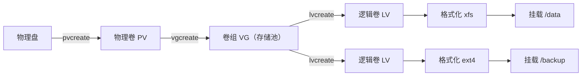

# 09 磁盘与存储管理

磁盘是系统的"地基"，一旦空间耗尽或 IO 打满，上层的数据库、应用会集体异常。本篇从"磁盘怎么被识别"讲起，覆盖分区、格式化、挂载、`df`/`du` 分析、磁盘满排查、LVM 动态扩容、RAID 与 swap，最后落到 IO 性能排查的实战套路。把这一篇吃透，你就能独立处理线上 90% 的存储类故障。

## 一、磁盘是怎么被识别的

Linux 把一切设备都抽象成文件。SCSI/SATA 硬盘显示为 `/dev/sda`、`/dev/sdb`（a、b 代表第几块盘）；NVMe 固态盘显示为 `/dev/nvme0n1`、`/dev/nvme1n1`（0 是控制器号，n1 是命名空间）。

分区表有两种主流格式：

| 对比项 | MBR | GPT |
| --- | --- | --- |
| 最大磁盘 | 2TB | 18EB（ practically 无上限） |
| 主分区数 | 最多 4 个主分区 | 几乎无限制（默认 128） |
| 冗余 | 分区表无备份 | 分区表头有备份 | 
| 新盘推荐 | 不推荐 | 推荐，尤其大于 2TB |

MBR 受限于"最多 4 个主分区"，实际做法是用一个**扩展分区**装多个**逻辑分区**。GPT 则没有这个限制，且分区表有备份，更安全。

一块盘在 Linux 里通常经历：物理盘 → 分区 → 创建文件系统 → 挂载到目录，这条链路才能被访问。看全景用 `lsblk`（list block devices）：

```bash
lsblk -f                     # 列出块设备、文件系统类型、UUID、挂载点
# NAME        FSTYPE LABEL UUID                                 MOUNTPOINT
# sda
# ├─sda1      xfs          xxxx-xxxx                           /boot
# └─sda2      LVM2_m                      
#   └─vg0-lv0 xfs          yyyy-yyyy                           /
```

`-f` 同时把文件系统（FSTYPE）和 UUID 一起打印，排查挂载问题非常直观。

## 二、分区 fdisk / parted

小于 2TB 的盘用 `fdisk`，大于 2TB 必须用 `parted`（GPT）。先看现有分区：

```bash
fdisk -l /dev/sdb             # 查看第二块盘的分区表
```

`fdisk /dev/sdb` 是交互式操作，典型流程（新建一个主分区）：

```bash
fdisk /dev/sdb
# 进入交互界面后依次输入：
#   n       新建分区
#   p       主分区（primary）
#   1       分区号
#   回车     起始扇区默认
#   +100G   结束扇区，分配 100G（也可直接回车用满整盘）
#   w       写入并退出
```

大于 2TB 用 `parted`（GPT）：

```bash
parted /dev/sdb
#   mklabel gpt
#   mkpart primary xfs 0% 100%
#   quit
```

**关键一步**：分区表改完之后，内核未必立刻识别新分区。必须执行 `partprobe` 让内核重读分区表，否则你 `ls /dev/sdb1` 可能找不到设备，后续格式化自然也进行不了：

```bash
partprobe /dev/sdb           # 通知内核重读分区表
lsblk /dev/sdb               # 确认 sdb1 出现了再继续
```

## 三、格式化与文件系统

分区只是"切蛋糕"，还要格式化成文件系统才能真正存数据。企业环境两大主流：

| 对比项 | ext4 | xfs |
| --- | --- | --- |
| 默认发行 | 多数仍支持 | RHEL 7+ 默认 |
| 大文件性能 | 良好 | 优秀（尤其并行/大文件） |
| 缩容 | 支持（需卸载） | **不支持缩容** |
| 碎片 | 较少 | 几乎无需整理 |
| 修复 | `fsck` | `xfs_repair` |

```bash
mkfs.xfs /dev/sdb1           # 格式化为 xfs
mkfs.ext4 /dev/sdb1          # 格式化为 ext4
```

格式化后每块文件系统都有唯一 UUID，用 `blkid` 查看，后续挂载强烈建议用 UUID 而不是设备名（盘序变化会导致 `/dev/sdb1` 变成别的盘）：

```bash
blkid /dev/sdb1              # 输出形如 UUID="xxxx" TYPE="xfs"
```

ext 系列还能用 `tune2fs` 调参数，比如调整自检间隔：

```bash
tune2fs -l /dev/sdb1         # 查看 ext4 文件系统参数
```

## 四、挂载 mount

挂载（mount）就是把一个文件系统"挂"到目录树的某个节点上，之后访问该目录就等于访问这块盘。

手动挂载：

```bash
mkdir -p /data
mount /dev/sdb1 /data                # 把 sdb1 挂到 /data
mount -t xfs -o noatime /dev/sdb1 /data   # 指定文件系统类型与挂载选项
```

常用挂载选项：

- `defaults`：默认 rw、suid、dev、exec、auto、nouser、async。
- `noatime`：不更新访问时间，能减少写操作、提升性能（日志/数据库盘推荐）。
- `ro`：只读挂载。

**开机自动挂载靠 `/etc/fstab`**，六列逐列含义：

```bash
# <设备>                    <挂载点>  <类型>  <选项>        <dump> <fsck>
UUID=xxxx-xxxx             /data     xfs     defaults,noatime  0      0
```

1. 设备：用 `UUID=...` 而非 `/dev/sdb1`，防盘序变化。
2. 挂载点：目录路径。
3. 文件系统类型：`xfs`/`ext4`/`swap` 等。
4. 挂载选项：逗号分隔。
5. dump：是否备份，0 不备份。
6. fsck：开机自检顺序，根分区为 1，其他为 2，0 不检查。

**血的教训**：改完 `fstab` 一定先用 `mount -a` 测试，确认无误再重启。否则写错一行，开机就会卡在 emergency 模式进不去系统：

```bash
mount -a                    # 按 fstab 重新挂载一遍，有错当场报错
```

卸载时若报 `Device is busy`，说明有进程正在占用该目录。用 `lsof` 找出"谁"在用：

```bash
umount /data                # 报错：Device is busy
lsof +D /data               # 列出占用该目录的进程和文件
fuser -mv /data             # 另一种查占用者的方法
# 确认没重要进程后，可停掉占用进程再 umount
```

## 五、df 与 du

看磁盘用量有两把尺子，维度完全不同：

- **`df`** 看"文件系统"维度：这块盘总共多少、用了多少、剩多少。
- **`du`** 看"文件"维度：某个目录/文件实际占了多少空间。

```bash
df -h                       # 人类可读，看每块挂载点的使用率
df -h /data                 # 只看 /data 所在文件系统
df -i                       # 看 inode 使用率（小文件极多时会先耗尽 inode）
```

`du` 逐层下钻找"空间大户"：

```bash
du -sh /data/app            # -s 汇总，-h 可读，看 app 目录总大小
du -sh /data/* | sort -h    # 把 /data 下一级按大小排序，最大的在最后
du -sh * | sort -rh | head  # 当前目录下最大的 10 个
```

**`df` 和 `du` 数值对不上怎么办？** 最常见原因：一个文件被删除了，但仍有进程占用着它（句柄没释放）。此时 `du` 查不到这个文件（已不在目录树），但 `df` 显示的空间还没回收（磁盘仍被占用）。解决办法是找到并重启那个进程，空间才会真正释放。详见下一节。

## 六、磁盘满了怎么办

线上磁盘 100% 是高频故障。下面是标准排查链路，照着走基本不会漏：

```bash
# 1. 先用 df 定位是哪块分区满了
df -h
# Filesystem      Size  Used Avail Use% Mounted on
# /dev/sda2       50G   50G     0 100% /

# 2. 下钻到根分区，逐层找大目录
du -sh /* 2>/dev/null | sort -h        # 先找 / 下的元凶目录
du -sh /var/* 2>/dev/null | sort -h    # 再往 /var 里钻

# 3. 常见元凶：日志、Docker overlay、/tmp 临时文件、core dump
du -sh /var/log/* | sort -h
docker system df                        # Docker 占用的空间

# 4. 已删除但被进程占用的"幽灵文件"
lsof | grep deleted | sort -k7 -n       # 第 7 列是文件大小
# 输出里 SIZE/OFF 较大且带 (deleted) 的，就是占着空间没释放的
```

找到幽灵文件后，重启对应进程（或 `kill` 对应 PID）即可释放空间，无需真的删除文件：

```bash
# 假设 lsof 显示 PID 1234 占着 /var/log/app.log (deleted)
kill -HUP 1234               # 优先让进程自己重新打开日志
# 或直接重启该服务
systemctl restart app
```

常见元凶与对策：

- **日志无轮转**：配 `logrotate`，定期压缩切割。
- **Docker 堆积**：`docker system prune -a` 清理悬空镜像与容器。
- **core dump 文件**：`ulimit -c` 限制，或 `/proc/sys/kernel/core_pattern` 定向。
- **大文件被删未释放**：`lsof | grep deleted` 后重启进程。

**预防**的核心是 `logrotate`，示例（每天切割、保留 7 天、压缩）：

```bash
# /etc/logrotate.d/app
/var/log/app/*.log {
    daily
    missingok
    rotate 7
    compress
    delaycompress
    copytruncate
}
```

## 七、LVM 逻辑卷

传统分区大小固定，扩容要停机重分。LVM（Logical Volume Manager）把这事变成"动态舀水"：把多块物理盘搅成**一个存储池**，再按需切分给上层用。



三个核心概念：

- **PV（Physical Volume）**：真实的物理盘或分区，被打上 LVM 标签。
- **VG（Volume Group）**：把多个 PV 汇成一个大池子。
- **LV（Logical Volume）**：从 VG 里切出来给用户用的"逻辑盘"，可随时扩缩。

创建与在线扩容实战：

```bash
# 1. 把新盘初始化为 PV
pvcreate /dev/sdc
# 2. 加入已有卷组（或新建 vgcreate vg0 /dev/sdc）
vgextend vg0 /dev/sdc
# 3. 给逻辑卷扩容 100G
lvextend -L +100G /dev/vg0/lv_data
# 4. 关键！扩展文件系统，否则空间系统不认
xfs_growfs /data                 # xfs 用这个
# 如果是 ext4：
resize2fs /dev/vg0/lv_data       # ext4 用这个
```

**务必记住**：`lvextend` 只是把 LV 变大，文件系统层面还必须 `xfs_growfs` 或 `resize2fs` 才能认到新增空间，否则 `df -h` 还是老大小。

缩容风险高（尤其 xfs 不支持缩容），一般不建议线上缩容，优先用"迁移数据+重建"替代。

LVM 还支持**快照**（snapshot），适合备份前给数据拍个瞬间副本，对数据库一致性备份很有用：

```bash
lvcreate -L 10G -s -n lv_data_snap /dev/vg0/lv_data
```

## 八、RAID 简介

RAID 把多块盘组合，换取容量、性能或冗余。常见级别对比：

| 级别 | 最少盘 | 容量利用率 | 冗余 | 读性能 | 写性能 |
| --- | --- | --- | --- | --- | --- |
| RAID 0 | 2 | 100% | 无 | 高 | 高 |
| RAID 1 | 2 | 50% | 可坏 1 块 | 高 | 中 |
| RAID 5 | 3 | (n-1)/n | 可坏 1 块 | 高 | 较低（写校验） |
| RAID 6 | 4 | (n-2)/n | 可坏 2 块 | 高 | 低 |
| RAID 10 | 4 | 50% | 每组可坏 1 块 | 很高 | 高 |

软 RAID 用 `mdadm` 管理，例如创建 RAID 1：

```bash
mdadm --create /dev/md0 --level=1 --raid-devices=2 /dev/sdb /dev/sdc
```

不过现在生产环境**更常用硬件 RAID 卡**（带电池缓存、性能与可靠性更好），或者干脆上分布式存储（Ceph、云盘），裸用 `mdadm` 的场景在变少。

## 九、swap 交换分区

swap 是磁盘上的一块"内存备胎"：物理内存不够时，内核把不常用的内存页换到磁盘，避免进程被 OOM 直接杀掉。

```bash
free -h                       # 看内存与 swap 使用情况
swapon -s                     # 列出已启用的 swap 设备及优先级
cat /proc/swaps               # 同上，另一种查看方式
```

什么时候需要 swap？

- 物理内存确实紧张的小内存机器（小于 2G）建议保留。
- 大内存服务器，如果追求极致性能且内存充足，可以不要。

**容器/K8s 环境通常禁用 swap**：kubelet 默认不允许 swap 开启，否则调度与资源隔离会失真（cgroup 无法准确限制内存）。

`swappiness` 控制内核"多想"用 swap（0~100），默认 60。值越大越倾向换出：

```bash
cat /proc/sys/vm/swappiness
sysctl vm.swappiness=10          # 临时调低，减少不必要的换出
# 持久化写入 /etc/sysctl.d/99-swap.conf: vm.swappiness=10
```

## 十、IO 性能排查

磁盘 IO 打满会让所有依赖它的服务变慢。先看整体 IO 负载：

```bash
iostat -x 1                     # 每 1 秒刷新，看设备级 IO 详情
```

`iostat -x` 关键列：

- `%util`：设备繁忙百分比，长期接近 100% 说明 IO 饱和。
- `await`：平均每次 IO 等待时间（毫秒），包含排队+服务，越大越堵。
- `svctm`：设备实际服务时间，正常应在个位数毫秒。
- `r/s`、`w/s`、`rkB/s`、`wkB/s`：读写请求数与吞吐量。

找"哪个进程在狂写"：

```bash
iotop                          # 类似 top，按 IO 排序（需 root）
pidstat -d 1                   # 看进程级 IO 读写
```

测裸盘吞吐（顺序写）：

```bash
dd if=/dev/zero of=/data/test bs=1M count=1024 oflag=direct
```

**`fio`** 是专业的 IO 压测工具，能模拟随机/顺序、读/写混合场景，比 `dd` 更接近真实负载：

```bash
fio --name=randread --rw=randread --bs=4k --ioengine=libaio \
    --direct=1 --numjobs=4 --size=1G --runtime=60 --time_based
```

**一个"磁盘 IO 打满"排查案例**：某服务响应变慢，`iostat -x 1` 看到 `%util` 持续 100%、`await` 飙到几百毫秒，用 `iotop` 定位到一个正在做全量备份的脚本在狂写。解决：把备份挪到业务低峰，并给备份进程 `ionice` 降优先级。

## 本篇小结

- **磁盘识别为 `/dev/sd*` 或 `/dev/nvme*`**，分区表优先选 GPT（支持大于 2TB）。
- **`lsblk -f` 一眼看全盘**设备、文件系统、UUID 与挂载点。
- **大于 2TB 必须用 `parted`**，分区后记得 `partprobe` 让内核重读。
- **xfs 不支持缩容、大文件性能好**，是 RHEL 7+ 默认；ext4 稳、可缩容。
- **`fstab` 挂载用 UUID 不用设备名**，改完先 `mount -a` 再重启。
- **`df` 看文件系统、`du` 看文件**，两者对不上多半是"已删未释放"。
- **`lsof | grep deleted` 找幽灵文件**，重启占用进程即可回收空间。
- **磁盘满标准链路**：`df -h` 定位 → `du -sh` 下钻 → 清日志/Docker/临时文件。
- **LVM 扩容后必须 `xfs_growfs`/`resize2fs`**，否则文件系统不认新空间。
- **swap 在 K8s 下通常禁用**，`swappiness` 可调低减少换出。
- **`iostat -x` 看 `%util` 与 `await` 判断是否 IO 饱和**，`iotop` 定位进程。

## 参考链接

- [Linux 命令大全（菜鸟教程）](https://www.runoob.com/linux/linux-command-manual.html)
- [Arch Wiki - LVM](https://wiki.archlinux.org/title/LVM)
- [Red Hat - Managing Storage Devices](https://access.redhat.com/documentation/en-us/red_hat_enterprise_linux/9/html/managing_storage_devices/)
- [XFS 官方文档](https://xfs.wiki.kernel.org/)
- [iostat / sysstat 手册](https://man7.org/linux/man-pages/man1/iostat.1.html)
- [logrotate 手册](https://man7.org/linux/man-pages/man8/logrotate.8.html)
- [fio 项目主页](https://fio.readthedocs.io/)

下一篇 → [10 网络配置与排查](/ops/linux/network)
