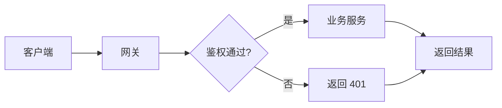
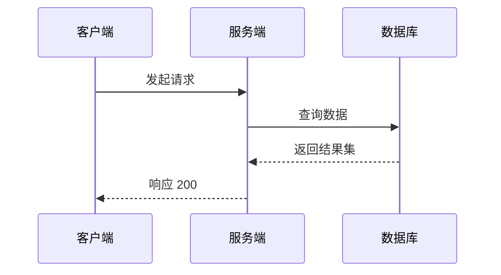
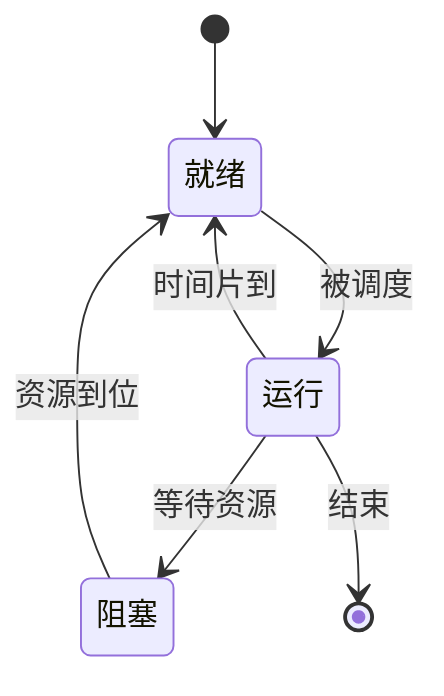
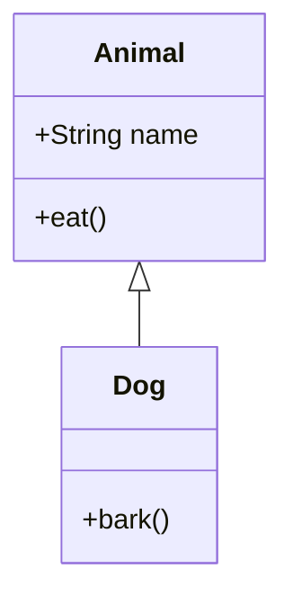

# Mermaid 图表规范

> 本篇导读：本站已启用 Mermaid，写 ` ```mermaid ` 代码块即可自动渲染成矢量图。本篇是写作速查：哪些图该用 mermaid、四种常用图的语法骨架、中文标签的必守规则，以及全站 ASCII 图迁移后的分工约定（哪些已转、哪些保留）。

## 一、为什么换成 Mermaid

本站此前所有示意图都是手敲的 ASCII 框图（` ```text ` 里的 `┌─┐│└┘`）。它有两个绕不开的毛病：

1. **中文是双宽字符**，一个汉字占 2 列而 ASCII 只占 1 列，稍不留神右边框 `│` 就歪了；
2. 箭头、分支、环路全靠作者手工排版：改一个节点往往要重排整幅图。

Mermaid 用**声明式语法**描述结构，由渲染引擎自动布局：

| 对比项 | ASCII 框图 | Mermaid |
| --- | --- | --- |
| 对齐 | 手工数格子，易漂移 | 引擎负责，永不漂移 |
| 改动成本 | 改一处动全图 | 改一行即可 |
| 表现力 | 方框 + 直线 | 流程/时序/状态/类/ER/甘特图 |
| 缩放 | 纯文本 | SVG 矢量，放大不糊 |
| 体积 | 极小 | 客户端异步加载渲染库（仅含图页面） |

## 二、分工原则：什么时候用谁

全站原有的 ASCII 框图**已完成全量迁移**，现在的原则是：

- **新写的图一律用 mermaid** —— 尤其是流程图、时序图、状态图、类图、树状结构；
- **纯格子 / 对照矩阵**（如「OSI 各层协议速查表」）继续用 Markdown 表格，表格比图更合适；
- **报文头位图**（IP / TCP / UDP 头那种"哪几位是什么字段"）保留 ASCII —— mermaid 画不了；
- **目录树 / 包结构树**也保留 ASCII，层级一目了然；
- **带具体数值的演算推导**（CRC 计算、KMP 匹配过程、页框置换步骤）保留 ASCII，转成图会丢信息；
- 极简的、一句话能说清的关系，不必强行画图。

::: tip 一句话判据
图表达的是**结构 / 流向** → 用 mermaid；表达的是**位、数值、层级文本** → 保留 ASCII 或改表格。
:::

## 三、必守规则（写错就渲染不出来）

1. **中文标签必须加引号**：`A["数据链路层"]`，不能直接写 `A[数据链路层]`。
   数字、纯英文可以不加，但**统一加引号最省心**。
2. **标签内含特殊字符**（如 `()`、`/`、`#`）必须整体加引号：`B["接收方(Receiver)"]`。
3. **节点 id 用简单的英文字母/数字**：`A`、`node1`，别用中文做 id。
4. **不要用 `{{ }}`**：会被 Vue 当成插值表达式。菱形判断节点用 `{...}`，即 `C{"是否命中?"}`。
5. 一个 package 代码块一张图，图前后各留一个空行。
6. **标题行里不要出现裸尖括号** `<` `>`（这是全站红线，会被解析成 HTML 标签）。

## 四、流程图 flowchart

流程图用得最多，`LR` 横向、`TD` 纵向。



常用语法：

| 语法 | 含义 |
| --- | --- |
| `A["文字"]` | 矩形节点 |
| `A("文字")` | 圆角节点 |
| `A{"文字"}` | 菱形判断节点 |
| `-->` | 实线箭头 |
| `-.->` | 虚线箭头 |
| `-->|标签|` | 带文字的箭头 |
| `---` | 无箭头连线 |
| `A & B --> C` | 多个节点同时指向 C |

## 五、时序图 sequenceDiagram

描述对象之间的**交互次序**，适合画三次握手、OAuth 授权、RPC 调用链。



要点：

- `participant X as 中文名` 给参与者起别名；
- `->>` 实线请求，`-->>` 虚线响应；
- `Note over C,S: 说明文字` 加注释；
- `alt` / `else` / `end` 画分支，`loop` / `end` 画循环。

## 六、状态图 stateDiagram-v2

最适合**状态机**：进程五态、TCP 状态变迁、订单流转。



要点：

- `[*]` 表示初态/终态；
- `状态A --> 状态B: 触发条件` 在冒号后写迁移条件；
- 复合状态用 `state 名称 { ... }` 嵌套。

## 七、类图 classDiagram

画类之间的关系，适合设计模式、领域模型。



关系符号：`<|--` 继承、`<|..` 实现、`o--` 聚合、`*--` 组合、`-->` 关联、`..>` 依赖。

## 八、其他可用图

按需选用，语法与上面同源：

| 图类型 | 首行关键字 | 典型用途 |
| --- | --- | --- |
| 实体关系图 | `erDiagram` | 数据库表关系 |
| 甘特图 | `gantt` | 排期、里程碑 |
| 饼图 | `pie` | 占比分布 |
| 思维导图 | `mindmap` | 知识结构梳理 |
|  Git 提交图 | `gitGraph` | 分支合并示意 |

其中 `gitGraph` 对 `docs/ops/git` 系列、`mindmap` 对知识梳理类页面很有参考价值。

## 九、常见坑

- **语法写错**：整张图不渲染，页面其他部分不受影响（不会崩站）。本地先跑 `npm run docs:dev` 看一眼再提交。
- **图太宽**：优先用 `TD`（纵向）而非 `LR`（横向），纵向更容易在一屏内放下。
- **中文引号/全角符号**：节点标签里尽量只用半角标点，全角括号偶尔会被解析器误判。
- **渲染时机**：mermaid 是客户端渲染，静态导出的 HTML 里看不到 SVG，必须在浏览器（dev 或 build 后的预览）里查看。

## 十、本地验证写法改动

改完图和 `.vitepress/config.mts` 后，务必本地构建一次确认无误：

```bash
npm run docs:build
```

## 本篇小结

- **本站已启用 Mermaid**，由 `vitepress-plugin-mermaid` 提供，配置见 `docs/.vitepress/config.mts` 的 `withMermaid()` 包装。
- **中文节点一律加引号**：`A["标签"]`，这是最高频的踩坑点。
- **全站 ASCII 图已全量迁移为 mermaid**，仅报文头位图、目录树、演算推导按类型保留。
- 标题行禁止裸尖括号；正文里的泛型、占位符要包反引号。
- 流程图 `flowchart` 的 `LR` 横向 / `TD` 纵向是最常用的两个方向。
- 时序图描述交互次序，状态图描述状态机，类图描述静态结构，按语义选图类型。
- 图 API 是客户端渲染，静态 HTML 中看不到 SVG 属正常现象。
- 一张图只做一件事；图太复杂就拆成两张。
- 纯对照矩阵仍然优先用 Markdown 表格，不要为了用图而用图。
- 提交前跑一次 `npm run docs:build`，确保语法错误不进仓库。

## 参考链接

- [Mermaid 官方文档](https://mermaid.js.org/)
- [Mermaid 在线编辑器（语法调试神器）](https://mermaid.live/)
- [vitepress-plugin-mermaid 仓库](https://github.com/emersonbottero/vitepress-plugin-mermaid)
- [Mermaid flowchart 语法](https://mermaid.js.org/syntax/flowchart.html)
- [Mermaid sequenceDiagram 语法](https://mermaid.js.org/syntax/sequenceDiagram.html)
- [Mermaid stateDiagram 语法](https://mermaid.js.org/syntax/stateDiagram.html)
- [Mermaid classDiagram 语法](https://mermaid.js.org/syntax/classDiagram.html)
